:::tip
[迪杰斯特拉(Dijkstra)算法--看一看](https://blog.csdn.net/xiaoxi_hahaha/article/details/110257368)
:::

## 深度优先搜索
**DFS解决什么问题**

DFS解决的是连通性的问题，即给定一个起始点(或某种起始状态)和一个终点(或某种最终状态)，判断是否有一条路径能从起点连接到终点

很多情况下，连通的路径有很多条，只需要找出一条即可，DFS只关心路径存在与否，不在乎其长短

**算法思想**

从起点出发，选择一个可选方向不断向前，直到无法继续位置

然后尝试另外一种方向，知道最后走到终点


### 例子
假设我们有这么一个图，里面有A,B,C,D,E,F,G,H 8个定点，点与点之间联系如下图所示

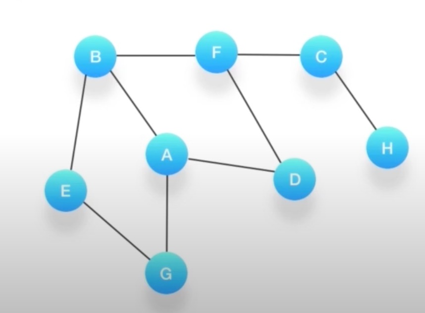

**如何对这个图进行深度优先的遍历呢？**

1. 深度有点必须依赖栈(Stack)这个数据结构
2. 栈的特点是后进先出(LIFO)

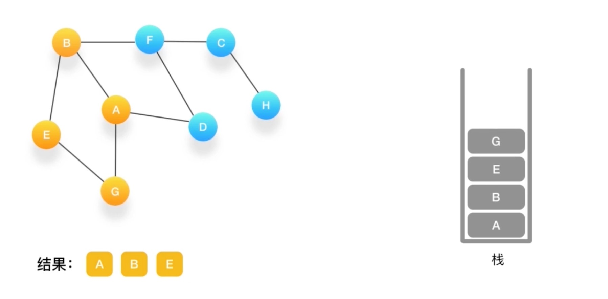

到G如果相连的节点都访问了 弹出

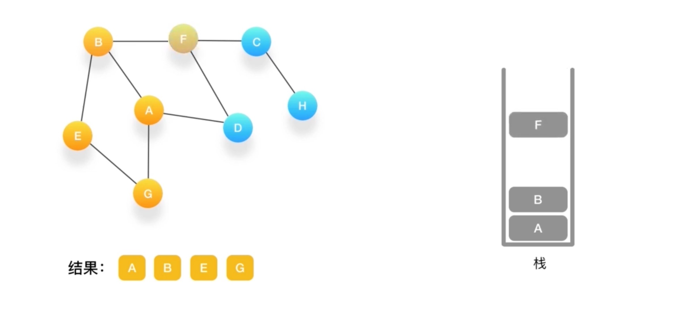


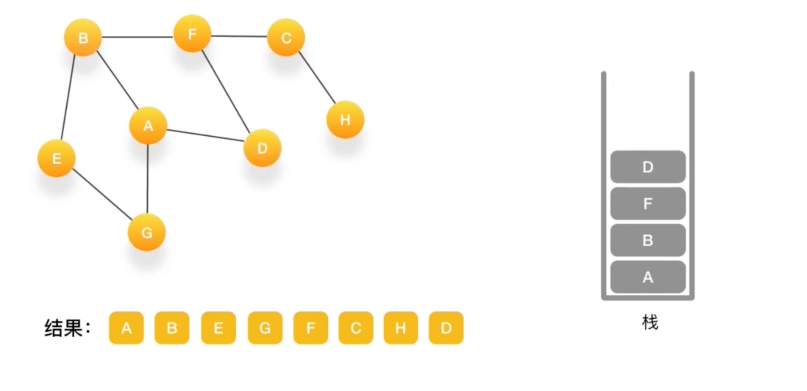
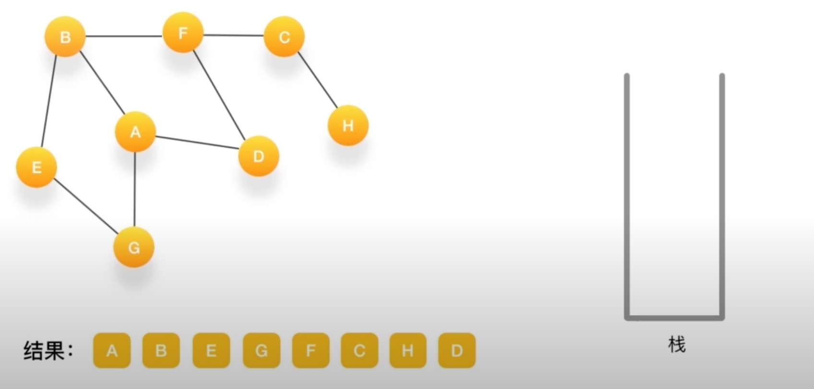
直到栈里没有了~

### demo
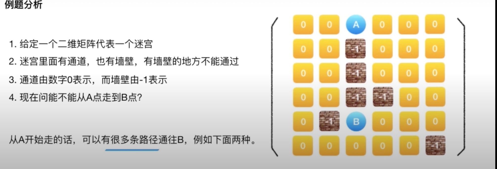

有两套路径 只许判断能否低达
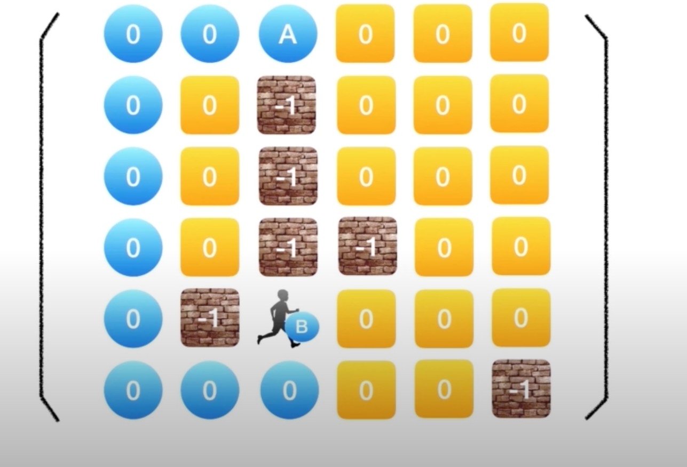

```js
// step1:判断是否抵达了目的地B，是则立即返回
// step2： 标记当前点已经被访问过了
// step3: 在规定的四个方向上进行尝试
// step4: 如果有一条路径找到了，则返回true
boolean dfs(int maze[][], int x, int y) {
    if (x == B[0] && y == B[1]) return true

    maze[x][y] = -1; // 访问过的直接设置-1 工作不推荐，直接修改输入可能对其他地方造成影响

    for (int d = 0; d < 4; d++) {
        int i = x + dx[d], j = y + dy[d];

        if (isSafe(maze, i, j) && dfs(maze, i, j)) { // 是否已经越界  是否已经尝试过
            return true;
        }
    }
    return false // 没有返回false
}
```
-  dfs的递归实现

    利用递归去实现DFS可以让代码看上去很简洁

    递归的时候需要将当前程序中的变量以及状态也入到系统栈里

    压入和弹出都需要较多的时候，如果需要压入很深的栈，会造成效率低下

- DFS的非递归实现

    栈的数据结构也支持压入和弹出操作

    完全可以利用栈来提高效率

> 非递归实现
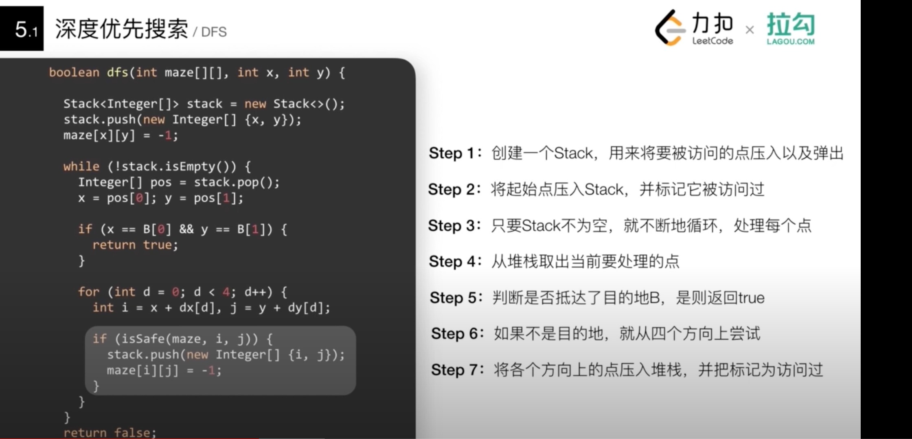

### 如何在迷宫中寻找最短路径dfs

- 暴力解题法

    找出所有路径，然后比较他们的长短，找出最短的那个;如果硬要使用DFS去找最短的路径，我们必须尝试所有的可能，dfs解决只是连通性的问题，不是用来求解最短路径问题
- 优化解题思路

    一遍寻找目的地，一边记录它和起始点的距离(也就是步数)；当发现从某个方面过来所需要的步数更少，则更新到这个点的步数；如果发现步数更多，则不在继续尝试

**情况一：从某个方面到达该店所需要的步数更少则更新**


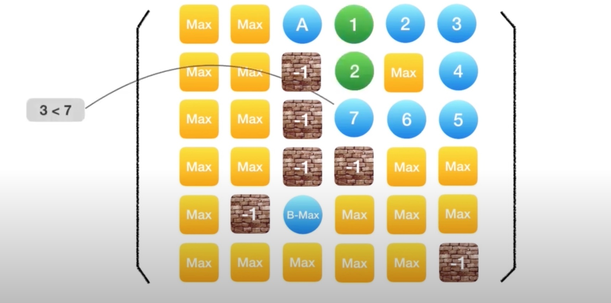

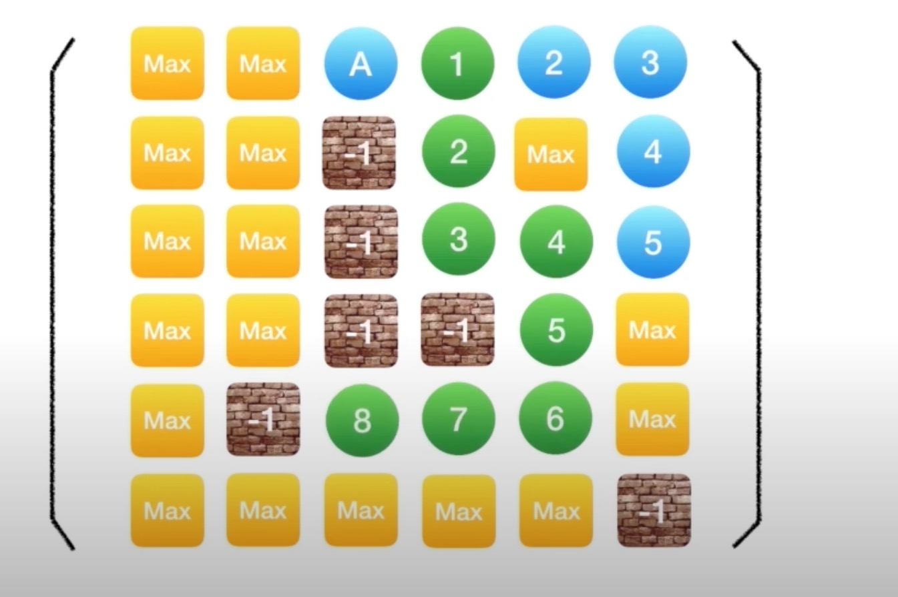

**情况二：从各个方向达到该店所需要的步数都更多则不再尝试**
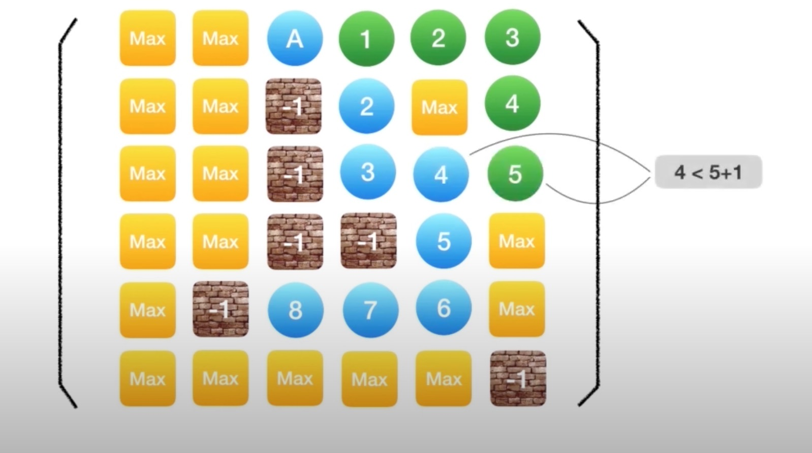

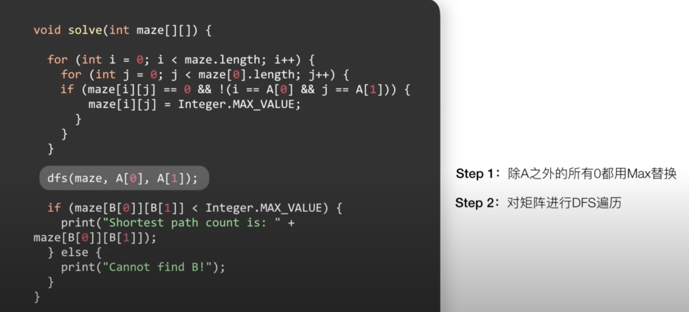
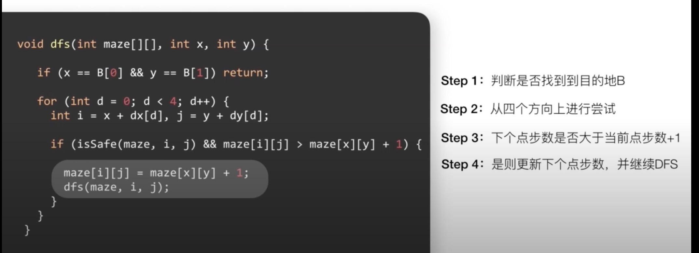
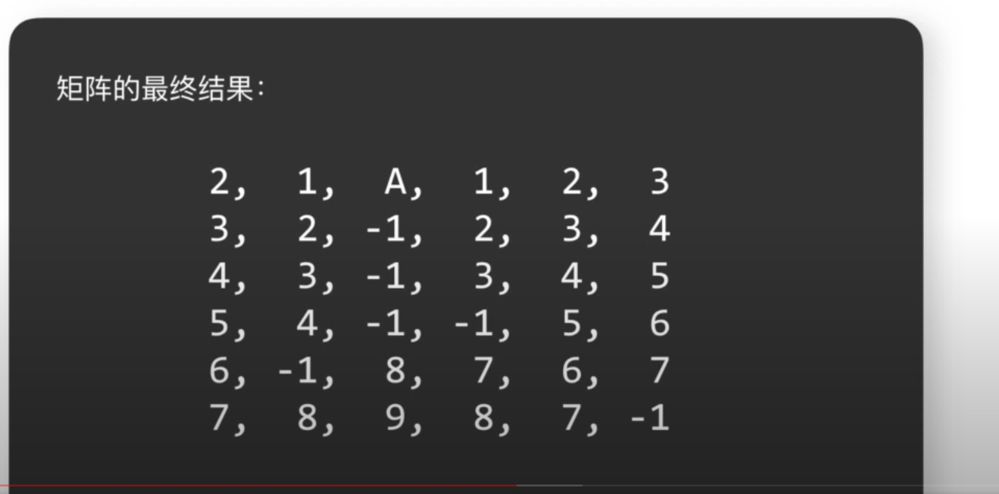

## 广度优先搜索
**广度优先搜索简称BFS**

广度优先搜索一般用来解决最短路径的问题

广度优先的搜索是从起始点触发，一层一层的进行

每层当中的点距离起始点的步数都是相同的

**双端BFS**

同时从起始点和终点开始进行的广度优先的搜索成为双端BFS；双端BFS可以大大提高搜索效率

> 例如：想判断社交应用程序中两个人之间需要经过多少个朋友的介绍才能互相认识

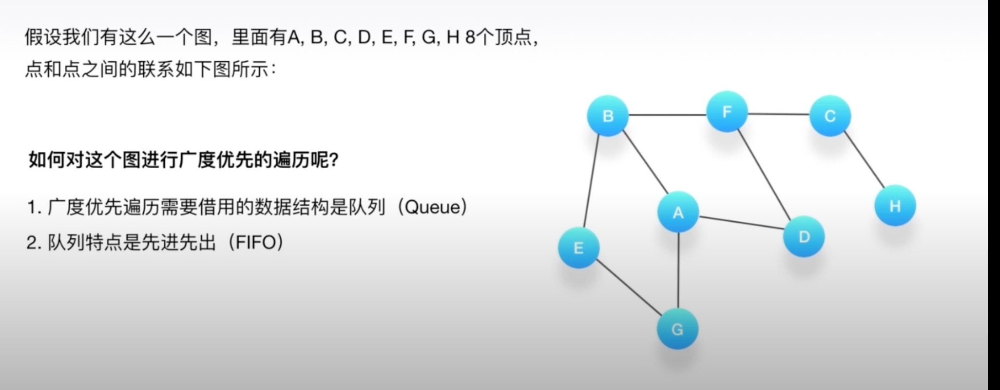

orange为标记为访问过
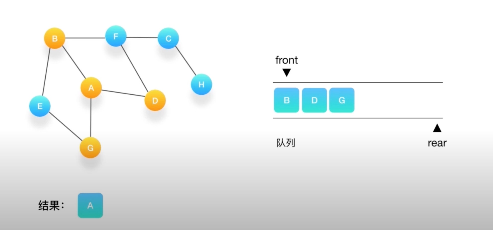
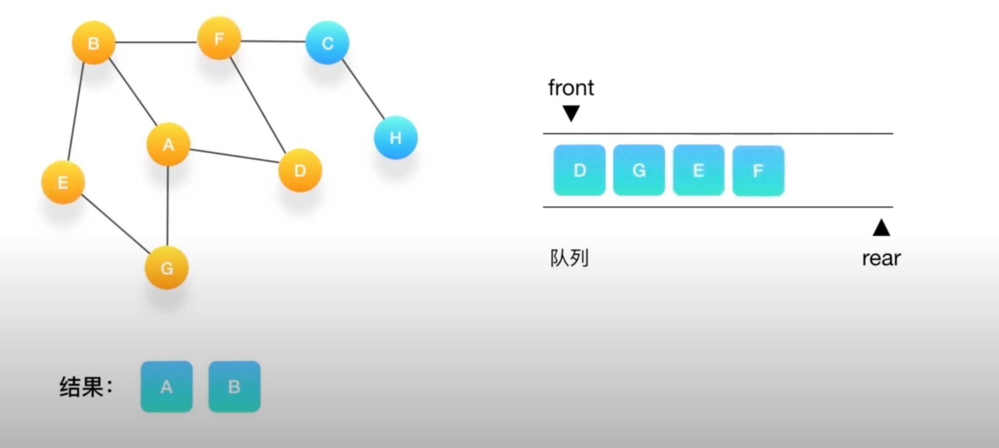

### 如何在迷宫中寻找最短路径bfs


## 资料
[ 第05讲：深度与广度优先搜索](https://www.youtube.com/watch?v=7G950ChRevA&list=PLFOgdf0iZ6uskTJam3P2BZwpdAGGG0e24&index=6)

[2020版数据结构与算法](https://www.bilibili.com/video/BV1VV411S7uv?p=142)