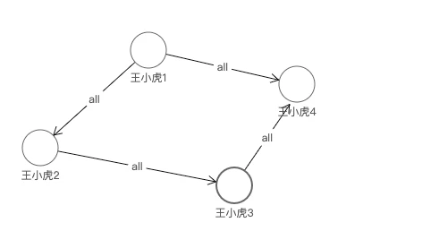
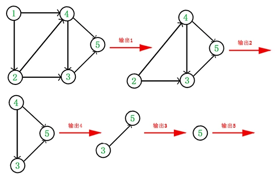

## 业务场景
调度系统的任务可视化界面需要完成用户可在界面上连线作为任意两个job间的依赖关系，也就是DAG图
- <span style="color: blue">DAG也就是有向无环图，有向无环图指的是一个无回路的有向图。环是一条至少含有一条边且起点和终点相同的路径</span>

## 问题描述
在添加依赖关系时，在向后端发送请求前，前端应该先判断当前添加的连线是否与已存在的依赖关系成为闭环(循环依赖为无效任务流)，减少无效请求。

job可以任意依赖，也就是每个job可以有多个节点或者父节点。

### 环的理解
刚开始以为肉眼能看到的回路就是环，如下图中最终汇合到王小虎4这个节点。但是下面如果是一个无向图那么就是有环。

- 有向图和无向图:从图上来说可以简单理解有剪头指向的就是有环图，无箭头指向的为无环图



## 判断有向图是否有环
有两种算法
1. 深度优先遍历图，如果在遍历的过程中，发现某个节点有一条边指向已经访问过的节点，则判断为有环

    ```js
    //图的深度遍历函数
    function DFS(i) {
        console.log('正在访问结点' + nodes[i]);
        //结点i变为访问过的状态
        visited[nodes[i]] = 1;
        for (let j = 0; j < nodes.length; j++) {
            //如果当前结点有指向的结点
            if (graph[nodes[i]][nodes[j]] != 0) {
                //并且已经被访问过
                if (visited[nodes[j]] == 1) {
                    isDAG = false; //有环
                    break;
                } else if (visited[nodes[j]] == -1) {
                    //当前结点后边的结点都被访问过，直接跳至下一个结点
                    continue;
                } else {
                    DFS(j); //否则递归访问
                }
            }
        }
        //遍历过所有相连的结点后，把本节点标记为-1
        visited[nodes[i]] = -1;
    }

    //创建图,以邻接矩阵表示
    function create(nodes, edges) {
        for (let i = 0; i < nodes.length; i++) {
            const pre = nodes[i];
            graph[pre] = {};
            for (let j = 0; j < nodes.length; j++) {
                const next = nodes[j];
                graph[pre][next] = 0;
            }
        }
        for (let k = 0; k < edges.length; k++) {
            const edge = edges[k];
            graph[edge.source][edge.target] = 1;
        }
        //初始化color数组为0，表示一开始所有顶点都未被访问过
        for (let i = 0; i < nodes.length; i++) {
            visited[nodes[i]] = 0;
        }
    }
    //邻接矩阵
    const graph = {};
    //结点个数和边的个数
    //标记矩阵,0为当前结点未访问,1为访问过,-1表示当前结点后边的结点都被访问过。
    const visited = {};
    //是否是DAG（有向无环图）
    let isDAG = true;

    // 获取所有的节点
    const edges = [
        {
            source: 'node1',
            target: 'node3'
        },
        {
            source: 'node3',
            target: 'node5'
        }
    ];
    const nodes = [];
    edges.forEach(e => {
        const { source, target } = e;
        if (!nodes.includes(source)) {
            nodes.push(source);
        }
        if (!nodes.includes(target)) {
            nodes.push(target);
        }
    });
    create(nodes, edges);
    //保证每个节点都遍历到，排除有的结点没有边的情况
    for (let i = 0; i < nodes.length; i++) {
        //该结点后边的结点都被访问过了，跳过它
        if (visited[nodes[i]] == -1) {
            continue;
        }
        DFS(i);
        if (!isDAG) {
            console.log('有环');
            break;
        }
    }
    if (isDAG) {
        console.log('无环');
    }
    ```
    这种算法由于矩阵元素个数为n^2,因此时间复杂度就是O(n^2)

2. 拓扑排序

    - 找到一个没有前驱(入度为0)的节点，入度就是指向该节点的依赖，从图中删除该节点和所有以它为起点的有向边
    - 在删除该节点的有向边过程中更新节点入度，找到下一个入度为0的节点，知道当前的DAG图为空或当前不存在无前驱的顶点位置，否则就是有环

    

    ```js
    // 获取所有的节点
    const edges = [
        {
            source: 'node1',
            target: 'node3'
        },
        {
            source: 'node3',
            target: 'node4'
        },
        {
            source: 'node1',
            target: 'node4'
        }
    ];
    const nodes = [];
    const list = {}; // 邻接表
    const queue = []; // 入度为0的节点集合
    const indegree = {};
    edges.forEach(e => {
        const { source, target } = e;
        if (!nodes.includes(source)) {
            nodes.push(source);
        }
        if (!nodes.includes(target)) {
            nodes.push(target);
        }
        addEdge(source, target);
    });
    const V = nodes.length;

    nodes.forEach(node => {
        if (!indegree[node]) indegree[node] = 0;
        if (!list[node]) list[node] = [];
    });

    function addEdge(source, target) {
        if (!list[source]) list[source] = [];
        if (!indegree[target]) indegree[target] = 0;
        list[source].push(target);
        indegree[target] += 1;
    }
    function sort() {
        Object.keys(indegree).forEach(id => {
            if (indegree[id] === 0) {
                queue.push(id);
            }
        });
        let count = 0;
        while (queue.length) {
            ++count;
            const currentNode = queue.pop();
            const nodeTargets = list[currentNode];
            for (let i = 0; i < nodeTargets.length; i++) {
                const target = nodeTargets[i];
                indegree[target] -= 1;
                if (indegree[target] === 0) {
                    queue.push(target);
                }
            }
        }
        // false 没有输出全部顶点，有向图中有回路
        return !(count < V);
    }
    console.log(sort());
    ```
    由于输出每个顶点的同时还要删除以它为起点的边，故上述拓扑排序的时间复杂度为O(V+E)
## 扩展：判断无向图是否有环
1. 遍历当前所有的依赖边,将所有相关节点的依赖节点加入到邻接表，这是用一个数组去存储
2. 边有起点source和终点target，假设起点为a，终点为b，则沿着a节点去深度遍历当前图a节点的相邻依赖都没有找到终点b的点，则这条依赖加入后也是无环图
3. 为了防止陷入死循环，在边单次循环中需要加入visited数组表示此节点被访问过
```js
const edges = [
    {
        source: 1,
        target: 3
    },
    {
        source: 3,
        target: 5
    },
    {
        source: 2,
        target: 3
    },
    {
        source: 4,
        target: 1
    },
    {
        source: 1,
        target: 6
    },
    {
        target: 5,
        source: 6
    }
];

function findRedundantConnection(edges) {
    // 使用邻接表存储图的信息
    const graph = new Map();

    // 遍历每一条边
    for (let i = 0; i < edges.length; i++) {
        const edge = edges[i];
        // Each element of edges is a pair [u, v] with u < v
        // const u = edge[0];
        // const v = edge[1];
        const u = edge.source;
        const v = edge.target;

        // 深度优先遍历该图，判断u到v之间是否已经存在了一条路径
        let hasPath = dfs(graph, u, v, []);

        if (hasPath == true) {
            return edge;
        } else {
            // 将该边加入到邻接表中
            if (!graph.has(u)) {
                graph.set(u, []);
            }
            const uArr = graph.get(u);
            uArr.push(v);
            graph.set(u, uArr);

            if (!graph.has(v)) {
                graph.set(v, []);
            }
            const vArr = graph.get(v);
            vArr.push(u);
            graph.set(v, vArr);
        }
    }

    return null;
}

// 深度优先遍历该图，判断start到end之间是否已经存在了一条路径
function dfs(graph, start, end, visited) {
    if (!graph.has(start) || !graph.has(end)) {
        return false;
    }

    if (start == end) {
        return true;
    }

    visited.push(start);

    // 遍历start的所有相邻节点
    const startArr = graph.get(start);
    for (let i = 0; i < startArr.length; i++) {
        const adj = startArr[i];
        if (!visited.includes(adj)) {
            if (dfs(graph, adj, end, visited) == true) {
                return true;
            }
        }
    }

    return false;
}
console.log(findRedundantConnection(edges));
```

## 资料
[JS实现判断DAG图是否有环](https://segmentfault.com/a/1190000020241908)

[高级数据结构](/front-end/Code/stady-04.html#图)