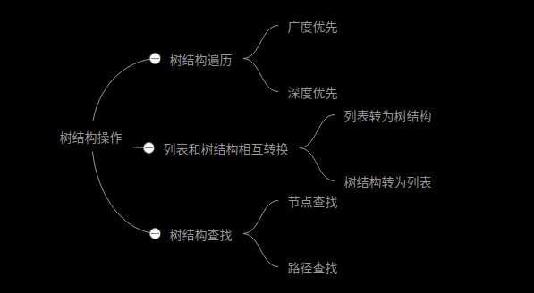
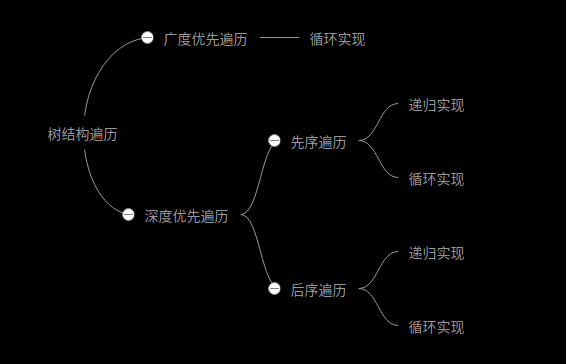

## 遍历树结构

### 树结构介绍
```js
let tree = [
    {
        id: '1',
        title: '节点1'，
        children: [
            {
                id: '1-1',
                title: '节点1-1'
            },
            {
                id: '1-2',
                title: '节点1-2'
            }
        ]
    },
    {
        id: '2',
        title: '节点2',
        children: [
            {
                id: '2-1',
                title: '节点2-1'
            }
        ]
    }
]
```
为了更通用，可以用存储了树根节点的列表表示一个树形结构，每个节点的children属性(如果有)是一颗子树，如果没有children或者children长度为0，则表示该接待为叶子节点

### 树结构遍历方法介绍
树结构的常用场景之一就是遍历，而遍历又分为广度优先遍历、深度优先遍历。其中深度优先遍历是可递归的，而广度优先遍历是非递归的，通常用循环来实现。深度优先遍历又分为先序遍历、后序遍历，二叉树还有中序遍历，实现方法可以是递归，也可以是循环



广度优先和深度优先的概念很简单，区别如下
- 深度优先，访问完一个子树在访问后面的子树，而访问子树的时候，先访问根在访问根的子树，成为先序遍历；先访问子树在访问根，成为后序遍历
- 广度优先，即访问树结构的第N+1层前必须先访问完n层

### 广度优先遍历的实现
广度优先的思路是，维护一个队列，队列的初始值为树结构根节点组成的列表，重复执行以下步骤知道队列为空
- 取出队列中的第一个元素，进行访问相关操作，然后再将其后代元素(如果有)全部追加到队列最后
下面是代码实现，类似于数组的forEach遍历，我们将数组的访问操作交给调用者自定义，即一个回调函数
```js
// 广度优先
function treeForeach(tree, func) {
    let node, list = [...tree];
    while(node = list.shift()) {
        func(node);
        node.children && list.push(...node.children);
    }
}
```
很简单吧 😁

用上述数据测试一下看看
```js
treeForeach(tree, node => console.log(node.title))

节点1
节点2
节点1-1
节点1-2
节点2-1
```
### 深度优先的递归实现
先序遍历，三五行代码
```js
function treeForeach(tree, func) {
    tree.forEach(data => {
        func(data);
        data.children && treeForeach(data.children, func); // 遍历子树
    })
}
```
后序遍历，与先序遍历思想一致，代码也极其相似，只不过调换一下节点遍历和子树遍历的顺序
```js
function treeForeach(tree, func) {
    tree.forEach(data => {
        data.children && treeForeach(data.children, func); // 遍历子树
        func(data);
    })
}
```
测试
```js
treeForeach(tree, node => console.log(node.title))
```
输出
```js
// 先序遍历
> 节点1
> 节点1-1
> 节点1-2
> 节点2
> 节点2-1

// 后序遍历
> 节点1-1
> 节点1-2
> 节点1
> 节点2-1
> 节点2
```
### 深度优先循环实现
先序遍历与广度优先实现类似，要维护一个队列，不同的是子节点不追加到队列最后，而是加到队列最前面
```js
function treeForeach(tree, func) {
    let node, list = [...tree];
    while(node = list.shift()) {
        func(node);;
        node.children && list.unshift(...node.children);
    }
}
```
后序遍历就略微复杂一点，我们需要不断将子树扩展到根节点前面去，(艰难的)执行列表遍历，遍历到某个节点如果它没有子节点或者它的子节点已经扩展到它前面了，则执行访问操作，否则扩展子节点到当前节点前面
```js
function treeForeach(tree, func) {
    let node, list = [...tree], i = 0;
    while (node = list[i]) {
        let childCount = node.children ? node.children.length : 0;
        if (!childCount || node.children[childCount - 1] === list[i - 1]) {
            func(node);
            i++;
        } else {
            list.splice(i, 0, ...node.children);
        }
    }
}
```
## 列表和树结构相互转换
### 列表转为树
列表结构通常是在节点信息中给定了父级元素的id，然后通过这个依赖关系将列表转换为树形结构，列表结构类似于
```js
let list = [
  {
    id: '1',
    title: '节点1',
    parentId: '',
  },
  {
    id: '1-1',
    title: '节点1-1',
    parentId: '1'
  },
  {
    id: '1-2',
    title: '节点1-2',
	  parentId: '1'
  },
  {
    id: '2',
    title: '节点2',
    parentId: ''
  },
  {
    id: '2-1',
    title: '节点2-1',
  	parentId: '2'
  }
]
```
列表结构转为树结构，就是把所有非根节点放到对应父节点的children数组中，然后把根节点提取出来
```js
function listToTree(list) {
    let info = list.reduce((map, node) => {
        map[node.id] = node;
        node.children = [];
        return map;
    }, {});
    return list.filter(node => {
        info[node.parentId] && info[node.parentId].children.push(node);
        return !node.parentId;
    })
}
```
这里首先通过iinfo建立了id=>node的映射，因为对象取值的时间复杂度是O(1),这样在接下来的找寻父元素就不需要再去遍历一次list，因为遍历寻找父元素时间复杂度是O(n)，并且在循环中遍历，则总体时间复杂度会变成O(n^2),而上述实现的总体复杂度是O(n)；

### 树结构转列表结构
有了遍历树的经验，树结构转为列表结构就很简单了。不过有时候，我们希望转出来的列表按照目录展示一样的顺利放到一个列表里，并且包含层级信息。使用先序遍历将树结构转为列表结构是合适的
```js
// 递归实现
function treeToList(tree, result = [], level = 0) {
    tree.forEach(node => {
        result.push(node);
        node.level = level + 1;
        node.children && treeToList(node.children, result, level + 1);
    })
    return result;
}
// 循环实现
function treeToList(tree) {
    let node, result = tree.map(node => (node.level = 1, node));
    for (let i = 0; i < result.length; i++) {
        if (!result[i].children) continue;
        let list = result[i].children.map(node => (node.level = result[i].level + 1; node));
        result.splice(i + 1, i, ...list)
    }
    return result
}
```
## 树结构筛选
树结构过滤即保留某些符合条件的节点，剪裁掉其他节点。一个节点是否保留在过滤后的树结构中，取决于它以及后代节点中是否有符合条件的节点。可以传入一个函数描述符合条件的节点
```js
function treeFilter(tree, func) {
    // 使用map复制一下节点，避免修改到原树
    return tree.map(node => ({...node})).filter(node => {
        node.children = node.children && treeFilter(node.children, func);
        return func(node) || (node.children && node.children.length)
    })
}
```
## 树结构查找
### 查找节点
查找节点其实就是一个遍历过程，遍历到满足条件的节点则返回，遍历完成未找到则返回null。类似数组的find方法，传入一个函数用于判断节点是否符合条件，代码如下
```js
function treeFind(tree, func) {
    for (const data of tree) {
        if (func(data)) return data;
        if (data.children) {
            const res = treeFind(data.children, func);
            if (res) return res;
        }
    } 
    return null;
}
```
### 查找节点路径
略微复杂一点，因为不知道符合条件的节点在哪个子树，需要用到回溯法的思想。查找领要使用先序遍历，维护一个队列存储路径上每个节点的id，假设节点就在当前分支，如果当前分支差不多，回溯
```js
function treeFindPath(tree, func, path = []) {
    if (!tree) return [];
    for (const data of tree) {
        path.push(data.id);
        if (func(data)) return path;
        if (data.children) {
            const findChildren = treeFindPath(data.children, func, path);
            if (findChildren.length) return findChildren;
        }
        path.pop();
    }
    return [];
}
```
用上面的树结构测试
```js
let result = treeFindPath(tree, node => node.id === '2-1');
console.log(result);
// 输出
['2', '2-1']
```
### 查找多条节点路径
思路和查找路径类似，不过代码却更加简单
```js
function treeFindPath(tree, func, path = [], result = []) {
    for (const data of tree) {
        path.push(data.id);
        func(data) && result.push([...path]);
        data.children && treeFindPath(data.children, func, path, result);
        path.pop()
    }
    return result;
}
```

## 结论
对于树结构的操作，其实递归是最基础的，也是最容易理解的。递归本身就是循环思想，所以可以用循环来改写递归。熟练掌握树结构的查找、遍历，对应日常需求应该绰绰有余

## 参考
[JS树结构操作:查找、遍历、筛选、树结构和列表结构相互转换](https://www.cnblogs.com/ming1025/p/13677512.html)