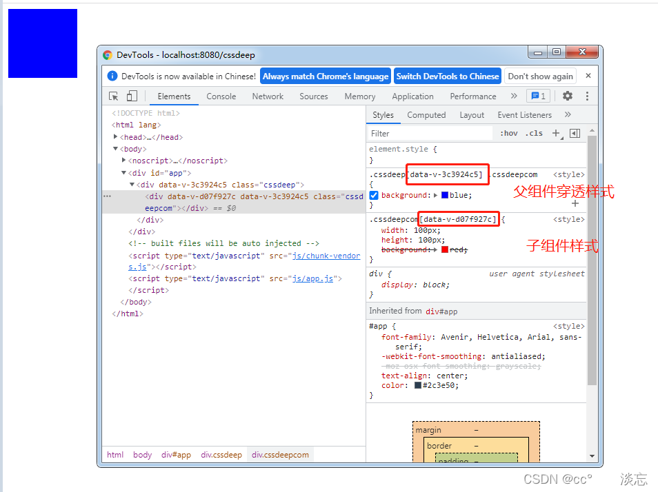

## scoped
- 什么是scoped，为什么要用

    在Vue文件中的style标签上，有个特殊的属性:scoped

    <span style="color:red">当一个style标签拥有scoped属性时，它的CSS样式就只能作用域当前的组件，通过该属性，可以使得组件之间的样式不相互污染</span>
- scoped的原理

    1. 为组件实例生成一个唯一标识,给组件中的每个标签对应的dom元素添加一个标签属性，data-v-xxx
    2. 给&lt;style scoped&gt;中的每个选择器的最后一个选择器添加一个属性选择器，原选择器[data-v-xxx],如：原选择器为.container #id div,则更改后选择器为.container #id div[data-v-xxx]

## 示例
转义前的vue代码
```html
<template>
    <div class="example">hello world</div>
</template>
<style scoped>
.example {
    color: red
}
</style>
```
转义后
```js
<template>
    <div class="example" data-v-49729759>hello world</div>
</template>
<style scoped>
.example[data-v-49729759] {
    color: red
}
</style>
```

## 样式穿透
### 为什么需要穿透scoped
引用了第三方组件后,需要在组件中局部修改第三方组件的样式，而又不想去除scoped属性造成组件之间的样式污染。此时只能通过特殊的方式，穿透scoped

### 样式床头的方法
<span style="color: red">样式穿透的写法有三种: >>>、/deep/、::v-deep</span>

- &gt;&gt;&gt;

    > 如果项目使用的是css原生样式，那么可以直接使用>>>穿透修改
    ```css
    /* 用法 */
    div >>> .cla {
        color: red;
    }
    ```

- /deep/
    > 项目中用到了预处理器scss、sass、less操作符 >>> 可能会因为无法编译而报错。可以使用/deep/ <span style="color: red">注意：vue-cli3以上版本不可以</span>
    ```js
    /* 用法 */
    div /deep/ .cla {
        color: red
    }
    ```

- ::v-deep

    ```css
    /* 用法 */
    div ::v-deep .cla {
        color: red
    }
    ```
## 样式穿透原理
scoped后选择器最后默认会加上当前组件的一个标识;比如[data-v-49729759]

<span style="color: red">用了样式穿透后，在deep之后的选择器最后就不会加上标识</span>

示例

父组件
```html
<template>
    <div class="cssdeep">
        <!-- 样式穿透 -->
        <cssdeepcom></cssdeepcom>
    </div>
</template>
<script>
import cssdeepcom from '../components/cssdeepcom';
export default {
    data() {
        return {}
    },
    components: {
        cssdeepcom,
    }
}
</script>
<style lang="less" scoped>
    .cssdeep /deep/ .cssdeepcom {
        background: red
    }
</style>
```
子组件
```html
<template>
    <div class="cssdeepcom"></div>
</template>
<script>
    export default {
        data() {
            return {}
        }
    }
</script>
<style lang="less" scoped>
    .cssdeepcom {
        width: 100px;
        height: 100px;
        background: red;
    }
</style>
```


<span style="color: red">可以看到父组件用了穿透在cssdeepcom的后面没有再跟标识[data-v-xxxx]，而是在deep的上一级的最后更上了父组件的标识</span>

## 资料
[Vue中的scoped实现原理和样式穿透方法及原理](https://blog.csdn.net/weixin_45272449/article/details/123083687)


[react中的css](/source-react/react-tips-css.html)