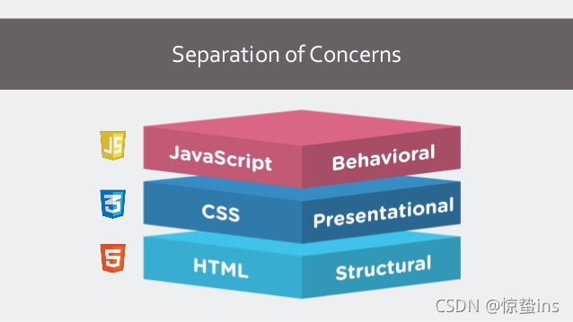
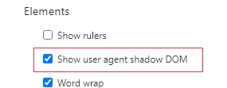
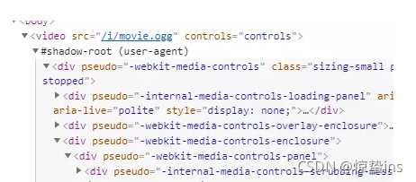
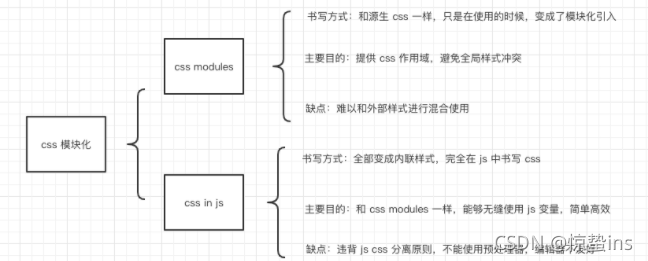

## 背景介绍
从第五代标准HTML推广发布后，其中工作线程(Web Worker)概念的推出让人眼前一亮，但未曾随之激起多大的浪花，并被在其随后的工程侧Angular、Vue、React等框架的浪潮淹没

微前端的概念自从火爆以来，对于JS隔离和css的隔离成为了众多开发者的解决的主要方向

## 什么是CSS隔离
css一旦生效，就会应用于全局，所以很容易出现冲突。css隔离就是为了解决这个问题。

当我们作为前端开发人员较长一段时间后，我们很轻易地就能想到为什么需要css隔离，抛弃微前端的概念不谈，就算当前流行的前端框架也在解决css隔离的路上做出了相应的动作，其中就有Vue，虽然React并没有对css隔离做处理，但是React关于这方面的插件也不少，开源的解决方案也特别多.

### css隔离条件
既然有需求就应该提出符合的要求---css隔离是将css样式通过特殊方法安置在独立环境中，暂时避免和其他CSS污染

### css隔离的几种方式
市面上大体上来说有三种，都能更好的实现CSS隔离的要求

1. 第一种：[CSS in js](/source-react/react-tips-css.html)

    这个概念是facebook提出的，最初呢？有一个观点叫做关注点分离，它的意思是，各种技术只负责自己的领域，不要混合在一起，形成耦合。对于网页开发来说，主要是三种技术隔离

    

    > HTML语言:负责网页的结构，又称语义层
    > CSS语言:负责网页的样式，又称为视觉层
    > JavaScript语言:负责网页的逻辑与交互，又称逻辑层或者交互层

    简单说，就是一句话，不要写"行内样式"（inline style）和"行内脚本"（inline script）。

    React 出现以后，这个原则不再适用了。因为，React 是组件结构，强制要求把 HTML、CSS、JavaScript 写在一起。

    但是实际上，React只能说是用js在写css，它封装了结构、样式和逻辑，完全违背了"关注点分离"的原则，但是它更利于组件之间的隔离，对于组件概念更加友好。

    由于 CSS 的封装非常弱，导致了一系列的第三方库，用来加强 React 的 CSS 操作。它们统称为 CSS in JS，意思就是使用 JS 语言写 CSS。根据不完全统计，各种 CSS in JS 的库层出不穷。但是我觉得，这种方式不会成为主流隔离方式，一方面对于第三方库的长期维护是一个问题，再加上封装的水平也是个问题

2. 第二种；CSS Module

    Vue大概就是这种方案，理解起来很简单，给每一个dom都给了一个独立的Hash，对于上面所挂在的CSS样式通过改hash绑定即可，没什么好说的，现在打包工具这么完善，借助打包工具很轻松的就能实现这种代码

3. 第三种:shadow DOM

    Web Component的一个重要属性是封装--可以将标记结构、样式和行为隐藏起来，并与页面上的其他代码相隔离，保证不同的部分不会混在一起，可实代码更加干净、整洁。其中，Shadow DOM接口是关键所在，它可以将一个隐藏的、独立的DOM附加到一个元素上。

    再举一个例子，拿video标签来说，对于外部来说，它只是一个video标签而已，但是实际上你把video展开来看，其实里面包含了很多dom结构。如图所示：

    

    

    可以很容易的看得出来，这里的video就是封装好的一个组件。这对于我们来说不是天然的组件容器吗？

## 总结

## 资料
[关于css隔离的几种方案带来的思考和展望](https://blog.csdn.net/u013605060/article/details/119994137)