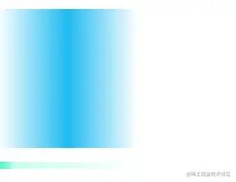
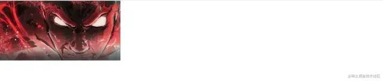
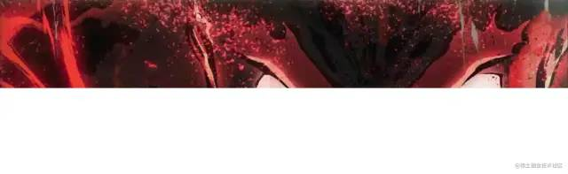
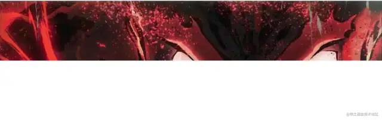
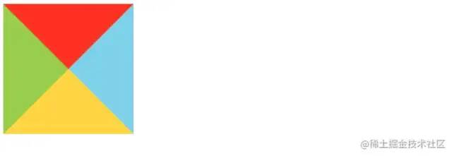

## 文字移除省略号
```css
/**文字单行溢出 */
overflow: hidden: /* 溢出隐藏 */
text-overflow: ellipsis; /* 溢出用省略号显示  */
white-space: nowrap; /** 规定段落中的文本不进行换行 */

/* 多行文字溢出 */
overflow: hidden; /* 溢出隐藏 */
text-overflow: ellipsis; /* 溢出用省略号显示  */
display: -webkit-box; /* 作为弹性伸缩盒子模型显示 */
-webkit-box-orient: vertical; /* 设置伸缩盒子的子元素排列方式：从上到下垂直排列 */
-webkit-line-clamp: 3; /* 显示的行数 */
```
## css 变量
CSS变量又称CSS自定义属性，通过在css中自定义属性--var与函数var()组成，var()用于引用自定义属性。谈到为何在CSS中使用变量，以下使用一个示例讲述
```css
:root {
    --c-color: orange;
}
.title {
    background-color: var(--c-color);
}
```
## 渐变
渐变分为线性渐变、径向渐变，这里直接记录的使用方式，也是为了使用的时候更加直观，这里说下，在使用线性渐变的时候，使用角度以及百分比去控制渐变，会更加的灵活
```css
/* 渐变(方向) */
background:linear-gradient(to right, rgba(255,255, 255, 0), #3FB6F7, rgba(255,255, 255,0));

/* 渐变(角度) */
background: linear-gradient(88deg, #4DF7BF 0%, rgba(77, 247, 191, 0.26) 12%, rgba(77, 247, 191, 0) 100%);
```


边框渐变

border有个border-image的属性，类似background也有个background-image一样，通过为其设置渐变颜色后，实现的渐变，后面的数字4为x方向偏移量

使用方式
```css
.border-grident {
    margin-top: 20px;
    width: 200px;
    height: 200px;
    border: 4px solid;
    border-image: linear-gradient(to right, #8f41e9, #578aef) 4;
}
```
## background-size: cover和contain以及100%
- contain：图片放大至满足背景区域的最小边即止,当背景区域与背景图片宽高比不一致的，背景区域可能会长边下有空白覆盖不全。
- cover：图片放大至能满足最大变时为止，当背景区域与背景图片宽高比不一致时，背景图片在段汴霞会有裁切，显示不全
- 百分比:可以设置两个值
    - 第一个设置宽度，第二个设置高度
    - 如果只设置了一个只，那么第二个值默认会被设置为auto
示例
```html
<!DOCTYPE html>
<html lang="en">
    <head>
        <meta charset="UTF-8">
        <meta http-equiv="X-UA-Compatible" content="IE=edge">
        <meta name="viewport" content="width=device-width, initial-scale=1.0">
        <title>Document</title>
        <style>
            * {
                margin: 0;
                padding: 0;
            }
            .bg {
                width: 100%;
                height: 300px;
                background: url('./img/mtk.png');
                /* background-size: contain;
                background-size: cover: */
                background-size: 100%;
                background-repeat: no-repeat;
            }
        </style>
    </head>
    <body>
        <div class="bg"></div>
    </body>
</html>
```
结果依次为下图展示:
- contain：
    
- cover
    
- 百分比(这里是100%)
    

## css伪类三角形
示例
```html
<!DOCTYPE html>
<html lang="en">
<head>
  <meta charset="UTF-8">
  <meta http-equiv="X-UA-Compatible" content="IE=edge">
  <meta name="viewport" content="width=device-width, initial-scale=1.0">
  <title>css-三角形</title>
  <style>
    .triangle {
    width: 0;
    height: 0;
    border: 100px solid;
    border-color: orangered skyblue gold yellowgreen;
}
  </style>
</head>
<body>
  <div class="triangle">
  </div>
</body>
</html>
```

如果想要一个下的三角形，可以让border的上边框可见，其他边框颜色都设置为透明
```css
.down-triangle {
    width: 0;
    height: 0;
    border-top: 50px solid skyblue;
    border-right:50px solid transparent;
    border-left: 50px solid transparent;
}
```


## 媒体查询
页面头部必须有 meta 关于viewport的声明

```html
<meta name="’viewport’" content="”width=device-width," initial-scale="1." maximum-scale="1,user-scalable=no”"/>
```
通常在做响应式布局的时候，以及大屏的时候很常用的，从而实现在不通分辨率下，实现不同的展示效果
```css
/* 超过1920分辨率后显示多列 */
@media screen and (min-width:1920px) {
  .car_box.el-card {
    min-width: 450px !important;
    width: 450px !important;
  }
}
```
## ElementUI样式修改的几种方式
笔者目前技术栈是vue，在修改elementui的样式真的是苦不堪言，style使用css的预处理器(less, sass, scss)的写法如下
```css
/deep/ .test{
    /* *** */
}

::v-deep .test{
    /* **** */
}
```
在一个有时候会遇到修改elementui中table的全部样式，下面就来一一对应的去修改下的：
- 修改表格头部背景

    ```css
    ::v-deep .el-table th {
        background: orange
    }
    ```
- 修改表格行背景

    ```css
    ::v-deep .el-table tr {
        background: #333;
    }
    ```
- 修改斑马线表格的背景

    ```css
    ::v-deep .el-table--striped .el-table__body tr.el-table__row--striped td {
        background: #ccc;
    }
    ```
- 修改行内线的颜色：

    ```css
    ::v-deep .el-table td,.building-top .el-table th.is-leaf {
        border-bottom:  2px solid #eee;
    }
    ```
- 修改表格最底部边框颜色和高度：

    ```css
    ::v-deep .el-table::before{
        border-bottom:  1px solid #ccc;
        height: 3px
    }
    ```
- 修改表头字体颜色：

    ```css
    ::v-deep .el-table thead {
        color: #ccc;
        font-weight: 700;
    }
    ```
- 修改表格内容字体颜色和字体大小：

    ```css
    ::v-deep .el-table{
        color: #6B91CE;
        font-size: 14px;
    }
    ```
- 修改表格无数据的时候背景，字体颜色

    ```css
    ::v-deep .el-table__empty-block{
        background: #ccc;
    }
    ::v-deep .el-table__empty-text{
    color: #fff
    }
    ```
- 修改表格鼠标悬浮hover背景色

    ```css
    ::v-deep .el-table--enable-row-hover .el-table__body tr:hover>td {
        background-color: pink;
    }
    ```


[原文](https://mp.weixin.qq.com/s/BbaTnRsRx7g5v0Yo3InHtQ)