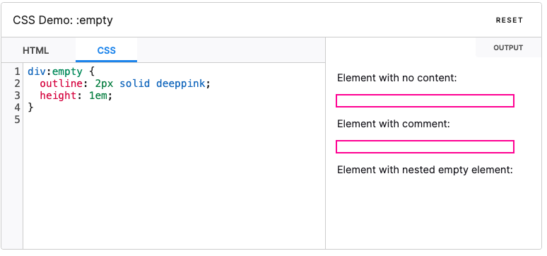

:empty CSS伪类用于选择不包含任何子元素的元素。子元素可以是元素节点或文本(包括空格)。但是注释、处理指令和CSS content不会影响被认定为空



## 示例
```html
<div>
  <h2>contenteditable</h2>
  <p>If you want to make fill-in-the-blank-type-stuff with text that runs like a paragraph and you want placeholder text too, you can use <i>'contenteditable'</i> to make inline-editable fields <span contenteditable class="demo"></span> and set your placeholder text on the <i>content</i> property with the <i>':empty:before'</i> pseudo-selector. No JavaScript needed! Try it below!
    <br /><br /> Works in IE9+.
</div>

<div>
  <p>Hi my name is <span contenteditable class="name"></span> and I'm a <span contenteditable class="job"></span>. I live in <span contenteditable class="city"></span> and I like to <span contenteditable class="activity"></span>. My favorite programming language is <span contenteditable class="language"></span>.</p>
</div>
```
```css
* {
    box-sizing: border-box;
}
body {
    background: #33363f;
    color: #aaaaaa;
    font-family: 'Open Sans', sans-serif;
    -webkit-font-smoothing: antialiased;
}
div {
  width: 700px;
  margin: 50px auto 0;
}

div:nth-of-type(2) {
  padding: 10px 20px;
  background: rgb(60, 60, 68);
}

p, span {
  font-size: 18px;
  line-height: 30px;
}

span {
  color: white;
  border-bottom: 1px dotted white;
  cursor: text;
}
span:empty:before{
  color: rgb(131, 131, 131);
}

i {
  color: #aaaaaa;
  font-family: monospace;
  font-style: normal;
}

.demo:empty:before {
  content: 'like this';
}

.name:empty:before {
  content: 'Dan';
}

.job:empty:before {
  content: 'Software Engineer';
}

.city:empty:before {
  content: 'Rochester';
}

.activity:empty:before {
  content: 'drink coffee';
}

.language:empty:before {
  content: 'BASIC';
}
```