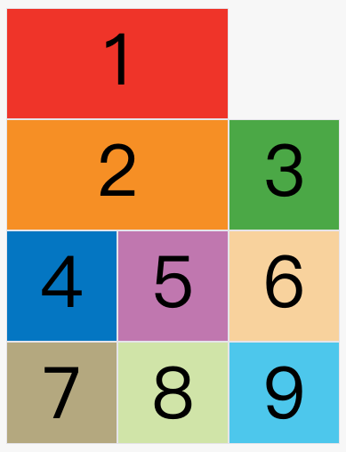

## 概述
网络布局(Grid)是强大的CSS布局方案

它将网页分成一个个网格，可以任意组合不同的网格。以前，只能通过复杂的CSS框架达到的效果，现在浏览器内置了


上图这样的布局，就是Grid布局的拿手好戏

Grid布局与[Flex布局](https://www.ruanyifeng.com/blog/2015/07/flex-grammar.html)有一定相似性，都可以指定容器内部多个项目的位置。但是他们也存在重大区别。

Flex布局是轴线布局，只能指定"项目"针对轴线的位置，可以看做是**一纬布局**。Grid布局则是将容器划分成"行"和"列"，产生单元格，然后指定"项目所在"的单元格，可以看做是"二纬布局"。Grid布局远比Flex布局强大

## 基本概念
学习Grid布局之前，需要了解一些基本概念

### 2.1容器和项目
采用网格布局的区域，成为容器。容器内部采用网格定位的子元素，成为项目(item);
```
<div>
  <div><p>1</p></div>
  <div><p>2</p></div>
  <div><p>3</p></div>
</div>
```
上面代码中，最外层的&lt;div&gt;元素就是容器，内层的三个&lt;div&gt;元素就是项目

注意：项目只能是容器的顶层子元素，不包含项目的子元素，比如上面代码p元素就不是项目。Grid布局只对项目生效

### 2.2行和列
容器里面的水平区域成为行(row),垂直区域成为列(column)


上图中，水平的深色区域就是行，垂直的深色区域就是列

### 2.3单元格
行和列的交叉区域，成为单元格

正常情况下，n行和m列会产生n x m个单元格。比如，3行3列会产生9个单元格。

### 2.4 网格线
划分网格的线，成为网格线(grid line).水平网格线划分出行，垂直网格线划分出列。

正常情况下，n行有n+ 1根水平网格线，m列有m+1根垂直网格线，比如三行就有四根水平网格线


上图是一个4x4的网络，共有5根水平网格线和5根垂直网格线

## 容器属性
Grid布局的属性分成两类。一类定义在容器上面,成为容器属性；另一类定义在项目上面，成为项目属性。这部分先介绍容器属性

### 3.1 display属性
display:grid指定一个容器采用网格布局
```
div {
  display: grid;
}
```


上图就是display:grid的[效果](https://jsbin.com/guvivum/edit?html,css,output)

默认情况下，容器元素都是块级元素，但也可以设成行内元素
```
display: inline-grid;
```
上面代码指定div是一个行内元素，该元素内部采用网格布局


上图就是display:inline-grid的[效果](https://jsbin.com/qatitav/edit?html,css,output)

::: danger
注意，设为网格布局以后，容器子元素(项目)的float、display:inline-block、display:table-cell、vertical-align和column-*等设置将失效
:::

### 3.2 grid-template-columns,grid-temeplate-rows属性
容器指定了网格布局以后，接着就要划分行和列。grid-template-columns属性定义每一列的列宽，grid-template-rows属性定义每一行的行高。
```
.container {
  display: grid;
  grid-template-columns: 100px 100px 100px;
  grid-template-rows: 100px 100px 100px;
}
```
[上面代码](https://jsbin.com/qiginur/edit?css,output)指定了一个三行三列的网格，列宽和行高都是100px


除了使用绝对单位，也可以使用百分比
```
.container {
  display:grid;
  grid-template-columns: 33.33% 33.33% 33.33%;
  grid-template-rows: 33.33% 33.33% 33.33%
}
```

#### repeat()
有时候，重复同样的值非常麻烦，尤其网格很多时。这时，可以使用repeat()函数，简化重复的值。上面的代码用repeat()改写如下
```
.container {
  display: grid;
  grid-template-columns: repeat(3, 33.33%);
  grid-template-rows: repeat(3, 33.33%);
}
```
repeat()接受两个参数，第一个参数是重复的次数(上栗是3)，第二个参数是所要重复的值。

repeat()重复某种模式也可以的
```
grid-template-comlums：repeat(2, 100px 20px 80px)
```
[上面代码](https://jsbin.com/gipumayuwa/edit?css,output)定义了6列，第一列和第四列的宽度为100px,第二列和第五列为20px,第三列和第六列为80px


#### auto-fill关键字
有时，单元格的大小是固定的，但是容器的大小不确定。我们希望每一行(或每一列)容纳尽可能多的单元格，这时可以使用auto-fill关键字表示自动填充
```
.container {
  display: grid;
  grid-template-colums: repeat(auto-fill, 100px)
}
```
[上面代码](https://jsbin.com/himoku/edit?css,output)表示每列宽度100px,然后自动填充，直到容器不能放置更多的列


#### fr关键字
为了方便表示比例关系，网格布局提供了fr关键字(fraction的缩写，意为片段)。如果两列的宽度分别为1fr和2fr，就表示后者是前者的两倍。
```
.container {
  display: grid;
  grid-template-columns: 1fr 1fr;
}
```
[上面代码](https://jsbin.com/hadexek/edit?html,css,output)表示两个相同的列


fr可以与绝对长度的单位结合使用，这时会非常方便
```
.container {
  display: grid;
  grid-template-columns: 150px 1fr 2fr;
}
```
[上面代码](https://jsbin.com/remowec/edit?html,css,output)，第一列宽度为150px，第二列的宽度为第三列的一半


#### minmax()
minmax()函数产生一个长度范围，表示长度就在这个范围之中。它接受两个参数，分别为最小值和最大值
```
grid-template-columns: 1fr 1fr minmax(100px, 1fr);
```
上面代码中，minmax(100px, 1fr)表示列宽不小宇100px, 不大于1fr

#### auto关键字
auto关键字表示浏览器自己决定长度
```
grid-template-columns: 100px auto 100px
```
上面代码中，第二列的宽度，基本上等于该列单元格的最大宽度，除非单元格内容设置了min-width,且这个值大于最大宽度。

#### 网格线的名称
grid-template-columns属性和grid-template-rows属性里面，还可以使用方括号，指定每一根网格线的名字，方便以后的引用
```
.container {
  display: grid;
  grid-template-columns: [c1] 100px [c2] 100px [c3] auto [c4];
  grid-template-rows: [r1] 100px [r2] 100px [r3] auto [r4];
}
```
上面代码指定网络布局为3行X 3列，因此有4根垂直网格线和4根水平网格线。方括号里面依次是这八根线的名字

网格布局允许同一根线有多个名字，比如[fifth-line row-5]

#### 布局实例
grid-template-columns属性对于网页布局非常有用。两栏布局只需要一行代码
```
.wrapper {
  display: grid;
  grid-template-columns: 70% 30%;
}
```
上面代码将左边栏设为70%，右边栏设为30%。

传统的十二网格布局，写起来也很容易
```
grid-template-columns: repeate(12, 1fr);
```

### 3.3 grid-row-gap属性，grid-column-gap属性，grid-gap属性
grid-row-gap属性设置行与行的间隔(行间距)，grid-columns-grap属性设置列与列的间隔(列间距)
```
.container {
  grid-row-gap: 20px;
  grid-columns-grap: 20px;
}
```
[上面代码](https://jsbin.com/mezufab/edit?css,output)，grid-row-grap用于设置行间距，grid-column-grap用于设置列间距


grid-grap属性是grid-column-gap和grid-row-gap的合并简写形式，语法如下
```
grid-gap: <grid-row-gap> <grid-row-gap>
```
因此，上面一段CSS代码等同于下面的代码
```
.container {
  grid-gap: 20px 20px;
}
```
如果grid-gap省略了第二个值，浏览器任务第二个值等于第一个值
::: danger
根据最新标准，上面三个属性名的grid-前缀已经删除，grid-column-gap和grid-row-gap写成column-gap和row-gap,grid-gap写成gap
:::

### 3.4 grid-template-areas属性
网格布局允许指定区域(area),一个区域由单个或多个单元格组成。grid-template-areas属性用于定义区域
```
.container {
  display:grid;
  grid-template-columns: 100px 100px 100px;
  grid-template-row: 100px 100px 100px;
  grid-template-areas: 'a b c'
                       'd e f'
                       'g h i';
}
```
上面代码先划分出9个单元格，然后将其定名为a到i的就个区域，分别对应这个就个单元格

多个单元和合并成一个区域的写法如下
```
grid-template-areas: 'a a a'
                      'b b b'
                      'c c c';
```
上面代码将9个单元格分成a, b , c 三个区域

下面是一个布局实例
```
grid-template-areas: "header header header"
                     "main main sidebar"
                     "footer footer footer";
```
上面代码中，顶部是页眉区域header，底部是页脚区域footer，中间部分则为main和sidebar。

如果某些区域不需要利用，则使用"点"（.）表示。
```
grid-template-areas: 'a . c'
                     'd . f'
                     'g . i';
```
上面代码中，中间一列为点，表示没有用到该单元格，或者改单元格不属于任何区域

:::danger
注意，区域的命名会影响到网格线。每个区域的其实网格线，会自动命名为区域名-start，终止网格线自动命名为区域名-end。

比如，区域名为header，则起始位置的水平网格线和垂直网格线叫做header-start，终止位置的水平网格线和垂直网格线叫做header-end。
:::

### 3.5 grid-auto-flow属性
划分网格以后，容器的子元素会按照顺序，自动放置在每一个网格。默认的放置顺序是"先行后列"，即先填满第一行，在开始放入第二行，即下图数字的顺序


这个顺序由grid-auto-flow属性决定，默认值是row，即"先行后列"。也可以将它设成column，变成**先列后行**
```
grid-auto-flow: column;
```
[上面代码](https://jsbin.com/xutokec/edit?css,js,output)设置了column以后，放置顺序就变成了下图


grid-auto-flow属性除了设置成row和column,还可以设成row dense和column dense。这两个值主要用于，某些项目指定位置以后，剩下的项目怎么自动设置

[下面例子](https://jsbin.com/wapejok/edit?css,output)让1号项目和2号项目各占据两个单元格，然后在默认的grid-auto-flow：row情况下，会产生下面这样的布局。



上图中，1号项目后面的位置是空的，这是因为3号项目默认跟着2号项目，所以会排在2号项目后面。

现在修改设置，设为row dense，表示"先行后列"，并且尽可能紧密填满，尽量不出现空格。
```
grid-auto-flow: row dense;
```
[上面代码](https://jsbin.com/helewuy/edit?css,output)效果如下


上图会先填满第一行，再填满第二行，所以3号项目就会紧跟在1号项目的后面。8号项目和9号项目就会排到第四行。

如果将设置改为column dense，表示"先列后行"，并且尽量填满空格。

```
grid-auto-flow: column dense;
```
[上面代码](https://jsbin.com/pupoduc/1/edit?html,css,output)的效果如下。


### 3.6 justify-items属性，align-items属性，place-items属性
justify-items属性设置单元格内容的水平位置(左中右),align-item属性设置单元格内容的垂直位置(上中下)
```
.container {
  justify-item: start | end | center | stretch;
  align-items: start | end | center | stretch;
}
```
这两个洗护ing的写法完全相同，都可以取下面这些值
::: danger
start: 对齐单元格的起始边缘
end: 对齐单元格的结束边缘
center: 单元格内部居中
stretch: 拉伸，占满单元格的整个宽度(默认值)
:::
```
justify-item: start；
```
上面代码表示，单元格的内容左对齐，效果如下图。


## 资料
[CSS Grid网络布局教程](https://www.ruanyifeng.com/blog/2019/03/grid-layout-tutorial.html)

[两列自适应布局的四种思路](https://www.cnblogs.com/xiaohuochai/p/5454232.html)