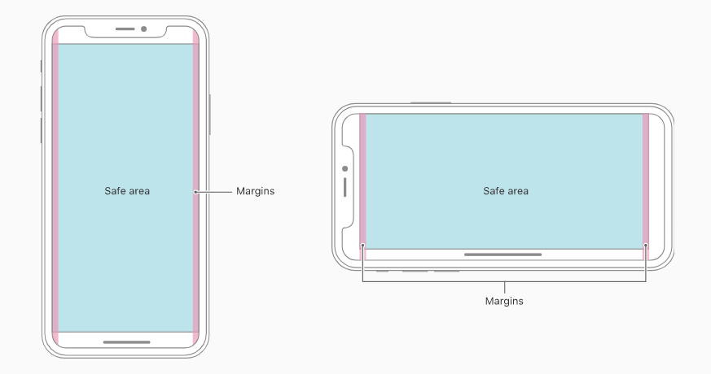

- 屏幕上安全距离:safe-area-inset-top
- 屏幕右安全距离:safe-area-inset-right
- 屏幕下安全距离:safe-area-inset-bottom
- 屏幕左安全距离: safe-area-inset-left

## IOS 11
```
padding-top: constant(safe-area-inset-top);
padding-right: constant(safe-area-inset-right);
padding-bottom: constant(safe-area-inset-botom);
padding-left: constant(safe-area-inset-left)
```

## IOS11.2+
```
padding-top: env(safe-area-inset-top);
padding-right: env(safe-area-inset-right);
padding-bottom: env(safe-area-inset-bottom);
padding-left: env(safe-area-inset-left);
```

## 兼容写法
```
padding-top: constant(safe-area-inset-top);
padding-top: env(safe-area-inset-top);
```

[IphoneX 安全区域](https://blog.csdn.net/shenxianhui1995/article/details/109113462)

[H5 iphoneX全棉屏适配方案](https://www.jianshu.com/p/41f9f4209664)