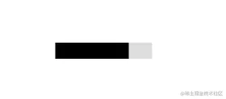
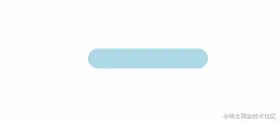
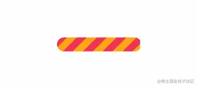
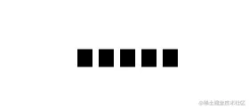
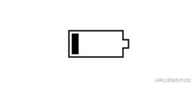
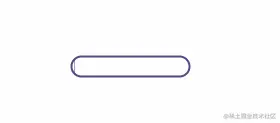
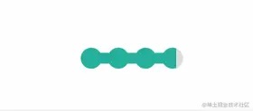

在推特上面看到 [T. Afif](https://twitter.com/ChallengesCss) 介绍的十个 Loading 效果。如上图。

Yeah，很赞哦，挺实用的，遂记录下来。

为保证运行正常，咱先规定下：

```css
* {
    box-sizing: border-box;
}
```
## 1. 平滑加载



```html
<div class="progress-1"></div>
```
```css
.progress-1 {
  width:120px;
  height:20px;
  background:
   linear-gradient(#000 0 0) 0/0% no-repeat
   #ddd;
  animation:p1 2s infinite linear;
}
@keyframes p1 {
    100% {background-size:100%}
}
```
1. linear-gradient(#000 0 0) 你可以理解为 linear-gradient(#000 0 100%)，如果还不熟悉，复制 linear-gradient(#000 0 50%, #f00 50% 0) ，替换原先的部分跑一下。觉得 linear-gradient(#000 0 0) 别扭的话，直接写 #000 即可。
2. 0/0% 是 background-position: 0;/background-size: 0; 的简写。

## 按步加载


```html
<div class="progress-2"></div>
```
```css
.progress-2 {
  width:120px;
  height:20px;
  border-radius: 20px;
  background:
   linear-gradient(orange 0 0) 0/0% no-repeat
   lightblue;
  animation:p2 2s infinite steps(10);
}
@keyframes p2 {
    100% {background-size:110%}
}
```
1. steps(10) 是 step(10, end) 的简写，指明刚开始没有，所以有第2点的处理
2. 100% {background-size:110%} 添加多一个 step 的百分比，上面的 step 是 10，所以是100% + (1/10)*100% = 110%

## 条纹加载


```html
<div class="progress-3"></div>
```
```css
.progress-3 {
  width:120px;
  height:20px;
  border-radius: 20px;
  background:
   repeating-linear-gradient(135deg,#f03355 0 10px,#ffa516 0 20px) 0/0% no-repeat,
   repeating-linear-gradient(135deg,#ddd 0 10px,#eee 0 20px) 0/100%;
  animation:p3 2s infinite;
}
@keyframes p3 {
    100% {background-size:100%}
}
```
repeating-linear-gradient(135deg,#ddd 0 10px,#eee 0 20px) 0/100%; 画出灰色的斑马线条纹，repeating-linear-gradient(135deg,#f03355 0 10px,#ffa516 0 20px) 0/0% no-repeat 则是进度条加载的条纹。

## 虚线加载


```html
<div class="progress-4"></div>
```
```css
.progress-4 {
  width:120px;
  height:20px;
  -webkit-mask:linear-gradient(90deg,#000 70%,#0000 0) 0/20%;
  background:
   linear-gradient(#000 0 0) 0/0% no-repeat
   #ddd;
  animation:p4 2s infinite steps(6);
}
@keyframes p4 {
    100% {background-size:120%}
}
```
-webkit-mask 默认有值 repeat，不然遮罩不会有五个。

## 电池加载


```html
<div class="progress-5"></div>
```
```css
.progress-5 {
  width:80px;
  height:40px;
  border:2px solid #000;
  padding:3px;
  background: 
    repeating-linear-gradient(90deg,#000 0 10px,#0000 0 16px) 
    0/0% no-repeat content-box content-box;
  position: relative;
  animation:p5 2s infinite steps(6);
}
.progress-5::before {
  content:"";
  position: absolute;
  top: 50%;
  left:100%;
  transform: translateY(-50%);
  width:10px;
  height: 10px;
  border: 2px solid #000;
}
@keyframes p5 {
    100% {background-size:120%}
}
```
原作者对 .progress-5::before 伪元素实现如下：
```js
.progress-5::before {
  content:"";
  position: absolute;
  top:-2px;
  bottom:-2px;
  left:100%;
  width:10px;
  background:
    linear-gradient(
        #0000   calc(50% - 7px),#000 0 calc(50% - 5px),
        #0000 0 calc(50% + 5px),#000 0 calc(50% + 7px),#0000 0) left /100% 100%,
    linear-gradient(#000 calc(50% - 5px),#0000 0 calc(50% + 5px),#000 0) left /2px 100%,
    linear-gradient(#0000 calc(50% - 5px),#000 0 calc(50% + 5px),#0000        0) right/2px 100%;
  background-repeat:no-repeat;
}
```
> #0000 是透明 同等transparent

## 内嵌加载
这名字起得有些不贴切，不过不重要，读者看图自然理解。



```html
<div class="progress-6"></div>
```
```css
.progress-6 {
  width:120px;
  height:22px;
  border-radius: 20px;
  color: #514b82;
  border:2px solid;
  position: relative;
}
.progress-6::before {
  content:"";
  position: absolute;
  margin:2px;
  inset:0 100% 0 0;
  border-radius: inherit;
  background: #514b82;
  animation:p6 2s infinite;
}
@keyframes p6 {
    100% {inset:0}
}
```
<span style="color: red">inset: 0 100% 0 0; 右边内缩100%， 所以在keyframes部分需要将inset设置为0</span>

## 珠链加载


```html
<div class="progress-7"></div>
```
```css
.progress-7 {
  width:120px;
  height:24px;
  -webkit-mask:
    radial-gradient(circle closest-side,#000 94%,#0000) 0 0/25% 100%,
    linear-gradient(#000 0 0) center/calc(100% - 12px) calc(100% - 12px) no-repeat;
  background:
   linear-gradient(#25b09b 0 0) 0/0% no-repeat
   #ddd;
  animation:p7 2s infinite linear;
}
@keyframes p7 {
    100% {background-size:100%}
}
```
遮罩 -webkit-mast 中 radial-gradient 是将宽度四等份，每份以最小 closest-side的边为直径画圆

## 斑马线加载


```html
<div class="progress-8"></div>
```
```css
.progress-8 {
    width: 60px;
    height: 60px;
    border-radius: 50%;
    -webkit-mask: linear-gradient(0deg, #000 55%, #0000 0) bottom/100% 18.88%;
    background:linear-gradient(#f03355 0 0) bottom/100% 0% no-repeat #ddd;
    animation: p8 2s infinite steps(7);
}
@keyframs p8 {
    100% {background-size: 100% 115%}
}
```
对linear-gradient 秒回的角度做调整，再加上蒙版

## 水柱加载

```js
<div class="progress-9"></div>
```
```css
.progress-9 {    
  --r1: 154%;
  --r2: 68.5%;
  width:60px;
  height:60px;
  border-radius: 50%; 
  background:
    radial-gradient(var(--r1) var(--r2) at top ,#0000 79.5%,#269af2 80%) center left,
    radial-gradient(var(--r1) var(--r2) at bottom,#269af2 79.5%,#0000 80%) center center,
    radial-gradient(var(--r1) var(--r2) at top ,#0000 79.5%,#269af2 80%) center right,
    #ccc;
  background-size: 50.5% 220%;
  background-position: -100% 0%,0% 0%,100% 0%;
  background-repeat:no-repeat;
  animation:p9 2s infinite linear;
}
@keyframes p9 {
    33%  {background-position:    0% 33% ,100% 33% ,200% 33% }
    66%  {background-position: -100%  66%,0%   66% ,100% 66% }
    100% {background-position:    0% 100%,100% 100%,200% 100%}
}
```
radial-gradient 画出水平面的波动，就三个圆。var(--r1)直接调用定义好的属性值。技能get

## 信号加载


```html
<div class="progress-10"></div>
```
```css
.progress-10 {
  width:120px;
  height:60px;
  border-radius:200px 200px 0 0;
  -webkit-mask:repeating-radial-gradient(farthest-side at bottom ,#0000 0,#000 1px 12%,#0000 calc(12% + 1px) 20%);
  background:
   radial-gradient(farthest-side at bottom,#514b82 0 95%,#0000 0) bottom/0% 0% no-repeat
   #ddd;
  animation:p10 2s infinite steps(6);
}
@keyframes p10 {
    100% {background-size:120% 120%}
}
```
用 repeating-radial-gradient 方法画出环状的蒙版遮罩。radial-gradient 从底部向上圆形渐变填充。


## 资料
[loading](https://juejin.cn/post/7080542771387301896)