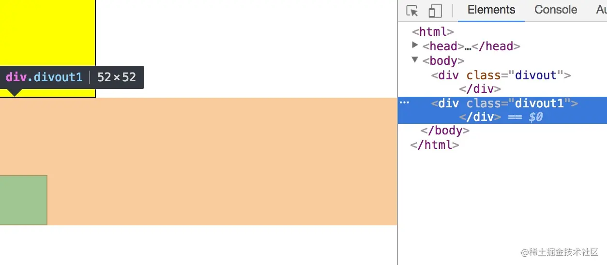
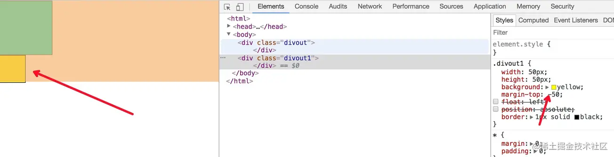
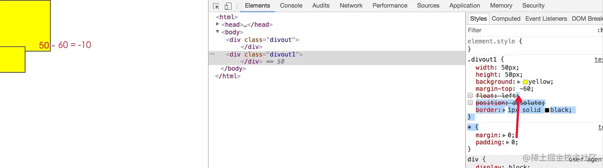
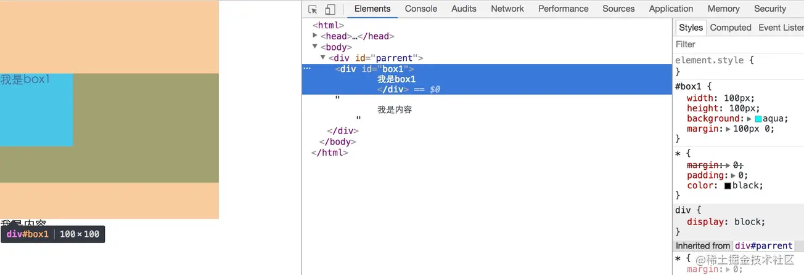

## 什么是外边距重叠
外边距重叠是指两个或多个盒子(可能相邻也可能嵌套)的相邻边界(其间没有任何非空内容、补白、边框)重合在一起而形成一个单一边界

## 相邻margin重叠问题
### 示例
```html
<style>
    * {
        margin: 0px;
        padding: 0px;
    }
    .divout {
        width: 100px;
        height: 100px;
        background: yellow;
        margin-bottom: 50px;
        border: 1px solid black;
    }
    .divout1 {
        width: 50px;
        height: 50px;
        background: yellow;
        margin-top: 80px;
        /* float: left; */
        /* position: absolute; */
        border: 1px solid black;
    }
</style>
<body>
    <div class="divout"></div>
    <div class="divout1"></div>
</body>
```
### 外边距重叠计算方式
- 全部为正值，取最大值

    

- 不全是正值，取绝对值，然后用正值的最大值减去绝对值的最大值

    
    

- 没有正值，则都取绝对值，然后用0减去最大值。

### 解决办法
- 底部元素设置为浮动float:left;
- 底部元素的position的值为absolute/fixed
- 在设置margin-top、bottom值时统一设置上或下

## 元素和父元素margin值问题
父元素无border、padding、inline content、clearance时，子元素的margin-top、bottom会与父元素的margin产生重叠问题

### 示例
```html
<style>
    *{
        margin:0;
        padding: 0;
        color: black;
    }
    #parrent{
        width:300px;
        height:150px;
        margin-top: 20px;
        background:teal;
    }
    #box1{
        width:100px;
        height:100px;
        background:aqua;
        margin:100px 0;
    }
</style>
<body>
    <div id="parrent">
        <div id="box1">
        我是box1
        </div>
        我是内容
    </div>
</body>
```


### 解决办法
- 外层元素添加padding
- 外层元素overflow:hidden;
- 外层元素透明边框：border: 1px solid transparent;
- 内层元素绝对定位position:absolute
- 内层元素加float:left，或display:inline-block;


[史上最全面、最透彻的BFC原理剖析](https://github.com/zuopf769/notebook/blob/master/fe/BFC%E5%8E%9F%E7%90%86%E5%89%96%E6%9E%90/README.md)

[CSS清浮动处理（Clear与BFC）](cnblogs.com/dolphinX/p/3508869.html)

## 资料
[CSS外边距(margin)重叠及防止方法](https://juejin.cn/post/6844903497045917710)