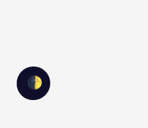
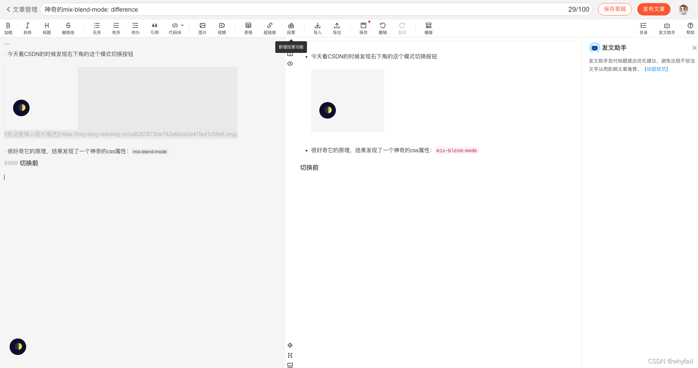
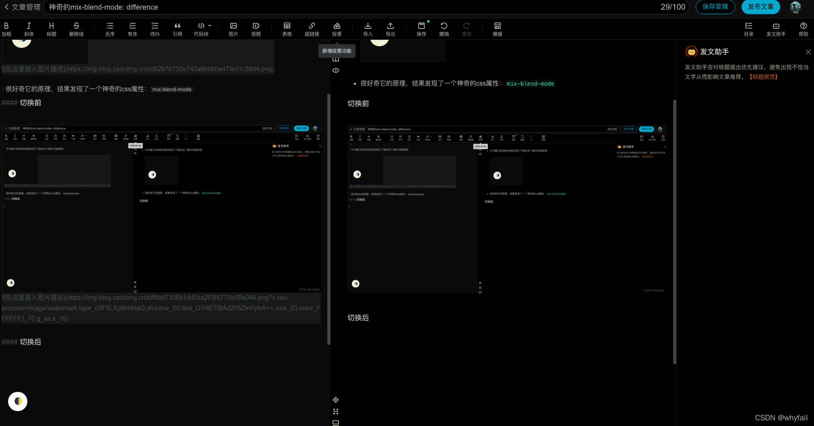
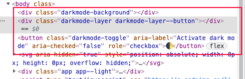
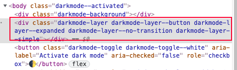
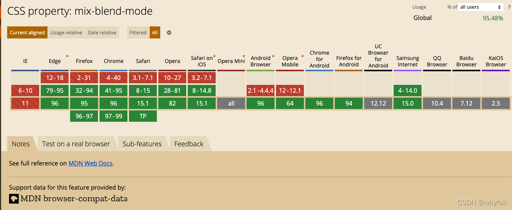

## 问题
之前安卓过CSDN的浏览器插件，右下角有一个DARK模式切换功能



出于好奇，今天了解了一下原理，结果发现一个神奇的css属性：mix-blend-mode

- 切换前

    

- 切换后

    

## 解析
在body标签下多了几个标签



最后锁定在第二个div标签

原理其实也很简单，在打开模式后，会在标签上多加几个class



其中的 darkmode-layer 这个 class 是这样的

```css
position: fixed;
pointer-events: none;
background: #fff;
transition: all 0.3s ease;
mix-blend-mode: difference;
```
这个div是铺满整个页面的，背景为白色 #fff,重点就是这个 mix-blend-mode: difference; 原谅我的孤陋寡闻，之前从没有见过这个属性，所以特意查了一下

<span style="color: red">**mix-blend-mode**：属性描述了元素内容应该与元素的直系父元素的内容和元素的背景如何混合</span>。可取的值有

```css
  mix-blend-mode: normal;         // 正常
  mix-blend-mode: multiply;       // 正片叠底
  mix-blend-mode: screen;         // 滤色
  mix-blend-mode: overlay;        // 叠加
  mix-blend-mode: darken;         // 变暗
  mix-blend-mode: lighten;        // 变亮
  mix-blend-mode: color-dodge;    // 颜色减淡
  mix-blend-mode: color-burn;     // 颜色加深
  mix-blend-mode: hard-light;     // 强光
  mix-blend-mode: soft-light;     // 柔光
  mix-blend-mode: difference;     // 差值
  mix-blend-mode: exclusion;      // 排除
  mix-blend-mode: hue;            // 色相
  mix-blend-mode: saturation;     // 饱和度
  mix-blend-mode: color;          // 颜色
  mix-blend-mode: luminosity;     // 亮度
```
插件所采用的就是这个mix-blend-mode:difference，也即是差值，这样就可以将整个页面转成和原来页面相反的颜色差值页面了，包括图片

不得不说css真牛逼，之后也可以在需要切换模式的项目中使用一下这个属性

自古有言：好东西，兼容性绝对不咋的


