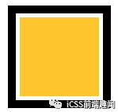
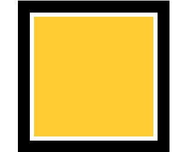
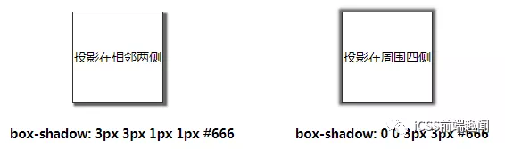
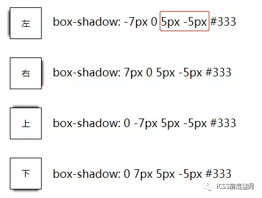
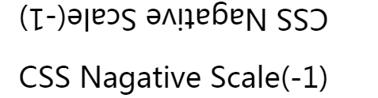
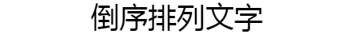
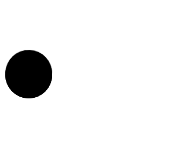
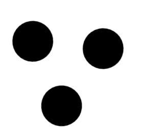
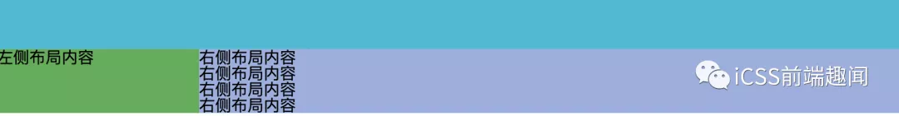

## 使用负值outline-offset实现加号
假设我们有这样一个简单的结构
```
<div></div>

div{
    width: 200px;
    height: 200px;
    outline: 20px solid #000;
    outline-offset: 10px;
}
```


修改outline-offset到一个合适的负值，那么在恰当的时候，outline边看就会箱内缩进为一个加号。

经过一番尝试，修改上述div的outline-offset为-118px
```
div {
    width: 200px;
    height: 200px;
    outline: 20px solid #000;
    outline-offset: -118px;
}
```
加上动画效果，大概是这样


### CodePen Demo--使用outline实现加号
很有意思，我尝试了很多不同的情况，最后总结了一个简单的规律，要使用负的outline-offset生成一个加号有一些简单的限制
- 容器的是一个正方形
- outline边框本身的宽度不能太小
- outline-offset负值x的取值范围为：-(容器宽度的一半+outline宽度的一半) < x < -(容器宽度的一半+outline宽度)

## 单侧投影
先说单侧投影,关于box-shadow,大部分时候，我们使用它都是用来生成一个两侧的投影，或者一个四侧的投影，如下：



ok，那如果要生成一个单侧的投影呢？

我们来看看box-shadow的用法的定义
```
box-shadow: node | [inset? && [ <offset-x> <offset-y> <blur-radius>? <spread-radius>? <color>? ] ]#
```
以box-shadow: 1px 2px 3px 4px #333为例，4个数字的含义分别是，x方向的偏移值、y方向的偏移值、模糊半径、扩张半径。

这里有个小技巧，**扩张半径可以为负值**

继续，如果阴影的模糊半径，与负的扩张半径一致，我们将看不到任何阴影，因为生成的阴影将被包含在原来的元素之下，除非给他设定一个方面的偏移值。所以这个时候，我们给定一个方面的偏移值，即可实现单侧投影



## 使用scale(-1)实现翻转
通常，我们要实现一个元素的180度翻转，我们会使用transform: rotate(180deg),这里有个小技巧，使用transform:scale(-1)可以达到同样的效果，看个DEMO
```
<p class="scale">CSS Nagative Scale</p>

.scale {
    transform: cale(1);
    animation: scale 10s infinite linear;
}
@keyframes scale {
    50% {
        transform: scale(-1);
    }
    100% {
        transform: scale(-1);
    }
}
```


GIF中第一行使用了transform:rotate(180deg)的效果


CodePen Demo -- 使用 scale(-1) 实现元素的翻转: https://codepen.io/Chokcoco/pen/VoQXVq

## 使用负letter-spacing倒序排列文字
与上面scale(-1)有异曲同工之妙的是负的letter-spacing.

letter-spacing属性明确了文字的间距行为，通常而言，除了关键字normal,我们还可以指定一个大小，表示文字的间距，像这样

```
<p class="letter_spacing">倒序排列文字</p>

.letter_spacing {
    font-size: 36px;
    letter-spacing: 0px;
    animation: move 10s infinite;
}
@keyframs move {
    40% {
        letter-spacing: 36px;
    }
    80% {
        letter-spacing: -72px;
    }
    100% {
        letter-spacing: -72px
    }
}
```
我们设置文字的letter-spacing从0-> -36px -> -72px，观察不同的变化



然而，受到中英文混排或者不同字体的影响，以及倒序后的排列方式，不建议使用这种方式来倒序排列文字。

## transition-delay 及 animation-delay的负值使用，立刻开始动画

我们知道，CSS动画及过渡提供了一个delay属性，可以延迟动画的进行

考虑下面这个动画：



简单的代码大概是这样
```
<div class="g-container">
    <div class="item"></div>
    <div class="item"></div>
    <div class="item"></div>
</div>

.item {
    transform: rotate(0) translate(-80px, 0);
}
.item:nth-child(1) {
    animation: rotate 3s infinite linear;
}
.item:nth-child(2) {
    animation: rotate 3s infinite 1s linear;
}
.item:nth-child(3) {
    animation: rotate 3s infinite 2s linear;
}

@keyframes rotate {
    100% {
        transform: roatate(360deg) translate(-80px, 0);
    }
}
```
如果，我们想要去掉这个延迟，希望在一进入页面的时候，3个球就同事移动，这个时候，只需要把正向的animation-delay改成负向即可

```
.item:nth-child(1) {
    animation: rotate 3s infinite linear;
}

.item:nth-child(2) {
    animation: rotate 3s infinite -1s linear;
}

.item:nth-child(3) {
    animation: rotate 3s infinite -2s linear;
}
```
这里，有个小技巧，被设置了animation-dealy为负值的动画会离职执行，开始的位置是起动画阶段中的一个阶段。所以动画在一开始的时刻就是下面的这样



以上述动画为例，一个被定义执行3s的动画，如果animation-delay为-1s,起点相当于正常执行，第2s(3-1)时的位置


## 负值margin
负值margin在CSS中算是运用的比较多的，元素外边距可以设置为负值。

在flexbox布局规划还没流行之前，实现多行等高布局还是需要下一番功夫的。其中一种方法便是使用正padding负margin相消的方法。

有如下布局



左右两栏的内容都是不确定的，也就是高度未知。但是希望无论左侧内容较多还是右侧内容较多，两栏的高度始终保持一致。

OK，其中一种 Hack 办法便是使用一个很大的正 padding 和相同的负 margin 相消的方法填充左右两栏：

```
.g-left {
  ...
  padding-bottom: 9999px;
  margin-bottom: -9999px;
}

.g-right {
  ...
  padding-bottom: 9999px;
  margin-bottom: -9999px;
}
```
可以做到无论左右两栏高度如何变化，高度较低的那一栏都会随着另外一栏变化

## 总结
另外，还有一些大家熟知的没有单独列出来，譬如
- 使用负margin实现元素的水平垂直居中
- 使用margin隐藏列表li收尾多余的边框
- 使用负text-indent实现文字的隐藏
- 使用负的z-index参与层级上下文排序

还有一些很深奥的，譬如张鑫旭大大在今年的 CSS 大会上分享的，利用负的 opacity 在 CSS 中实现了伪条件判断，配合 CSS 自定义属性，使用纯 CSS 实现 360° 的饼图效果：

第五届CSS大会主题分享之CSS创意与视觉表现: https://www.zhangxinxu.com/wordpress/2019/06/cssconf-css-idea/

额，虽然 CSS 负值的一些使用场景的确有有用之处，但是与此同时有可能带来的是代码可读性的下降。有的时候看到这些代码不得不好好捋一捋才能缓过神来，再感叹一句，原来如此。

如果有其他更好的更易理解的实现方式，具体使用实现的时候应该好好权衡一下。


## 原文
[玩爆CSS中的负值技巧](https://mp.weixin.qq.com/s/HycwHPzqBZplxLFLrmH5bg)