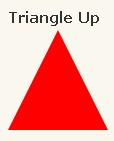

## 特殊形态实现
### 一个例子-css实现正方形div的三种方式
1. css3 vw单位
    1vw = 1% viewport width
    ```
    <div class="vw">hello, viewport</div>
    <style>
        .vw {
            width: 50%;
            height: 50vw;
            background: #ccc;
        }
    </style>
    ```
    实测不管用（chrome，版本 49.0.2623.110）

2. pading-bottom+after+abslute
    ```
    <div class="square">
        <div class="content">
            Hello!
        </div>
    </div>
    .square {
        width: 50%;
        background: #ccc;
    }

    .square:after {
        content: "";
        display: block;
        padding-bottom: 100%;
    }

    .content {
        position: absolute;
        width: 100%;
        height: 100%;
    }
    ```
    这个方法不错，而且还能在里面写字
3. 其他方法
    - 利用js计算出方块
    - 画一个正方形表格

### css实现三角形


```css
width: 0px;
height: 0;x
border-left: 50px solid transparent;
border-right: 50px solid transparent;
border-bottom: 100px solid red;
```
[纯css实现绘制三角形](https://www.cnblogs.com/chengxs/p/11406278.html)
## width，height

width,height百分比是根据父元素的宽高决定的

## padding margin
**<span style="color:red">padding 和margin中如果取百分比，这个百分比都是根据宽度而言的(父元素)</span>**

## font-size

也是根据父元素的font-size决定的百分比


[css中的单位](https://www.runoob.com/cssref/css-units.html)

[终于搞懂了 CSS 中的百分比是基于什么工作的了！](https://mp.weixin.qq.com/s/qOijlt_XCFpycdUPr_TnDA)