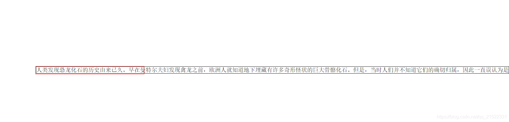
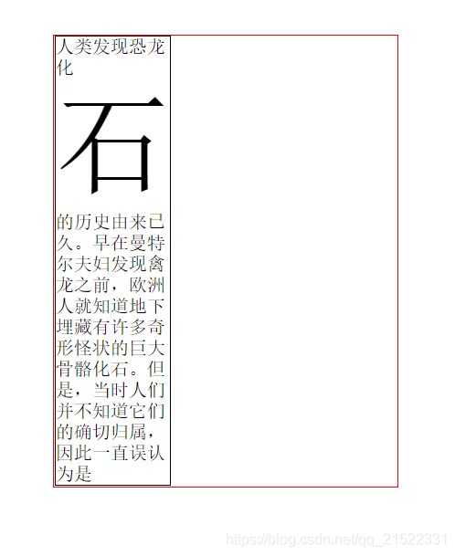
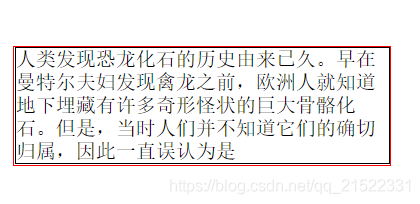
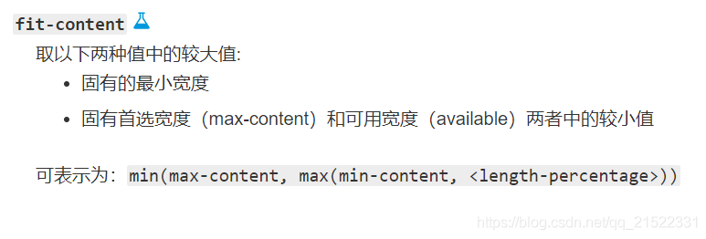

> 黑色的框是设置这些属性的盒子，红色的框是父盒子

## max-content

内容有多宽，盒子就有多宽，不会顾及父级盒子有多宽，只满足自己的需求

## min-content

装下单个最大内容的最小宽度,下面这个图片能够直观的说明这个意思

## fit-content

在不超过父级盒子宽度的情况下，尽量撑开盒子满足自己的需求

max-content和fit-content在自己内容不足以撑满父盒子时，宽度只为自己内容的最大宽度，不会强行撑大。

fit-content官方给出可以表示为一个公式：

## fill-available

width:fill-available表示盛满可用空间

[实例参考](https://www.cnblogs.com/xiaohuochai/p/7210540.html)