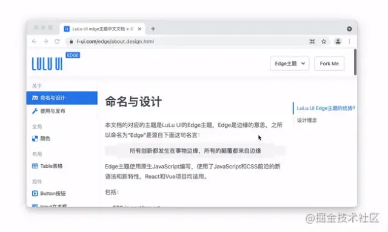
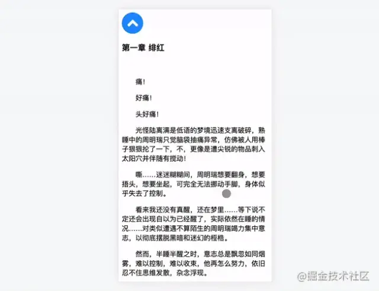
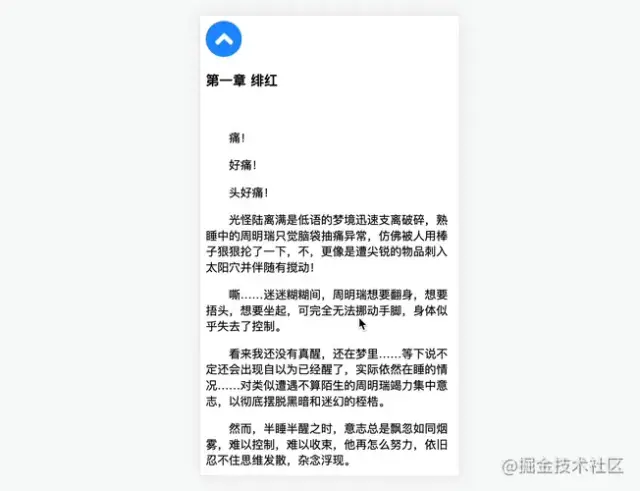
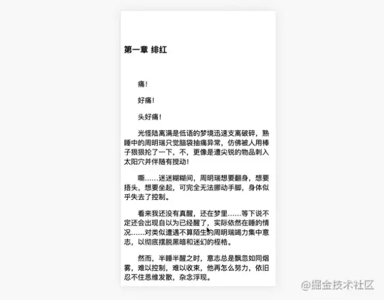
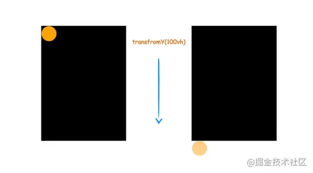
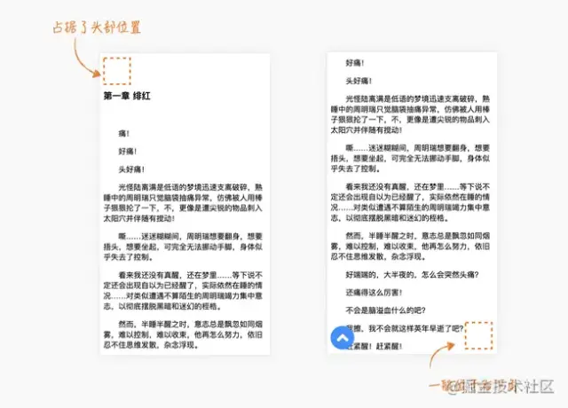
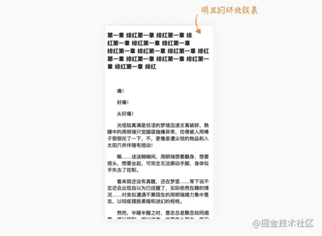
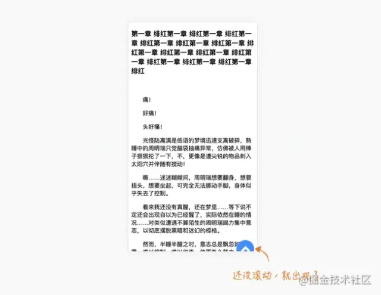
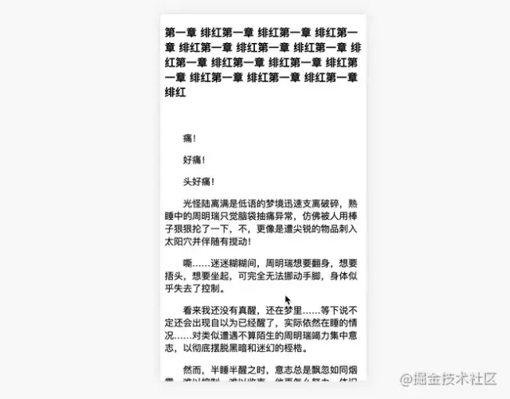
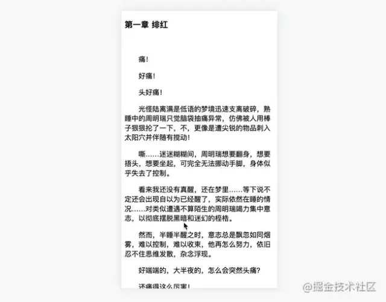

经常在某些文档中或文章中可以看到这样的一个返回顶部的功能，具体交互
1. 只有滚动一定距离才会出现，返回顶部重新隐藏
2. 点击返回到顶部
比如[LuLu UI](https://l-ui.com/edge/about.design.html)



又是点击，又是滚动的，看着好像必须要借助JavaScript了，其实也可不必，经过我的一番琢磨，仅仅使用一点点CSS就可以实现交互效果

## 粘性滚动
这里就需要一点点想象了。比如这里滚动到一定距离才出现，是不是有点类似CSS sticky的概念？只不过sticky是滚动到一定距离，然后就固定到某一位置

:::tip
元素根据正常文档流进行定位，然后相对它的**最近滚动祖先(nearest scrolling ancestor)**和containing block(最近块级祖先 nearest block-level ancestor)
，包括table-related元素，基于top、right、bottom 和left的值进行偏移。偏移值不会影响任何其他元素的位置
:::

虽然和我们需要的交互有点出入，但是仍然可以通过一定的技巧联合起来，先简单实现以下布局
```
<a class="back"></a>
<article>
...很多内容
</article>
```
这里注意需要将.back放在前面，不然没法触发粘性定位，然后给.back加上sticky定位
```
.back {
    position: sticky;
    display: block;
    top: 0;
    border-radius: 50%;
    background: url("data:image/svg+xml,%3Csvg xmlns='http://www.w3.org/2000/svg' viewBox='0 0 320 512'%3E %3Cpath fill='%23ffffff' d='M177 159.7l136 136c9.4 9.4 9.4 24.6 0 33.9l-22.6 22.6c-9.4 9.4-24.6 9.4-33.9 0L160 255.9l-96.4 96.4c-9.4 9.4-24.6 9.4-33.9 0L7 329.7c-9.4-9.4-9.4-24.6 0-33.9l136-136c9.4-9.5 24.6-9.5 34-.1z'%3E%3C/path%3E %3C/svg%3E") center no-repeat dodgerblue;
    background-size: 50%;
    width: 50px;
    height:50px;
}
```
由于这里的top给的为0,所以返回按钮在滚动过程中是贴在顶部的：如下



这时，如果把top改为一个负值会怎么样呢？
```
.back {
    position: sticky;
    top: -30px;
}
```
可以看到，按钮会在超出屏幕-30px的地方固定



接着，我们把.back向下便宜整个屏幕位置，也就是100vh
```
position: sticky;
top: -30px;
transform: translateY(100vh);
```
这样,和我们需要的效果已经很接近了，只是最后只出现了一部分，如下。



原理示意如下：


最后，把刚才的top设置的更小一些，直到.back可以完全出现，比如设置-60px
```
.back {
    position: sticky;
    top: -60px;
    transform: translateY(100vh)；
}
```
这样基本完成了，不过还有一些问题

## 右下角处理

上面的实现其实还有两个布局问题需要优化
1. 按钮本身占据了一定的空间
2. 按钮一般位于右下角



一般为了让一个元素不占空间，可能想到的方法是设置绝对定位。但是这里由于设置了position: sticky，所以肯定不能在设置绝对定位了。除此之外，我们还可以采用浮动float,可以轻易解决以上两个问题

```
.back {
    float:right
}
```
设置右浮动有两个好处，一是脱离文档流，不影响高度，二是实现右效果，实际效果如下


其实到了这里，还有个小问题的，当头部的文字比较多时，可以很清楚的看到有环绕效果，如下



如何处理呢？很简单，加一个负margin就可以了

```
.back {
    float: right;
    margin-top: -50px; // 自身高度
}
```
但是又出现了新问题，底下的按钮又漏出来了



由于top已经被sticky占用，现在改变按钮位置只能靠transform了，这里可以用calc进行计算，同时top也要相应减少自身高度
```
.back {
    float: right;
    margin-top: -50px;
    top: -110px; // 60 + 50
    transform: translateY(calc(100vh + 50px));
}
```


## 返回顶部
返回顶部就比较容易了，一般可以通过href='#'就可以事先，当然了为了平滑的滚动，可以加上scroll-behavior:smooth
```
html, body {
    scroll-behavior: smooth
}
```
实际效果如下



最后完整代码如下
```
html,body{
  scroll-behavior: smooth;
}
.back{
  position: sticky;
  float: right;
  top: -110px;
  margin-top: -50px;
  border-radius: 50%;
  background: url("data:image/svg+xml,%3Csvg xmlns='http://www.w3.org/2000/svg' viewBox='0 0 320 512'%3E %3Cpath fill='%23ffffff' d='M177 159.7l136 136c9.4 9.4 9.4 24.6 0 33.9l-22.6 22.6c-9.4 9.4-24.6 9.4-33.9 0L160 255.9l-96.4 96.4c-9.4 9.4-24.6 9.4-33.9 0L7 329.7c-9.4-9.4-9.4-24.6 0-33.9l136-136c9.4-9.5 24.6-9.5 34-.1z'%3E%3C/path%3E %3C/svg%3E") center no-repeat dodgerblue;
  background-size: 50%;
  width: 50px;
  height: 50px;
  transform: translateY(calc(100vh + 50px));
}

// HTML
<body>
  <a class="back" href="#"></a><!--添加再这里就行了-->
  <article>
  ...很多内容
  </article>
</body>
```

## 总结
以上借助 CSS sticky 实现了一个自动显示返回按钮的小交互，本身代码量并不复杂，其实是一点点想象力，把比较相似的效果联想起来，多多尝试，可能会带来不一样的解决方案。下面总结一下实现要点：
1. CSS sticky可以事先粘性滚动效果，可以设置负值
2. transformY(100vh)可以偏移1屏幕高度，不影响占位
3. 浮动可以脱离文档流，不影响高度
4. 负的margin可以抵消浮动的环绕效果
5. scroll-behavior: smooth可以实现平滑滚动
6. 兼容性取决于sticky 不兼容IE

## 原文
[奇技淫巧 ：巧用 CSS sticky 实现返回顶部功能](https://mp.weixin.qq.com/s/-yJmzwBd0LW8SRnh5BEAtQ)