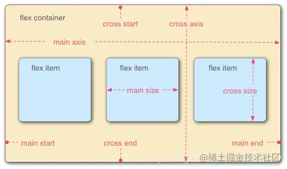
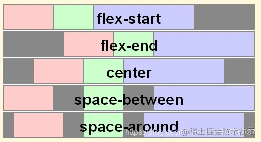
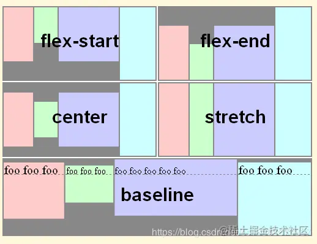
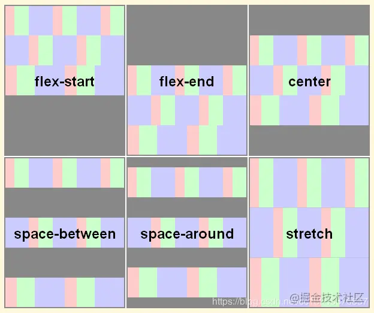
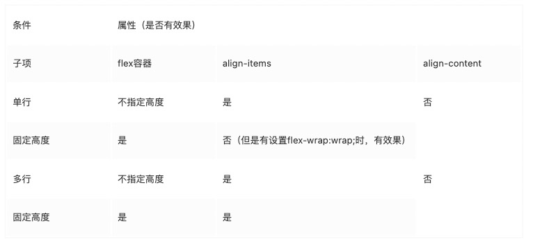

## align-items和align-content的区别
在用flex布局时，发现有两个属性功能好像有点类似:align-items 和 align-content,咋看之下，它们都是用于定义flex容器中元素在交叉轴(主轴为flex-derication定义的方向，默认为row，那么交叉轴跟主轴垂直即为column，反之它们互调，flex基本概念如下图所示)上的对齐方式，那么它们之间有什么区别呢？

### stack overflow 上的回答
[详见问题](https://stackoverflow.com/questions/31250174/css-flexbox-difference-between-align-items-and-align-content)

- [justfiy-content](https://www.w3.org/TR/css-flexbox-1/#propdef-justify-content)属性可应用于所有的flex容器，它的作用是设置flex子项(flex items)在主轴上的对齐方式。不同的取值效果如下所示

  

- align-items属性可以应用于所有的flex容器，它的作用是设置flex子项在每个flex行的交叉轴上的默认对齐方式。不同取值效果如下所示

  

- align-content只适用于多行的flex容器(也就是flex容器中的子项不只一行时该属性才有效果)，它的作用是当flex容器在交叉轴上有多余的空间时，将子项作为一个整体(属性值为：flex-start、flex-end、center时)进行对齐。不同取值的效果如下所示

  

### 总结
如下表

**总结：**从上标可知，对于align-items和align-content的区别，我们只需要记住一下两点，
1. align-items属性是针对单独的每一个flex子项起作用，它的基本单位是每一个子项，在所有情况下都有效果(当然要看具体的属性值)
2. align-congtent属性是将flex子项作为一个整体起作用，它的基本单位是子项构成的行，只在两种情况下有效果，1.子项多行且flex容器高度固定2.子项单行，flex容器高度固定且设置了flex-wrap:wrap

[align-items和align-content的区别](https://juejin.cn/post/6844903911690600456)