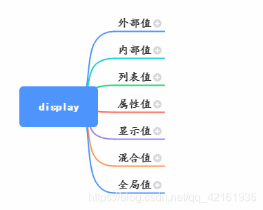

在此之前，这个分类完全没听过，对于display我的学习是这样的，一开始block、inline、inline-block，后来多了个none,在后来学了flex，其他的table、contents等也见过几次，但是没有深究。不过这里只是作为解释型的介绍，了解一些其他的属性值，有一些布局还是比较复杂的，像table、list、grid布局都是可以写很多的，以后可以单独吓出来

## 外部值
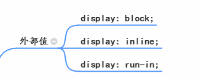

外部值就是定义自身元素的外部表现，而不影响其内的子元素。

- display: block;
- display: inline;

    块级元素和行内元素，这两个很常见了。譬如，div、h1-h6、p元素等就是块级元素，span、i、label等就是行内元素，通过改变这两个值，去改变他的视线方式

- display: run in

    这个属性倒是不常见，也不常用，基本上也只有IE和Opera支持他。很简单，就是让设置了这个值的属性【闯入】下一行
    ```html
    <span>我是</span>
    <span style="display: run-in">run in</span>
    ```
    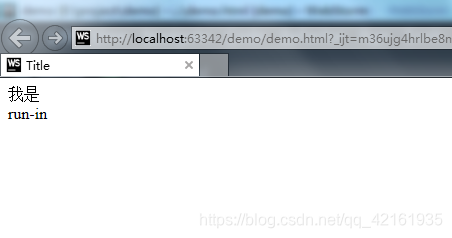

## 内部值
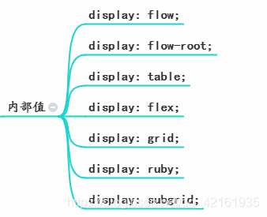

**和外部值相反，没布置就是定义子元素布局的**

- display: flow

    翻译过来就是流布局，具体怎么用代表什么意思也没有查出来，但对chrome不支持，基本可以放弃。

- display:flow-root

    不同于flow、flow-root可以用起来，可以撑开浮动的元素高度，就是可以清楚浮动效果
    ```html
    <div class="father">
        <div class="son">我是</div>
        flow-root
    </div>

    .father {
        display:flow-root;
        border:1px solid #000;
        width: 600px;
    }
    .son {
        float:left;
        width: 400px;
        height: 400px;
        background-color: pink
    }
    ```
- display: table

    当我们想写表格，但却想要自动换行，那么我们可以用&lt;div&gt;代替&lt;table&gt;&lt;tr&gt;&lt;td&gt;等标签。可以和属性类的table值搭配使用

- display:flex;

    弹性布局，和flex-driection、flex-wrap、flex-flow、justify-content、align-items、align-content配合使用，也可以使用连写flex。特别好用的一个布局方式，2009年诞生，它的诞生，不亚于css界一场工业革命，标志着float被彻底抛进历史的垃圾堆。比较常用，也比较多，想要更深入地学习可以看[A Complete Guide to Flexbox](https://css-tricks.com/snippets/css/a-guide-to-flexbox/)非常好。

- display: grid;

    网络布局--学习grid布局有两个重点：**一个重点是grid布局引入了一个全新的单位**：fr--它是fraction(分数)的缩写，所以从此之后，你的兵器库里除了px,em,rem，百分比这些常见的兵器以及vw,vh这些新式武器之外，又多了一个旁门暗器fr,要想用好grid，必须充分掌握fr.**另一个重点是斜杠操作符**，这可不是分数哦。它表示的是起始位置和结束位置，比如说3/4，这可不是 四分之三的意思，这是指一个元素从第 3行开始，到第 4行结束，但又不包括第 4行。

    grid布局是一种比较强大的布局方式，后面需要专门写一篇，本文知识简单介绍这些布局。

    [详情参考grid布局](https://css-tricks.com/snippets/css/complete-guide-grid/)

- display: ruby;

    旁注标记，看起来非常有用的一种布局，但是只有firefox支持比较好

- display:subgrid;

    display:subgrid;是属于 2017年 11月 9日发布的非正式的CSS网格布局模块第二级的内容。这是一个非常新的草案，并且争议不断。

    subgrid是想要大网格里还可以套小网格，并且互相不影响。但如果 grid里可以再套 subgrid的话，那我 subgrid里还想再套 subgrid怎么办？ subsubgrid吗？况且，到底是 grid:subgrid;还是 display:subgrid;这个也没有达成共识。

## 列表值
- display:list-item

    他和table相似，目的都是为了用div去替代&lt;ul&gt; &lt;li&gt;标签之类的
## 属性值
一些和table布局、ruby搭配一起控制页面布局的属性值
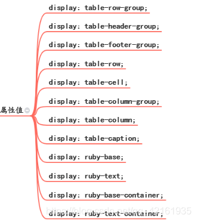

## 显示值
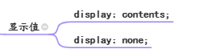

- display:content;

    经常会看到这个布局方式，但是不太懂它做了什么，简单看下他对布局和元素的影响：

    1. 它使div元素不产生任何边界框,因此元素的背景、边框和填充部分都不会渲染。然而，颜色(color)和字体(font)却可以渲染。所以我对它的理解是直影响其内容的样式生效
    ```html
    <div class="son">a</div>
    <div class="son diff">b</div>
    <div class="son">c</div>

    <style>
        .son {
            border: 1px slid deeppink;
            background-color: pink;
            font-size: 25px;
            color: orangered;
            width: 300px;
        }
        .diff {
            display: contents;
        }
    </style>
    ```
    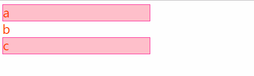

    2. 它对父元素的布局会继承，但同样的设置display:contents；时它本身的边框、边距、填充都会消失。如下一个父元素中有三个元素，其中第二个盒子，又有两个盒子，在父盒子中使用flex布局

    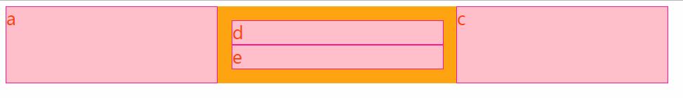

    在第二个子盒子中使用display:contents;后就会发生变化，第二个盒子不进没了边框、边距和填充，并且他的布局和父盒子的弹性布局效果一样。

    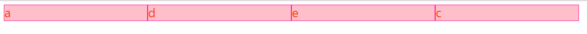

- display: none 

    隐藏；元素渲染，但是不显示，相当于v-show的使用

## 混合值
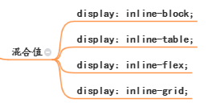

- display:inline-block; 行内块元素，即在行内显示块级元素
- display:inline-table; 即在行内显示表格元素
- display:inline-flex；即在行内显示弹性布局
- display:inline-grid；即在行内显示网格布局


## 全局值
几乎很多属性都存在这几种值

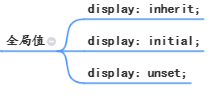

- display:inherit;  

    继承父元素的display属性

    刚刚说了,display:contents;也有继承的功能，那inherit相对于它就是没有本身让边框、边距、填充消失的功能，当然除非他继承的是contents；

    举个继承contents示例
    ```html
    <body>
    <div class="father">
        <div class="li">a</div>
        <div class="li diff">
            <div class="li differ">
                <div class="li">d</div>
                <div class="li">f</div>
            </div>
            <div class="li">e</div>
        </div>
        <div class="li">c</div>
    </div>
    </body>
    <style>
        .father {
            display: flex;
        }
        .li {
            border: 1px solid deeppink;
            background-color: pink;
            font-size: 25px;
            color: orangered;
            width: 300px;
        }
        .diff {
            border: 20px solid orange;
            display: contents;
        }
        .differ {
            border: 20px solid darkorange;
            display: inherit;
        }
    </style>
    ```
    没有设置inherit之前：

    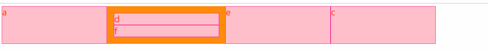

    设置inherit之后

    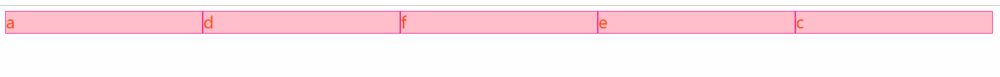

- display:initial;

    不管父元素怎么设定，恢复到浏览器最初时的display属性
- display:unset

    unset混合了inherit和initial。如果父元素设置了，就用父元素的设定，如果父元素没有设置，就用浏览器的缺省设置


## 原文
[原文](https://blog.csdn.net/qq_42161935/article/details/99844944)