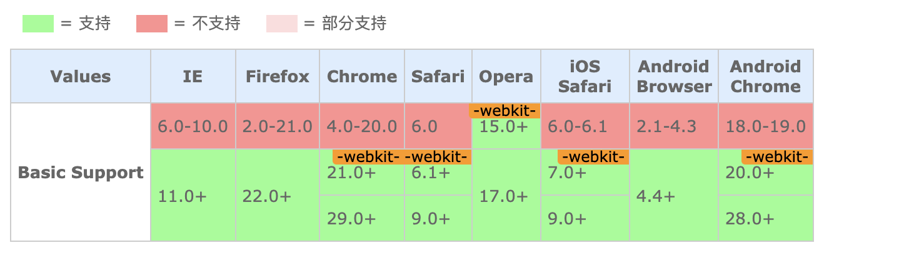

## 伸缩盒(新)

属性 | 版本 | 继承性 | 描述
---|---|---|---
flex | css3 | 无 | 复合属性。设置或检索伸缩盒对象的子元素如何分配空间
flex-grow | css3 | 无 | 设置或检索弹性盒的扩张比率
flex-shrink | css3 | 无 | 设置或检索弹性盒的收缩比率
flex-basis | css3 | 无 | 设置或检索弹性盒伸缩基准值
flex-flow | css3 | 无 | 复合属性。设置或检索伸缩盒对象的子元素排列方式
flex-direction | CSS3 | 无 | 设置或检索伸缩盒对象的子元素在父容器中的位置。
flex-wrap | CSS3 | 无 | 设置或检索伸缩盒对象的子元素超出父容器时是否换行。
align-content | CSS3 | 无 | 设置或检索弹性盒堆叠伸缩行的对齐方式。
align-items | CSS3 | 无 | 设置或检索弹性盒子元素在侧轴（纵轴）方向上的对齐方式。
align-self | CSS3 | 无 | 设置或检索弹性盒子元素自身在侧轴（纵轴）方向上的对齐方式。
justify-content | CSS3 | 无 | 设置或检索弹性盒子元素在主轴（横轴）方向上的对齐方式。
order | CSS3 | 无 | 设置或检索伸缩盒对象的子元素出現的順序。

### flex
#### 语法
flex: none | <'flex-grow'> <'flex-shrink'> ? || <'flex-basis'>

默认值:看各分拆属性

适用于：flex子项

继承性: 无

动画性: 否

计算值: 看各分拆属性

#### 取值
none: none关键字的计算值为:0 0 auto

<'flex-grow'>:用来指定扩展比率，即剩余空间是正值时此[flex子项]相对于flex容器里其他[flex子项]能分配到空间比例。在[flex]属性中该值如果被省略则默认为[1]

<'flex-shrink'>:用来指定收缩比率，即剩余空间是负值时此[flex子项]相对于[flex容器]里其他[flex子项]能收缩的空间比例。在收缩的时候比率会以伸缩基准值加权。在[flex]属性中该值如果被省略则默认为[1]

<'flex-basis'>:用来指定伸缩基准值，即在根据伸缩比率计算出剩余空间的分布之前，[flex子项]长度的起始值。

在[flex]属性中该值如果被省略则默认为0%。

在[flex]属性中该值如果被指定为[auto]，则伸缩基准值的计算是自身的<'width'>设置，如果自身的宽度没有定义，则长度取决与内容。

#### 说明
**复合属性。设置或检索弹性盒模型对象的子元素如何分配空间**
+ <span style="color: red">如果缩写[flex:1], 则其计算职位[1 1 0%];</span>
+ <span style="color: red">如果缩写[flex:auto],则其计算值为[1 1 auto];</span>
+ <span style="color: red">如果[flex:none],则计算值为[0 0 auto]</span>
+ <span style="color: red">如果[flex: 0 auto]或[flex:initial],则其计算值为[0 1 auto], 即[flex]初始值</span>
+ 实例：如下情况每个元素的计算宽为多少

```css
<ul class="flex">
    <li>a</li>
    <li>b</li>
    <li>c</li>
</ul>

.flex{display:flex;width:800px;margin:0;padding:0;list-style:none;}
.flex :nth-child(1){flex:1 1 300px;}
.flex :nth-child(2){flex:2 2 200px;}
.flex :nth-child(3){flex:3 3 400px;}
```
:::warning
本例定义了父容器宽(即主轴宽)为800px,由于子元素设置了伸缩基准值flex-basis，相加300+200+400=900，那么子元素将会溢出900-800=100px;

由于同时设置了**收缩因子**,所以加权综合可得300 x 1 + 200 x 2+400 x 3 = 1900px;

于是我们可以计算a,b,c将被溢出的溢出量是多少：

a被移出溢出量：(300 x 1/1900) x 100, 即约等于16px;

b被移出移出量：(200 x 2/1900) x 100, 即约等于21px

c被移出溢出量：(400 x 3/1900) x 100,即约等于63px

最后a,b,c的实际宽度分别为300-16=284px,200-21 = 179px;400-63=337px;
:::

**仍然是上面这个例子，不过将容器的宽度改成了1500px;**
```css
<ul class="flex">
    <li>a</li>
    <li>b</li>
    <li>c</li>
</ul>

.flex{display:flex;width:1500px;margin:0;padding:0;list-style:none;}
.flex :nth-child(1){flex:1 1 300px;}
.flex :nth-child(2){flex:2 2 200px;}
.flex :nth-child(3){flex:3 3 400px;}
```
:::warning
本例定义了父容器宽（即主轴宽）为1500px，由于子元素设置了伸缩基准值flex-basis，相加300+200+400=900，那么容器将有1500-900=600px的剩余宽度；

于是我们可以计算a,b,c将被扩展量是多少：

a的扩展量：(1/(1+2+3)) x 600，即约等于100px

b的扩展量：(2/(1+2+3)) x 600，即约等于200px

c的扩展量：(3/(1+2+3)) x 600，即约等于300px

最后a,b,c的实际宽度分别为：300+100=400px, 200+200=400px, 400+300=700px

从本例能看出：
当「flex-basis」在「flex」属性中不为0时（包括值为auto，此时伸缩基准值等于自身内容宽度），「flex子项」将分配容器的剩余空间（剩余空间即等于容器宽度减去各项的伸缩基准值）

当「flex-basis」在「flex」属性中等于0时，「flex子项」将分配容器的所有空间（因为各项的伸缩基准值相加等于0，剩余空间等于容器宽度减去各项的伸缩基准值，即减0，最后剩余空间值等于容器宽度），所以可以借助此特性，给各子项定义「flex: n」来进行按比例均分容器总宽度
:::

#### 兼容性 



#### 示例

```html
<!DOCTYPE html>
<html lang="zh-cmn-Hans">
<head>
<meta charset="utf-8" />
<title>align-content_CSS参考手册_web前端开发参考手册系列</title>
<meta name="author" content="Joy Du(飘零雾雨), dooyoe@gmail.com, www.doyoe.com" />
<style>
h1{font:bold 20px/1.5 georgia,simsun,sans-serif;}
.box{
	display:-webkit-flex;
	display:flex;
	width:400px;height:100px;margin:10px 0 0;padding:0;border-radius:5px;list-style:none;background-color:#eee;}
.box li{background:#aaa;text-align:center;}
.box li:nth-child(1){background:#999;}
.box li:nth-child(2){background:#aaa;}
.box li:nth-child(3){background:#ccc;}
#box li:nth-child(1){-webkit-flex:1;flex:1;}
#box li:nth-child(2){-webkit-flex:1;flex:1;}
#box li:nth-child(3){-webkit-flex:1;flex:1;}
#box2 li:nth-child(1){-webkit-flex:1 0 100px;flex:1 0 100px;}
#box2 li:nth-child(2){-webkit-flex:2 0 100px;flex:2 0 100px;}
#box2 li:nth-child(3){-webkit-flex:3 0 100px;flex:3 0 100px;}
#box3 li:nth-child(1){-webkit-flex:1 1 400px;flex:1 1 400px;}
#box3 li:nth-child(2){-webkit-flex:1 2 400px;flex:1 2 400px;}
#box3 li:nth-child(3){-webkit-flex:1 2 400px;flex:1 2 400px;}
</style>
</head>
<body>
<h1>flex示例：</h1>

<ul id="box" class="box">
	<li>flex:1;</li>
	<li>flex:1;</li>
	<li>flex:1;</li>
</ul>

<ul id="box2" class="box">
	<li>flex:1 0 100px;</li>
	<li>flex:2 0 100px;</li>
	<li>flex:3 0 100px;</li>
</ul>

<ul id="box3" class="box">
	<li>flex:1 1 400px;</li>
	<li>flex:1 2 400px;</li>
	<li>flex:1 2 400px;</li>
</ul>
</body>
</html>
```


[参考地址](http://css.doyoe.com/)