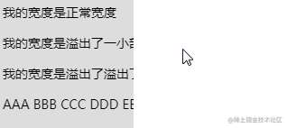
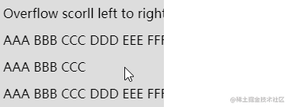

在许久之前，曾经写过这样一篇文章 -- [不定宽溢出文本适配滚动](https://mp.weixin.qq.com/s?__biz=Mzg2MDU4MzU3Nw==&mid=2247488698&idx=1&sn=56606975e13f2fe16718551b3d810d36&chksm=ce25774cf952fe5a04a6237f4c58a90cf7344bacb19bad1fc08842a2f7fe39a40abedddf3146&scene=21#wechat_redirect)。我们实现了这样一种效果：

1. 文本内容不超过容器宽度，正常展示
2. 文本内容超过容器的情况，内容可以进行跑马灯来回滚动展示

像是这样：



但是，之前的方案，有一个很明显的缺点，如果我们事先知道了容器的宽度，那么没问题，但是如果没法确定容器的宽度，也就文本宽度不确定，容器宽度也不确定的话，那么整个效果会有一点瑕疵。

瑕疵在于，当时的 CSS 技术，其实没法判断当前文本内容长度是否超过了其容器宽度，导致即便文本没有没有超长，Hover 上去也会进行一个来回滚动，像是这样：



## 容器查询cqw 和 CSS 数学函数 max

首先，我们的问题其实可以抽象成：

判断文本宽度与容器宽度的大小差异，文本宽度是否大于容器宽度
如果超出，则设置来回位移动画，位移的幅度为容器宽度与文本宽度的差值
那么，我们一步一步来。

假设我们的 HTML 结构如下：
```html
<div class="marquee">
    <span>Lorem ipsum dolor sit amet elit.Animi, aliquid.</span>
</div>
```
其中，div为容器，span为文本内容。同时，我们利用容器查询，**设置父容器marquee为容器查询的容器，并且将基于容器的inline-size 维度**。
```css
.marquee {
    white-space: nowrap;
    container-type:inline-size;
}
```
继续，我们如何能够在span中得知，当前span的内容长度与父容器宽度谁比较大呢？

在之前，这是很难办到的，但是现在，我们有了容器查询后，可以靠容器查询单位cqw完成。

首先，什么是容器查询？容器查询它给予了CSS，在不改变浏览器视口宽度的前提下，只是根据容器的宽度变化，对布局做成调整的能力

> [新时代布局新特性 -- 容器查询](https://github.com/chokcoco/iCSS/issues/201)

容器查询带来了很多新的单位，其中有：
- <span style="color: blue">cqw 容器查询宽度(Container Query Width)占比。1cqw等于容器宽度的1%;假设容器宽度是100px，则此时1cqw对应的计算值就是10px</span>
- <span style="color:blue">cqh 容器查询高度(Container Query Height)占比，1cqh等于容器高度的1%</span>
- <span style="color:blue">cqi 表示容器查询内联方向尺寸(Container  Query Inline-Size)占比。这个是逻辑属性单位，默认情况下等同于cqw</span>
- <span style="color:blue"></span>
- <span style="color:blue"></span>
- <span style="color:blue"></span>