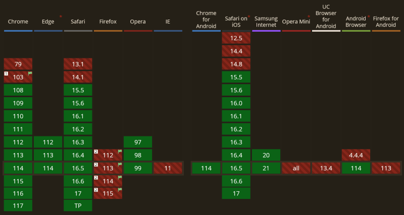

多年来，CSS 开发者一直希望能够根据元素内容来选择元素。虽然 CSS 提供了许多基于特征选择元素的选择器，但直到最近才有了根据元素内容选择元素的方法。

幸运的是，:has() 的引入改变了这一点。这个新功能是一个“颠覆者”，因为它允许你根据元素内容选择元素。

在本文中，我们将深入探讨其中一个最受期待的 CSS 特性：:has 伪类。事实证明，它远不仅仅是一个“父选择器”。

## 语法
:has伪类用于根据元素内容选择元素.它应用于我们想应用规则的元素上，并将其传递给应该包含的元素的选择器：

```css
// 这里我们选择任何包含 h1 的具有 post类的元素
.post:has(h1) {
    background-color: teal;
}
```
## 使用 :has 作为父选择器
将:has 作为父选择器可以简化很多情况。以下是一些可能的示例：
- 在应用的某些页面上，你可能想要更改 body 元素的全局字体大小或背景颜色。在引入:has伪类之前，我们通常需要通过后端根据页面类型切换某些HTML类。然而通过父选择器，现在可以轻松实现

    ```css
    body:has(.container.legal-mentions) {
        font-size: 80%;
    }
    ```
- 在博客文章列表中，如果文章包含图片，我们希望这些文章的边距发生变化

    ```css
    .post:has(img) {
        margin-left: 0;
    }
    ```
这本身就非常强大，但是在使用 组合器 时，我们可以做得更多。
## 进一步使用组合器
> 组合器以一种使它们彼此和文档中内容位置之间关系更有用的方式组合其他选择器---MDN

我们可以在has中使用**子代选择器 >**,已确保我们选择的是直接子元素。例如，要选择具有hr元素作为直接子元素的div元素，可以使用选择器 div:has(>hr)

我们可以使用**相邻兄弟组合器 +** 来选择紧跟在另一个元素后面的元素。例如，要选择一个标题后面跟着一个副标题，可以使用 title:has(+.subtitle)

## 与其他伪类组合
当在子元素上悬停时，改变容易的杨阿是，牛吧？

我们可以把 has 与 hover 结合使用来实现这一点。例如，如果我们希望在容器中的任何链接 hover 时都有边框，可以使用以下代码：
```css
container:has(a:hover) {
    border: 2px solid pink;
}
```
## 浏览器支持
截至 2023 年 6 月，:has 伪类仅在 Firefox 中缺失。然而，它在一个标志后面，所以很快应该会被支持！




## 结论
:has 伪类是CSS选择器工具中的一个强大补充。它允许你根据元素内容选择元素，从而简化了许多情况，是你的代码更易于维护。通过使用组合器，你可以进一步细化选择并实现更高级的效果。

尽管在 Firefox 中仍然缺失，但预计它很快会得到支持。在发布到生产环境之前，请务必在所有主要浏览器中测试你的代码。