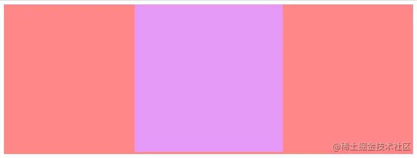
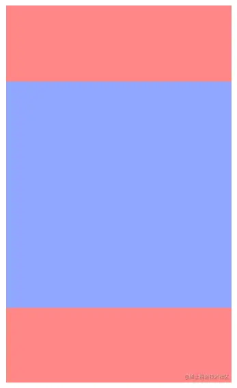

## 水平居中
实现水平布局比较简单,方法也比较多，这里总结7种常用的布局方法，其公共的CSS代码如下
```css
.parent {
    background: #ff8787;
}
.child {
    height: 300px;
    width: 300px;
    background: #e599f7;
}
```
其HTML结构也是固定的，就是一个父级，其宽度继承了&lt;body&gt;的宽度，还有一个子级，这里是固定的300px*300px，代码如下：
```html
<div class="parent">
  <div class="child"></div>
</div>
```
最终的实现效果如下：


### 1. 使用 text-align 属性
该元素为行内块元素，也就是display: inline-block; 的元素,可以通过为其父元素设置 text-align：center实现水平居中。实现的CSS代码如下
```css
.parent {
    /* 对于子级为dsiplay: inline-block;可以通过text-align:center 实现水平居中 */
    text-align: center;
}
.child {
    display: inline-block;
}
```
### 2. 定宽块级元素水平居中(方法一)
对于定宽的块级元素实现水平居中，最简单的一种方式就是margin: 0 auto;但是指的注意的是一定需要设置宽度
```css
.child {
    margin: 0 auto;
}
```
### 3. 定宽块级元素水平居中(方法二)
对于开启定位的元素，可以通过left属性和margin实现。
```css
.child {
    /* 开启定位 */
    position: relative;
    left: 50%;
    /* margin-left 为负的宽度的一半 */
    margin-left: -150px;
}
```
### 4. 定宽块级元素水平居中
```css
.parent {
  position: relative;
  height: 300px;
}

.child {
  /* 开启定位 父相子绝 */
  position: absolute;
  /* 水平拉满屏幕 */
  left: 0;
  right: 0;
  width: 300px;
  /* 拉满屏幕之后设置宽度，最后通过 margin 实现水平居中 */
  margin: auto;
}
```
### 5.  定宽块级元素水平居中(方法四)
```css
.parent {
  position: relative;
}

.child {
  /* 开启定位 */
  position: absolute;
  /* 该方法类似于 left 于 -margin 的用法，但是该方法不需要手动计算宽度。 */
  left: 50%;
  transform: translateX(-50%);
}
```
### 6. Flex方案
通过Flex可以有很多方式实现居中方案的效果
```css
.parent {
    height: 300px;
    display: flex;
    justify-content: center;
}
.child {
    margin: auto;
}
```
### 7. Grid方案
通过Grid实现居中布局比通过Flex实现的方式更多一些。

```css
.parent {
  height: 300px;
  /* 开启 Grid 布局 */
  display: grid;
  /* 方法一 */
  justify-items: center;
  /* 方法二 */
  justify-content: center;
}

.child {
  /* 方法三 子元素 margin: auto*/
  margin: auto;
}
```
## 垂直居中
实现垂直布局也是比较简单的，方法也比较多，这里总结了6中常用的布局方法，其公共的Css代码如下
```css
.parent {
    height: 500px;
    width: 300px;
    margin: 0 auto;
    background-color: #ff8787;
}
.child {
    width: 300px;
    height: 300px;
    background-color: #91a7ff;
}
```
其HTML结构也是固定的，就是一个父级包裹一个子级，这里的子级是固定的300px * 300px，代码如下
```html
<div class="parent">
    <div class="child"></div>
</div>
```
最终效果如下


### 1. 行内块级元素垂直居中
若元素是行内块级元素，基本思想是子元素使用 display:inline-block,vertical-align: middle; 并让父元素行高等于高度。

```css
.parent {
    /* 为父级容器设置行高 */
    line-height: 500px;
}
.child {
    /* 将子级元素设置为 inline-block 元素 */
    display: inline-block;
    /* 通过 vertical-align: middle; 实现居中 */
    vertical-align: middle;
}
```
### 2. 定位方式实现(方法一)


## 资料
[总结了42种前端常用布局方案](https://juejin.cn/post/7028962991345254407)