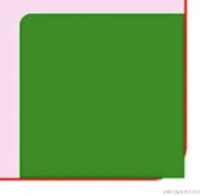
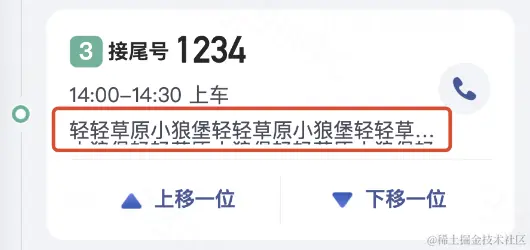
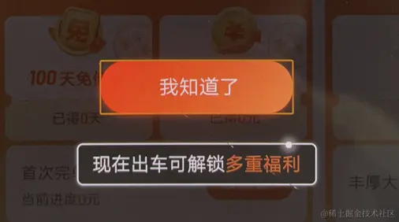
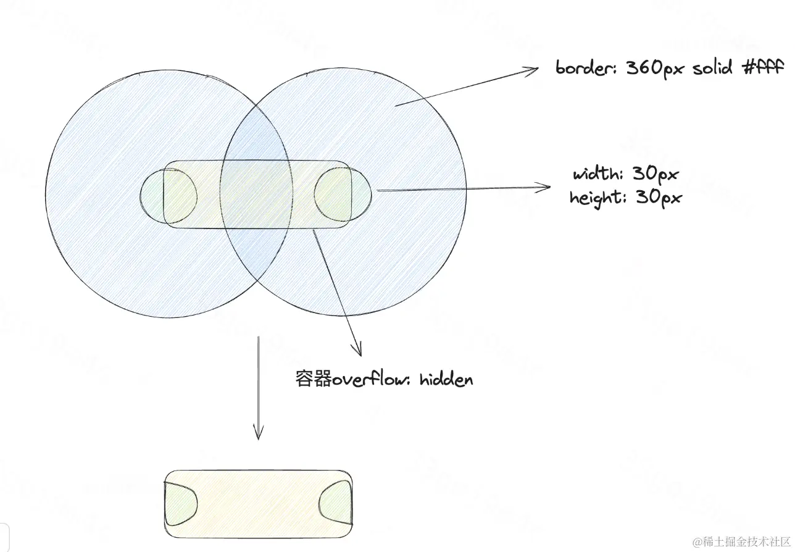
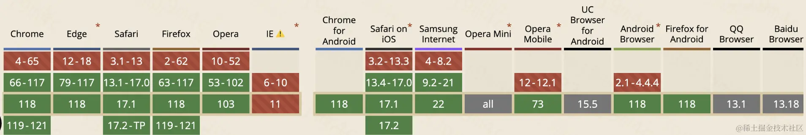
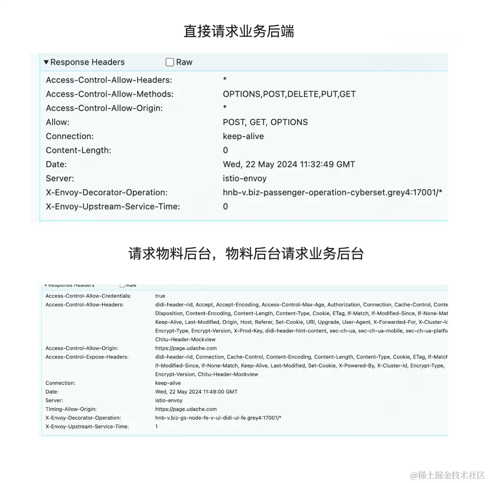
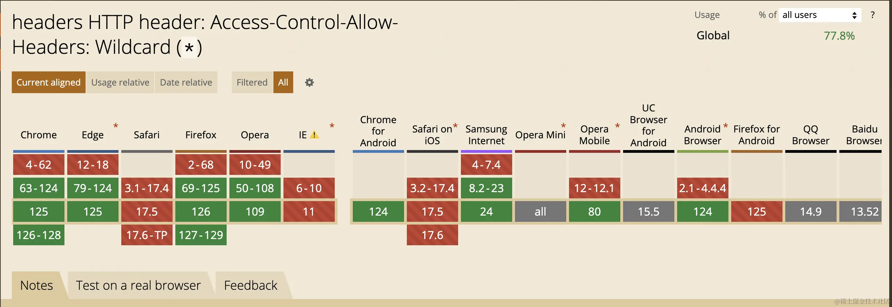

## IOS圆角不生效
ios中使用border-raduis配合overflow:hidden出现了失效的情况



> 出现此问题的原因是因为ios手机会在transform的时候导致border-radius失效

解决方法: 在使用动画效果带 transform 的元素的上一级div元素的css加上下面语句

```css
-webkit-transform:rotate(0deg);
```

## ios文本省略溢出问题
在部分ios手机上会出现以下情况



### 原因
在目标元素上设置font-size = line-height,并加上以下单行省略代码
```css
.text-overflow {
    display: -webkit-box;
    overflow : hidden;
    text-overflow: ellipsis;
    word-break: break-all;
    -webkit-line-clamp: 1;
    -webkit-box-orient: vertical;
}
```
或
```css
.text-overflow {
    overflow: hidden;
    white-space: nowrap;
    text-overflow: ellipsis;
}
```
由于不同系统包含的字体的行高不一致，即使设置了height = ling-height 一样会有以上问题

### 解决问题
经过测试，在height = line-height = font-size 的情况下，加上 padding-top: 1px 可以解决这个问题，即在需要使用单行省略的地方加上
```css
.demo {
    height: 28px;
    line-height: 28px;
    font-size: 28px;
    padding-top: 1px;
}
```
如： &lt;div class="text-overflow demo"&gt;我是需要进行单行省略的文案&lt;div&gt;


## 安卓手机按钮点击后有橙色边框



解决方案
```css
button:focus {
    outline: none;
}
```
### 优惠劵打孔效果
需求中经常需要实现一类效果：优惠券打孔，如下图所示：


通常情况下会找设计采用图片的形式，但这个方案最大的缺陷是无法适配背景变化。因此，我们可以采用如下方案，左右两侧各打一个空，且穿透背景



具体细节可以参考这篇文章：[纯 CSS 实现优惠券透明圆形镂空打孔效果](https://blog.csdn.net/haplant/article/details/125015825)


## Clipboard 兼容性问题
navigator.clipboard 兼容性不是很好,低版本浏览器不支持



解决方案
```js
const copyText = (text: string) => {
    return new Promise(resolve => {
        if(navigator.clipboard?.writeText) {
            return resolve(navigator.clipboard.writeText(text));
        }
        // 创建输入框
        const textarea = document.createElement('textarea');
        document.body.appendChild(textarea);
        // 隐藏此输入框
        textarea.style.position = 'absolute';
        textarea.style.clip = 'rect(0 0 0 0)';
        // 赋值
        textarea.value = text;
        // 选中
        textarea.select();
        // 复制
        document.execCommand('copy', true);
        textarea.remove();
        return resolve(true);
    })
}
```
## Unocss打包样式不生效
这个问题是由webpack缓存导致的，在vue.config.js中添加以下代码
```js
config.module.rule('vue').uses.delete('cache-loader');
```
具体原因见：[UnoCSS webpack插件原理](https://juejin.cn/post/7325255455290621986)

## 低端机型options请求不过问题
在我们的业务需求中，覆盖的人群很广，涉及到的机型也很多。于是我们发现在部分低端机型下（oppo R11、R9等），有很多请求只有options请求，没有真正的业务请求。导致用户拿不到数据，报network error错误，我们的埋点数据也记录到了这一异常。

在我们的这个项目中，我们的后台有两个，一个提供物料，一个提供别的数据。但是奇怪的是，物料后台是可以正常获取数据，但业务后台就不行！

经过仔细对比二者发送的options请求，发现了问题所在：



发现二者主要存在以下差异
1. Access-Control-Allow-Headers: *
2. Access-Control-allow-origin: *

于是我便开始排查两个响应头的兼容性，发现在这些低端机型上，Access-Control-Allow-Headers: * 确实会有问题,这些旧手机无法识别这个通配符，或者直接进行了忽略，导致options请求美国，自然就没有后续真正的请求了



解决方案：由后台枚举前端需要的headers,在Access-Control-Allow-Headers中返回
