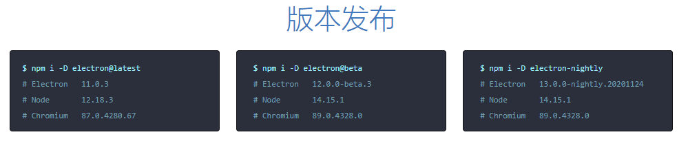

[原文](https://blog.csdn.net/qq_39235055/article/details/111995373)

## 什么是Electron
### 介绍
- 使用Javascript、HTML、CSS等技术开发跨平台(Windows、Linux、MacOS)桌面应用--这是Electron的官网简介
- 最初被Github开发，2013年4月11日以Atom Shell为名起步，2014年5月16日开源，2015年4月17日改名为Electron。

### 组成
