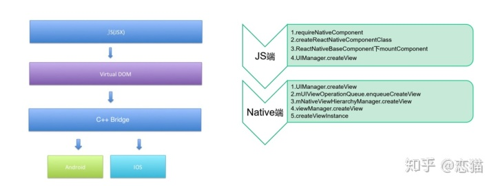
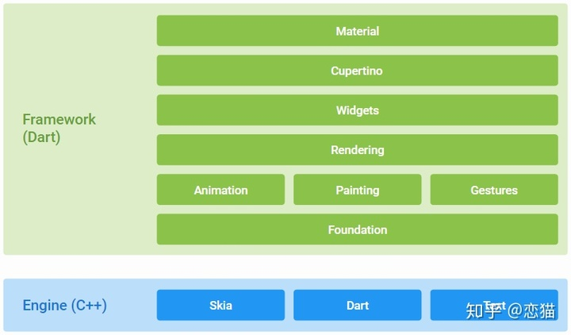

## 实现原理
在Android和IOS上，**默认情况下Fultter和React Native都需要一个原生平台的Activity/ViewController支持，且在原生层面属于一个"单页面应用"，而他们之间最大的不通点在于UI构建**

- React Native

    React Native是一套UI框架，默认情况下React Native会在Activity下加载JS文件，然后运行在JavascriptCore中解析Bundle文件布局，最终堆叠出一系列的原生控件进行渲染。

    简单来说就是**通过JS代码配置页面布局，然后React Native最终会解析渲染成原生控件**,如View标签对应ViewGroup/UIView，&lt;ScrollView&gt;标签对应ScrollView/UIScrollView，&lt;Image&gt;标签对应ImageView/UIImageView等。

    

    所以相较于如Ionic等框架而言，React Native让页面的性能得到进一步提升

- Flutter

    如果说React Native是为了开发者做了平台兼容，那Flutter则更想是为开发者屏蔽平台的概念。

    > Flutter中只需平台提供一个Surface和一个Canvas，剩下的Flutter说你可以躺下了，我们自己来动

    Flutter中绝大部分的Widget都与平台无关，开发者基于Framework开发App，而Framework运行在Engine纸上，由Engine进行适配和跨平台支持。这个跨平台的支持过程，其实就是将Flutter UI中的Widget"数据化"，然后通过Engine上的Skia直接绘制到屏幕上

    

所以从上可以看出:**React Native的Learn once，write anywhere的思路，就是只要你会React，那么你可以用写React的方式，在去开发一个性能不错的app，而Flutter则是让你忘掉平台，专注于Flutter UI就好了**

- DOM

    额外补充一点，React的虚拟DOM的概念相信大家都知道，这是React的性能保证之一，而Flutter其实也存在类似的虚拟DOM概念

    > 看过我Flutter系列文章可能知道，Flutter中我们写的Widget，其实并非真正的渲染控件，这一点和React Native中标签类似，Widget更像配置文件，由它组成的Widget树并非真正的渲染树

    **Widget在渲染时会经过Element变化，最后转化为RenderObject在进行绘制，而最终组成的RenderObject树才是"真正的渲染DOM"每次Widget树触发的改变，并不一定会导出RenderObject树的完全更新**

    **所以在实现原理上 React Native 和 Flutter 是完全不同的思路，虽然都有类似“虚拟 DOM 的概念” ，但是React Native 带有较强的平台关联性，而 Flutter UI 的平台关联性十分薄弱。**

## 资料
[全网最全 Flutter 与 React Native 深入对比分析](https://wjrsbu.smartapps.cn/zhihu/article?id=70070316&isShared=1&_swebfr=1&_swebFromHost=baiduboxapp)
