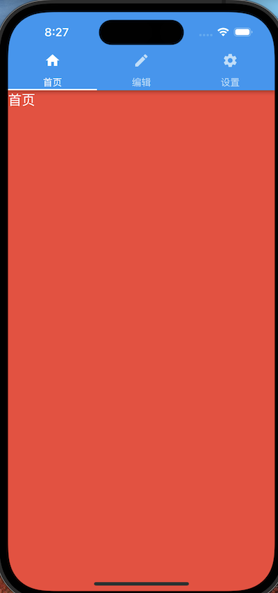

[原文](https://www.jianshu.com/p/061c39384084)

在flutter使用TabController过程中
```js
TabController _tabController;
```
提示：<span style="color: red">Non-nullable instance field '_tabController' must be initialized.
Try adding an initializer expression, or a generative constructor that initializes it, or mark it 'late'.</span>

如果 _tabController 是全局的变量，在之前版本中是不报错，看到报错信息已经提示了这么修改，添加修饰词 late,稍后初始化的意思

<span style="color: blue">"Flutter Late就是Flutter的延迟执行函数，它被用来处理延迟执行请求，以确保在特定时间之后才会执行"。这样就解决报错了</span>

然后在 initState()方法中初始化

```js
void initState() {
    super.initState();

    _tabController = TabController(length: 3, vsync: this)
}
```
## 完整代码
```js
import 'package:flutter/material.dart';

void main() => runApp(MaterialApp(
      debugShowCheckedModeBanner: false,
      title: "TabBar Inside AppBar Demo",
      home: TopTabBarAppBarDemo(),
    ));

class TopTabBarAppBarDemo extends StatefulWidget {
  @override
  _TopTabBarAppBarDemoState createState() => _TopTabBarAppBarDemoState();
}

class _TopTabBarAppBarDemoState extends State<TopTabBarAppBarDemo> with SingleTickerProviderStateMixin {
  late TabController _tabController;

  @override
  void initState() {
    super.initState();

    _tabController = TabController(length: 3, vsync: this);
  }

  @override
  void dispose() {
    _tabController.dispose();
    super.dispose();
  }

  Widget getTabBar() {
    return TabBar(controller: _tabController, tabs: [
      Tab(text: "首页", icon: Icon(Icons.home)),
      Tab(text: "编辑", icon: Icon(Icons.edit)),
      Tab(text: "设置", icon: Icon(Icons.settings)),
    ]);
  }

  Widget getTabBarPages() {
    return TabBarView(controller: _tabController, children: <Widget>[
      Container(
        color: Colors.red,
        child: Text("首页",
            style: Theme.of(context) //
                .primaryTextTheme
                .titleLarge),
      ),
      Container(color: Colors.green),
      Container(color: Colors.blue)
    ]);
  }

  @override
  Widget build(BuildContext context) {
    return Scaffold(
        appBar: AppBar(
          flexibleSpace: SafeArea(
            child: getTabBar(),
          ),
        ),
        body: getTabBarPages());
  }
}
```
效果图：

