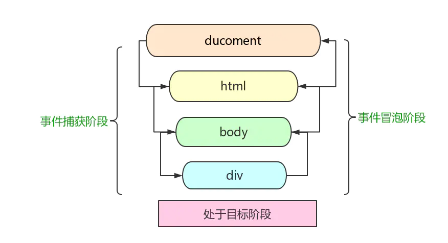
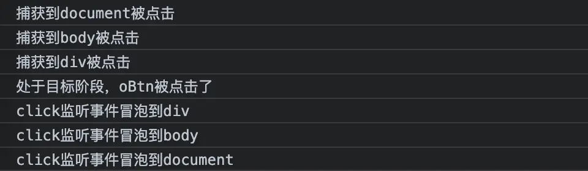
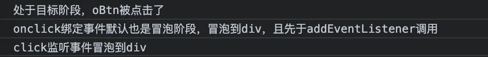

## JS事件绑定

> 均已点击事件为例

### 0级把函数赋值给DOM元素的[事件处理程序属性](https://developer.mozilla.org/zh-CN/docs/Web/API/GlobalEventHandlers)

也叫DOM 0级事件处理程序,分为两个
- <span style="color: blue">标签内写onclick事件</span>
- <span style="color: blue">在JS写onclick = funciton() {} 函数</span>

<span style="color: blue">一个DOM元素对象拥有很多事件处理程序属性(onclick是这些属性之一，其他还有很多比如onchange、onfocus...)</span>

```js
// 1 HTML元素行间事件
<input id="myButton" type="button" value="Press Me" onclick="alert('thanks');" >

<button onclick="btnClick()">我是oBtn,点击我</button>
fuction btnClick() {
    console.log(this, 'oBtn被点击了')； // this指向全局对象呢
}
// 2
<button id="btnId">我是目标oBtn,点击我</button>

var oBtn = document.getElementById('btnId');
oBtn.onclick = function(event) {
    console.log('我是oBtn绑定的第一个onclick事件');
}

// 或者
var btnClick = function(){ // 函数表达式
  // 函数内部的this指向 oBtn (DOM元素对象/节点对象)
  console.log('我是oBtn绑定的第二个onclick事件', this, this.id)
} 
oBtn.onclick = btnClick // 把函数赋值给一个事件处理程序属性(onclick)
// oBtn.onclick = null //去掉绑定的事件
```

我们给element.onclick赋了两次值，第二次的值当然会覆盖第一次的值，因此会执行第二个函数里的内容

### 1级DOM(为什么没有1级DOM)
DOM级别1于1998年10月1日成为W3C推荐标准，1级DOM标准中并没有定义事件相关的内容，所以没有所谓的1级Dom事件模型。

在2级DOM中除了定义了一些DOM相关的操作之外还定义了一个事件模型，这个标准下的事件模型就是我们所说的2级事件模型
### 2级通过事件监听的方式来绑定事件

也叫DOM 2级事件处理程序

```js
function btnClick1() {
  console.log('我是oBtn绑定的监听事件一')
}
function btnClick2() {
  console.log('我是oBtn绑定的监听事件二', this) // this指向 oBtn
}
oBtn.addEventListener('click', btnClick1)
oBtn.addEventListener('click', btnClick2)
// oBtn.removeEventListener('click', btnClick1) // 解绑监听事件
```
addEventLienter可以给同样一个事件注册多个事件处理程序

## DOM 事件流

【DOM2级事件】规定，事件流包含3个阶段，捕获阶段，目标阶段，冒泡阶段.

- <span style="color: blue">**捕获阶段**: 事件对象从目标的祖先(window)一路传播到目标的父级元素</span>
- <span style="color: blue">**目标阶段**：事件对象到达[事件目标](https://www.w3.org/TR/DOM-Level-3-Events/#event-target).如果该[事件类型](https://www.w3.org/TR/DOM-Level-3-Events/#event-type)不会冒泡，则事件对象将会在次阶段完成停止.(**不会冒泡的事件类型:scroll、blur、focus、mouseleave 、mouseenter 以及Media事件(onpause、onplay等))**)</span>
- <span style="color: blue">**冒泡阶段**: 以和捕获阶段相反的顺序，从事件目标的父元素开始传播到window结束</span>



:::tip
对于事件目标上的事件监听器来说，事件会处于目标阶段。这时会触发该元素(即事件目标)上所有监听器，而不在乎这个监听器注册时的useCapture参数是true还是false
:::

<span style="color: red">[addEventListennter](https://developer.mozilla.org/zh-CN/docs/Web/API/EventTarget/addEventListener)方法可以控制listener的触发阶段(捕获、冒泡)。**而其他事件绑定方式均没有捕获阶段**。虽然一般都是将处理程序添加到事件的冒泡阶段(**只要不阻止冒泡，且事件类型会冒泡，默认都是在此阶段**)，说明冒泡的兼容性好</span>。但是需要灵活控制嵌套元素同一事件的触发顺序这种特殊情况，只有addEventListener()能事件

语法：target.addEventListener(type, listener, [useCapture])

- **target:** 一个文档上的元素Element,Document和Window或者任何其他支持事件的对象(比如XMLHttpRequest).

- **type:** 表示监听[事件类型](https://developer.mozilla.org/zh-CN/docs/Web/Events)的字符串

- **useCapture:** 指在事件冒泡阶段/捕获阶段触发该监听器，以处理事件处理程序。默认是false，即冒泡阶段

```js
<button id="btnId">我是目标oBtn，点击我</button>

var oBtn = document.querySelector('#btnId')
var oDiv = document.querySelector('div')
var oBody = document.querySelector('body')

// 绑定 onclick 事件，默认也是按冒泡顺序来执行的，没有捕获阶段。
oBtn.onclick = function () {
  console.log('处于目标阶段，oBtn被点击了')
}
oDiv.addEventListener('click', function (e) {
  console.log('click监听事件冒泡到div')
})
oBody.addEventListener('click', function () {
  console.log('click监听事件冒泡到body')
})
document.addEventListener('click', function () {
  console.log('click监听事件冒泡到document')
})

oDiv.addEventListener('click', function () {
  console.log('捕获到div被点击')
}, true) // true表示在捕获阶段执行，false或不传参表示冒泡阶段
oBody.addEventListener('click', function () {
  console.log('捕获到body被点击')
}, true)
document.addEventListener('click', function () { 
  console.log('捕获到document被点击')
}, true)
```



其实我们很少利用冒泡做什么实质操作，甚至经常要阻止冒泡。因此我们可以将事件流理解成:先捕获事件(拿到事件消息)，然后处理，在冒泡出去(给予响应),这么个过程(不太对？)

## 阻止事件冒泡

function stopBubble(event){ event.stopPropagation() }

```js
var oBtn = document.querySelector('#btnId')
var oDiv = document.querySelector('div')
var oBody = document.querySelector('body')

oBtn.onclick = function () {
  console.log('处于目标阶段，oBtn被点击了')
}

// DOM 0级事件处理程序，将处理程序绑定在元素的 onclick 属性上，
// 没有捕获阶段，默认也是按冒泡顺序来执行的。
oDiv.onclick = function (e) {
  console.log('onclick绑定事件默认也是冒泡阶段，冒泡到div，且先于addEventListener调用')
  // e.stopPropagation() // 阻止事件冒泡，使用方式和监听器一样 -- 执行结果 同在在dev中addEventListener
}
oBody.onclick = function () {
  console.log('onclick绑定事件冒泡到body')
}

oDiv.addEventListener('click', function (e) {
  console.log('click监听事件冒泡到div')
  e.stopPropagation() // 阻止事件冒泡
})
oBody.addEventListener('click', function () {
  console.log('click监听事件冒泡到body')
})
document.addEventListener('click', function () {
  console.log('click监听事件冒泡到document')
})
document.onclick = function () {
  console.log('onclick绑定事件冒泡到document')
}
```



onclick绑定事件(Dom 0级事件处理程序)先于监听器事件(DOM 2级事件处理程序)执行。

## 阻止默认事件
function stopDefault(event) { event.preventDefault() }

```js
<a id="aId" href="">我是a标签，即使href为空点击我默认还是会跳转</a>

document.querySelector('#aId').addEventListener('click', function (e) {
  e.preventDefault()
  console.log('我是a链接被点击了，没有跳转')
})
```

## 资料
[对JS中addEventListener底层实现原理的个人理解](https://blog.csdn.net/HarryMing/article/details/95181585)

[JS--DOM0级事件处理和DOM2级事件处理](https://www.cnblogs.com/holyson/p/3914406.html)