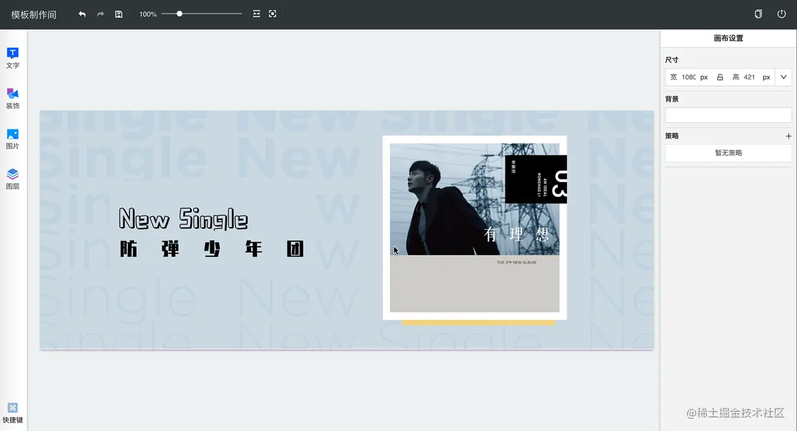

这个页面有着类似PPT的交互:从左侧的工具栏中选择元素放入中间的画布、在画布中可以删除、操作(拖动、缩放、旋转等)这些元素

在这个编辑过程中，让用户能够进行操作的撤销、重做会提高编辑效率，大大提高用户体验，而本文要讲的正式这个功能实现中的探索和总结

## 功能分析
用户的一些列操作会改变页面的状态


在进行了某个操作后，用户有能力回到之前的某个状态，即**撤销**


在撤销某个操作后，用户有能力再次恢复这个操作，即**重做**


当页面处于某个状态时，这时用户进行了某个操作后，这个状态后面的状态会被抛弃，此时会产生一个新的状态分支


下面，开始实现这些逻辑

## 功能初实现
基于以上的分析，实现撤销重做功能需要实现

- <span style="color: blue">保存用户的每个操作</span>
- <span style="color: blue">针对每个操作设计与之对应的一个撤销逻辑</span>
- <span style="color: blue">实现撤销重做的逻辑</span>

### 第一步:数据化每一个操作
操作造成的状态改变可以用语言来描述，如下图，页面上有一个绝对定位div和一个button，每次点击button会让div向右移动10px.这个点击操作可以被描述为:div的样式属性left增加10px


显然，Javascript并不认识这样的描述，需要将这份描述翻译成Javascript认识的语言
```js
const action = {
    name: 'changePosition',
    params: {
        target: 'left', 
        value: 10
    }
}
```
上面代码中使用变量name表示操作具体的名称，params存储了该操作的具体数据。不过JavaScript目前让然不知道如何使用这个它，还需要一个执行函数来指定如何使用上面的数据：
```js
function changePosition(data, params) {
    const { property, distance } = params;
    data = { ...data };
    data[property] += distance;
    return data;
}
```
其中，data为应用的状态数据，params为action.params;

### 第二步:编写操作对应的撤销逻辑
撤销函数中结构与执行函数类似，也应该能获取到data和action
```js
function changePositionUndo(data, params) {
    const { property, distance } = params;
    data = { ...data };
    data[property] -= distance;
    return data;
}
```
所以，action的设计应当同时满足执行函数和撤销函数的逻辑

### 第三步:撤销、重做处理
上述的action、执行函数、撤销函数三者作为一个整体共同描述了一个操作，所以存储时三者都要保存下来。

这里基于约定进行绑定:执行函数名等于操作name,撤销函数名等于name + 'Undo'，这样就只需要存储action，隐式的存储了执行函数和撤销函数

编写一个全局模块存放函数、状态等：src/manager.js
```js
const functions = {
    changePosition(state, params) {},
    changePositionUndo(state,params) {},
}

export default {
    data: {},
    actions: [],
    undoActions: [],
    getFunction(name) {
        return functions[name]
    }
}
```
那么，点击按钮会产生一个新的操作，我们需要做的事情有三个
- <span style="color: blue">存储操作action</span>
- <span style="color: blue">执行该操作</span>
- <span style="color: blue">如果处于历史节点，需要产生新的操作分支</span>
```js
import manager form 'src/manager.js';

buttonElem.addEventListener('click', () => {
    manager.actions.push({
        name: 'changePosition',
        params: { target: 'left', value: 10}
    })

    const execFn = manager.getFunction(action.name);
    manager.data = execFn(manager.data, action.params);

    if(manager.undoActions.length) {
        manager.undoActions = [];
    }
})
```
其中，undoActions存放的是撤销的操作action,这里清空表示抛弃当前节点以后的操作。将action存进manager.actions,这样需要撤销操作的时候，直接取出manager.actions中最后一个action，找到对应撤销函数并执行即可
```js
import manager from 'src/manager.js';

function undo() {
    const action = manager.actions.pop();
    const undoFn = manager.getFunction(`${action.name}Undo`);
    manager.data = undoFn(manager.data, action.params);
    manager.undoActions.push(action)
}
```
需要重做的时候，取出manager.undoActions中最后的action,找到对应执行函数并执行
```js
import manager from 'src/manager.js';

function redo() {
    const action = manager.undoActions.pop();
    const execFn = manager.getFunction(action.name);
    manager.data = execFn(manager.data, action.params);
}
```

## 模式优化:命令模式
以上代码可以说基本满足了功能需求，但是在我看来让然存在一些问题：

- <span style="color: red">管理分散：某个操作的action、执行函数、撤销函数分开，当项目越来越大将会维护困难</span>
- <span style="color: red">职责不清: 并么有明确规定执行函数、撤销函数、状态改变交给业务组件执行还是给全局管理者执行，这不利于组件和操作的复用</span>

想有效地解决以上问题，需要找到一个合适的新模式来组织代码，我选择了命令模式。

### 命令模式简介
<span style="color: blue">简单来说，命令模式将方法、数据都封装到单一的对象中，对调用方与执行方进行解耦，达到职责分离的目的</span>

以顾客在餐厅吃饭为例子
- 顾客点餐时，选择想吃的才，提交一份点餐单
- 厨师收到这份菜单后根据内容做菜

<span style="color: blue">期间，顾客和厨师之间没有见面交谈，而是通过一份点餐单来形成联系，这份点餐单就是一个命令对象，这样的交互模式就是命令模式</span>

### action+ 执行函数+ 撤销函数= 操作命令对象
为了解决管理分散的问题，可以吧一个操作的action、执行函数、撤销函数作为一个整体封装成一个命令对象
```js
class ChangePositionCommand {
    constructor(property, distance) {
        this.property = property; // 如left
        this.distance = distance; // 如10
    }
    execute(state) {
        const newState = {...state};
        newState[this.property] += this.distance;
        return newState;
    }
    undo(state) {
        const newState = {...state};
        newstate[this.property] -= this.distance;
        return newState;
    }
}
```
### 业务组件只关心命令对象的生成和发送
在状态数据处理过程中往往伴随着一些副作用，这些与数据耦合的逻辑会大大降低组件的复用性。因此，业务组件不关心数据修改过程，而是专注于自己指着:生成操作命令对象发送给状态管理者
```js
import manager from 'src/manager';
import { changePositionCommand } from 'src/commands';

buttonElem.addEventListener('click', () => {
    const command = new ChangePositionCommand('left', 10);
    manager.addCommand(command);
})
```
### 状态管理者值关心数据变更和操作命令对象治理
```js
class Manager {
    constructor(initialState) {
        this.state = initialState;
        this.commands = [];
        this.undoCommands = [];
    }
    addCommand(command) {
        this.state = command.execute(this.state);
        this.commands.push(command);
        this.undoCommands = [];
    }
    undo() {
        const command = this.commands.pop();
        this.undoCommands.push(command);
    }
    redo() {
        const command = this.undoCommands.pop();
        this.state = command.execute(this.state);
        this.commands.push(command);
    }
}
export default new Manager({});
```
这样的模式已经可以让项目的代码变得健壮，看起来已经不错了，但是能不能更好呢？

## 模式进阶：数据快照式
命令模式要求开着针对每一个操作都要额外开发一个撤销函数，这无疑是麻烦的。接下来我们要介绍数据快照就是改进这个缺点

<span style="color: blue">数据快照式通过保存每次操作后的数据快照，然后在撤销重做的时候通过历史快照恢复页面，模式模型如下</span>


要使用这种模式是有要求的
- <span style="color: blue">应用的状态数据需要集中管理，不应该分散在各个组件</span>
- <span style="color: blue">数据更改流程中有统一的地方可以做数据快照存储</span>

这些要求不难理解，既然要产生数据快照，集中管理才会更加便利。基于这些要求，我选择了市面上较为流行的Redux来作为状态管理器

### 状态数据结构设计
按照上面的模型图，Redux的state可以设计成
```js
const state = {
    timeline: [],
    current: -1,
    limit: 1000,
}
```
代码中，各个属性的含义为
- timeline：存储数据快照的数组
- current：当前数据快照的指针，为timeline的索引
- limit：规定了timeline的长度，防止存储的数据量过大

### 数据快照生成的方式
假设应用初始的状态数据为：
```js
const data = { left: 100 };
const state = {
    timeline: [data],
    current: 0,
    limit: 1000,
}
```
进行了某个操作后，left加100, 有些新手可能会直接怎么做
```js
const newData = data;
newData.left += 100;
state.timeline.push(newData);
state.current += 1;
```
这显然是错误的，因为Javascript的对象是引用类型，变量名只是保存了他们的引用，真正的数据存放在内存中，所以data和newData共享一份数据，所以历史数据和当前数据都会发生变化

1. 方式一：使用深拷贝

    深拷贝的实现最简单的方法就是使用JSON对象的原生方法：
    ```js
    const newData = JSON.parse(JSON.stringify(data));
    ```
    或者借助一些工具比如dash
    ```js
    const newData = lodash.cloneDeep(data);
    ```
    不过，深拷贝可能会出现循环引用而引起的死循环问题，而且，深拷贝会拷贝每一个节点，这样的方式带来了无谓的性能损耗
2. 方式二：构建不可变数据

    假设有个对象如下，需要修改第一个component的width为200
    ```js
    const state = {
        components: [
            { type: 'rect', width: 100,  height: 100 },
            { type: 'triangle': width: 100, height: 50}
        ]
    }
    ```
    目标属性的在对象树中的路径为：['components', 0, 'width']，这个路径上有些数据是引用类型，为了不造成共享数据的变化，这个引用类型要先变成一个新的引用类型，如下：
    ```js
    const newState = { ...state };
    newState.components = [...state.components];
    newState.components[0] = { ...state.components[0] };
    ```
    这时你就可以放心修改目标值了：
    ```js
    newState.components[0].width = 200;
    console.log(newState.components[0].width, state.components[0].width); // 200, 100
    ```
    这样的方式只修改了目标属性节点的路径上的引用类型值，其他分支上的值是不变的，这样节省了不少内存。为了避免每次都一层一层去修改，可以将这个处理封装成一个工具函数：
    ```js
    const newState = setIn(state, ['components', 0, 'width'], 200)
    ```
    setIn [源码](https://github.com/cwajs/cwa-immutable/blob/master/src/setIn.js)

### 数据快照处理逻辑
运行某个操作，reducer代码为
```js
function operationReducer(state, action) {
    state = {...state};
    const { current, limit } = state;
    const newData = ...;// 省略过程
    state.timeline = state.timeline.slice(0, current + 1);
    state.timeline.push(newData);
    state.timeline = state.timeline.slice(-limit);
    state.current = state.timeline.length - 1;
    return state;
}
```
有两个地方需要解释：

- <span style="color: blue">timline.slice(0, current + 1)：这个操作是前文提到的，进行新操作时，应该抛弃当前节点后的操作，产生一个新的操作分支；</span>
- <span style="color: blue">timline.slice(-limit)：表示只保留最近的 limit 个数据快照；</span>

### 使用高阶reducer
在实际项目中，通常会使用[combineReducers](https://redux.js.org/api/combinereducers)来模块化reducer,这种情况下，在每个reducer中都要重复以上的逻辑。这时候就可以使用高阶reducer函数来抽取公共逻辑
```js
const highOrderReducer = reducer => {
    return (state, action) => {
        state = { ...state };
        const { timeline, current, limit } = state;
        // 执行真实的业务的reducer
        const newState = reducer(timeline[current], action);
        // timeline 处理
        state.timeline = timeline.slice(0, current + 1);
        state.timeline.push(newState);
        state.timeline = state.timeline.slice(-limit);
        state.current = state.timeline.length - 1;
        return state;
    }
}
```
这个高阶 reducer 使用 const newState = reducer(timeline[current], action) 来对业务 reducer 隐藏数据快照队列的数据结构，使得业务 reducer 对撤销重做逻辑无感知，实现功能可拔插。

### 增强高阶reducer,加入撤销重做逻辑
撤销重做时也应该遵循 Redux 的数据修改方式使用 store.dispatch，为：
- store.dispatch({ type: 'undo' })
- store.dispatch({ type: 'redo'})
这两种action不应该进入到业务reducer，需要进行拦截
```js
const highOrderReducer = (reducer) => {
  return (state, action) => {
    // 进行 undo、redo 的拦截
    if (action.type === 'undo') {
        return {
            ...state,
            current: Math.max(0, state.current - 1),
        };
    }
    // 进行 undo、redo 的拦截
    if (action.type === 'redo') {
        return {
            ...state,
            current: Math.min(state.timeline.length - 1, state.current + 1),
        };
    }

    state = { ...state };
    const { timeline, current, limit } = state;
    const newState = reducer(timeline[current], action);
    state.timeline = timeline.slice(0, current + 1);
    state.timeline.push(newState);
    state.timeline = state.timeline.slice(-limit);
    state.current = state.timeline.length - 1;
    return state;
  };
}
```
### 使用 react-redux 在组件中获取状态
我在项目使用的是React和React-redux，由于state的数据结构发生了变化，所以在组件中获取状态的写法也要响应的调整
```js
import React from 'react';
import { connect } from 'react-redux';

function mapStateToProps(state) {
    const currentState = state.timeline[state.current];
    return {};
}

class SomeComponent extends React.Component {}

export default connect(mapStateToProps)(SomeComponent);
```
然而，这样的写法让组件感知到了撤销重做的数据结构，与上面所说的功能可插拔明显相悖，我通过重写store.getState方法来解决
```js
const store = createStore(reducer, initialState);

const originGetState = store.getState.bind(store);

store.setState = (...args) => {
    const state = originGetState(...args);
    return state.timeline[state.current]
}
```


## 资料
[Web 应用的撤销重做实现](https://juejin.cn/post/6844903921878564872#heading-13)