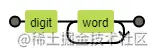

## 正则表达式到底是什么
正则表达式(Regular Expression)其实就是一门工具，目的是为了字符串模式匹配，从而实现搜索和替换功能。它是一种描述规则的表达式。<span style="color: red">而它的底层原理也十分简单，就是使用状态机的思想进行模式匹配，大家可以利用[https://regexper.com/](https://regexper.com/)这个工具很好的可视化自己写的表达式</span>

如<span style="color:orange">/\d\w+/</span> 这个正则表达式



对于具体的算法实现，大家如果感兴趣可以阅读《算法导论》。

## 从字符出发
我们学习一个系统化知识，一定要从基础构成来了解。正则表达式的<span style="color:blue">基本组成元素分为：字符和元字符</span>。字符很好理解，就是基础的计算机字符编码，通常正则表达式里面使用的就是数字、英文字母。而元字符，也被称为特殊字符，是一些用来表示特殊语义的字符。如^表示非，|表示或等。利用这些元字符，才能构造出强大的表达式模式(pattern)。接下来我们就来从这些基本单位触发，学习一下如何构建正则表达式

### 单个字符
最简单的正则表达式可以由简单的数字和字母组成，没有特殊语义，纯碎就是一一对应关系。如想在'apple'这个单词,就直接用<span style="color: blue">/a/</span>这个正则就可以了。

但是如果想要匹配特殊字符的话，就得请出我们第一个元字符<span style="color:blue">\\</span>,它是转义字符字符，顾名思义，就是让其后续的字符是去其本来的含义，举个例子

想匹配<span style="color:orange">\*</span>这个字符，由于<span style="color:orange">\*</span>这个符号本身是特殊字符,所以我们要利用转义元字符<span style="color:blue">\\</span>来让它是去其本来的含义

```javascript
/\*/
```

如果本来这个字符不是特殊字符，使用转义符号就会让它拥有特殊的含义。我们通常需匹配一些特殊字符，比如空格，制表符，回车，换行符，而这些就需要我们使用转义字符来匹配。
特殊字符|正则表达式|以及方式
---|---|---
换行符|\n|new line
换页符|\f|form feed
回车符|\r|return
空白符|\s | space
制表符|\t| tab
垂直制表符|\v|vertical tab
回退符|[\b]|backspace，之所以使用[]符号是避免和\b重复

### 多个字符
单个字符的映射关系是一对一的，即正则表达式被用来筛选匹配的字符只有一个。而这显然是不够的，只要引入集合区间和通配符的方式就可以事先一对多的匹配了。

在正则表达式里,集合的定义方式是使用中括号<span style="color: orange">[</span>和<span style="color: orange">]</span>。如<span style="color: orange">/[123]/</span>这个正则就能同时匹配1,2,3三个字符。那如果我想匹配所有的数字怎么办？从0到9显然太多抵消，所以元字符<span style="color: orange">-</span>就可以用来表示区间范围，利用<span style="color: orange">[0-9]</span>就能匹配所有的数字，<span style="color: orange">[a-z]</span>则可以匹配所有的英文小写字母

即便有了集合和区间的定义方式，如果想要同时匹配多个字符也还要一一列巨额，这是低效的。所以在正则表达式里衍生了一批用来同事匹配多个字符的简便正则表达式

匹配区间|正则表达式| 记忆方式
---|---|---
除了换行符之外的任意字符|.|句号，除了句子结束符
单个数字[0-9]|\d|digit
除了[0-9]|\D|not digit
匹配下划线在内的单个字符[A-Za-z0-9_]|\w|word
非单个字符|\W|not word
匹配空白字符，包括空格、制表符、换页符和换行符|\s|space
匹配非空白字符|\S|not space

## 循环与重复
一对一和一对多的字符匹配都讲完了。接下来，就该介绍如何同时匹配多个字符。要实现多个字符的匹配我们只要多次循环，重复使用我们之前的正则规则就可以了。那么根据循环次数的多少，我们可以分为0次，1次，多次，特定次

### 0|1
元字符<span style="color: orange">?</span>代表了匹配一个字符或者0个字符。试想一下你要匹配<span style="color: orange">color</span>和<span style="color: orange">colour</span>这个单词,就需要同时保证<span style="color: orange">u</span>这个字符能否出现都能被匹配到，所以你的正则表达式应该是这样啊的<span style="color: orange">/colou?r/</span>

###  >=0 
元字符<span style="color: orange">*</span>用来匹配0个字符或无数个字符。通常用来过滤某些可有可无的字符串

### >=1
元字符<span style="color: orange">+</span>适用于要匹配同个字符出现1次或多次的情况

### 特定次数
在某些情况下，我们需要匹配特定的重复次数，元字符<span style="color: orange">{</span>和<span style="color: orange">}</span>用来给重复匹配设置精确的区间范围。如'a'我想匹配3次,那么我就使用<span style="color: orange">/a{3}/</span>这个正则，或者说'a'我想匹配至少两次就是用<span style="color: orange">/a{2,}/</span>这个正则。

以下是完整的语法：
- {x}: x次
- {min, max}:介于min次到max次之间
- {min, }: 至少min次
- {0, max}： 至多max次

由于这些元字符比较抽象，且容易混淆，所以我用了联想记忆的方式编了口诀能保证在用到的时候就能回忆起来。

匹配规则|元字符|联想方式
---|---|---
0次或1次|? | 且问，此时有事还无
0次或者无数次|*|宇宙洪荒,辰宿列张：宇宙伊始，从无到有，最后星宿布满星空
1次或者无数次|+| 一加，+1
特定次数| {x}, {min, max} |可以想象成一个数轴，从一个点，到一个射线再到线段。min和max分别表示了左闭右闭区间的左界和右界


## 位置边界
匹配完单词，我们在来看一下整个字符串的边界怎么匹配。元字符<span style="color:orange">^</span>用来匹配字符串的开头。而元字符<span style="color:orange">$</span>用来匹配字符的末尾。注意的是在长文本里，如果要排除换行符的干扰，我们要使用多行模式。试着匹配I am scq000这个句子：
```
I am scq000.
I am scq000.
I am scq000.
```
我们可以使用<span style="color:orange">/^I am scq000\.$/m</span>这样的正则表达式，其实m是multiple line的首字母。正则里面的模式除了m外比较常用的还有i和g。前者的意思是忽略大小写，后者的意思是找到所有符合的匹配。

边界和标志|正则表达式|记忆方式
---|---|---
单词边界|\b|boundary
非单词边界|\B|not boundary
字符串开头|^|小头尖尖那么大个
字符串结尾|$|终结者
多行模式|m标志|multiple of lines
忽略大小写|i标志|ignore case, case-insensitive
全局模式|g标志|global

## 子表达式
字符匹配我们介绍的差不多了，更加高级的用法就得用到子表达式了。通过嵌套递归和自身引用可以让正则发挥更强大的功能。

从简单到复杂的正则表达式演变通常要采用分组、回溯引用和逻辑处理的思想。利用这三种规则，可以推演出无限复杂的正则表达式。

### 分组
其中分组体现在：所有以<span style="color:orange">(</span>和<span style="color:orange">)</span>元字符所包含的正则表达式被分为一组，每一个分组都是一个子表达式，它也是构成高级正则表达式的基础。如果只是使用简单的<span style="color:orange">(regex)</span>匹配语法本质上和不分组是一样的，如果要发挥它强大的作用，往往要结合回溯引用的方式。

### 回溯引用
所谓回溯引用(backreference)指的是模式的后面部分引用前面已经匹配到的子字符串。你可以把它想象成是变量，回溯引用的语法想<span style="color: orange">\1,\2,...</span>其中<span style="color: orange">\1表示引用的第一个子表示，\2表示引用的第二个子表达式，以此类推，而\0则表示整个表达式</span>

假设现在要在下面这个文本里匹配两个连续相同的单词，你要怎么做呢？
```
Hello what what is the first thing, and I am am scq000.
```
利用回溯引用，我们可以很容易的写出<span style="color: blue">/\b(\w+)\s\1/</span>这样的正则

回溯引用在替换字符串中十分有用，语法上有些区别，用<span style="color: orange">$1,$2...来引用要被替换的字符串</span>
```javascript
var str = 'abc abc 123';
str.replace(/(ab)c/g, '$1g') // 'abg abg 123'
```
如果我们不想子表达式被引用，可以使用<span style="color: blue">非捕获正则(?:regex)</span>这样就可以避免浪费内容
```javascript
var str = 'scq000';
str.replace(/(scq00)(?:0)/, '$1,$2')
// 返回scp00,$2  
// 由于使用了非捕获正则，所以第二个引用没有值，这里直接替换为$2
```
<span style="color: red">有时，我们需要限制回溯引用的使用范围。那么通过前向查找和后向查找就可以达到目的</span>

#### 前向查找
前向查找(lookahead)是用来限制后缀的。<span style="color: blue">凡是以 (?=regex) 包含的子表达式在匹配过程中都会用来限制前面表达式的匹配</span>。例如<span style="color:orange">happy happily</span>这两个单词，我想获得以<span style="color: orange">happ</span>开头的副词，那么就可以使用<span style="color: red">/happ(?=ily)/</span>来匹配。如果我想过滤所有以<span style="color: orange">happ</span>开头的副词，那么也可以采用<span style="color: blue">负前向查找的正则/happ(?!ily)/,就会匹配到happy单词的happ前缀</span>

```javascript
var str = 'happy happily'
str.match(/happ(?=ily)/g)
// ['happ']
```

### 后向查找
介绍完前向查找，接着我们再来加些一下它的反向操作，后向查找。<span style="color: blue">后向查找(lookbehind)是通过指定一个子表达式，然后从符合这个子表达式的位置出发开始查找符合规则的字符串。</span>举个例子：<span style="color:orange">apple</span>和<span style="color:orange">people</span>都包含<span style="color:orange">ple</span>这个后缀，那么如果我只想找到<span style="color:orange">apple的ple，该怎么做呢？</span>我们可以通过限制app这个前缀，就能唯一确定ple这个单词了。

```javascript
/(?<=app)ple/
```
其中<span style="color:orange">(?<=regex)的语法就是我们这里要介绍的后向查找</span>。regex指代的子表达式会作为限制项进行匹配，匹配到这个子表达式后，就会继续向后查找。<span style="color:orange">另外一种限制匹配是利用(?<!regex) 语法，这里称为负后向查找。</span>与正前向查找不同的是，被指定的子表达式不能被匹配到。于是，在上面的例子中，如果想要查找apple的ple也可以这么写成/(?<!peo)ple。

需要注意的，不是每种正则实现都支持后向查找。在javascript˙欧诺个是不支持的，所以如果有用到后向查找的情况，有一个思路是将字符串进行翻转，然后在使用前向查找，做完处理后在翻转回来
```javascript
// 比如我想替换apple的ple为ply
var str = 'apple people';
str.split('').reverse().join('').replace(/elp(?=pa)/, 'ylp').split('').reverse().join('');
// apply peaple
```
:::tip
ps: 感谢评论区提醒，从es2018之后，chrome中的正则表达式也支持反向查找了。不过，在实际项目中还需要注意对旧浏览器的支持，以防线上出现Bug。详情请查看http://kangax.github.io/compat-table/es2016plus/#test-RegExp_Lookbehind_Assertions
:::

### 逻辑处理
而非关系，分为两种情况：一种是字符匹配，另一种是子表达式匹配。在字符匹配的时候，需要使用^这个元字符。在这里要着重记忆一下：只有在[和]内部使用的^才表示非的关系。子表达式匹配的非关系就要用到前面介绍的前向负查找子表达式(?!regex)或后向负查找子表达式(?<!regex)。
或关系，通常给子表达式进行归类使用。比如，我同时匹配a,b两种情况就可以使用(a|b)这样的子表达式。

逻辑关系|正则元字符
---|---
与|无
非| [^Regexp]和!
或| |

## 正则表达式，匹配中间的某一段字符串
```js
(?<=AAA\s).*(?=\s\\)
```


## 资料
[正则表达式不要背](https://juejin.cn/post/6844903845227659271#heading-17)


