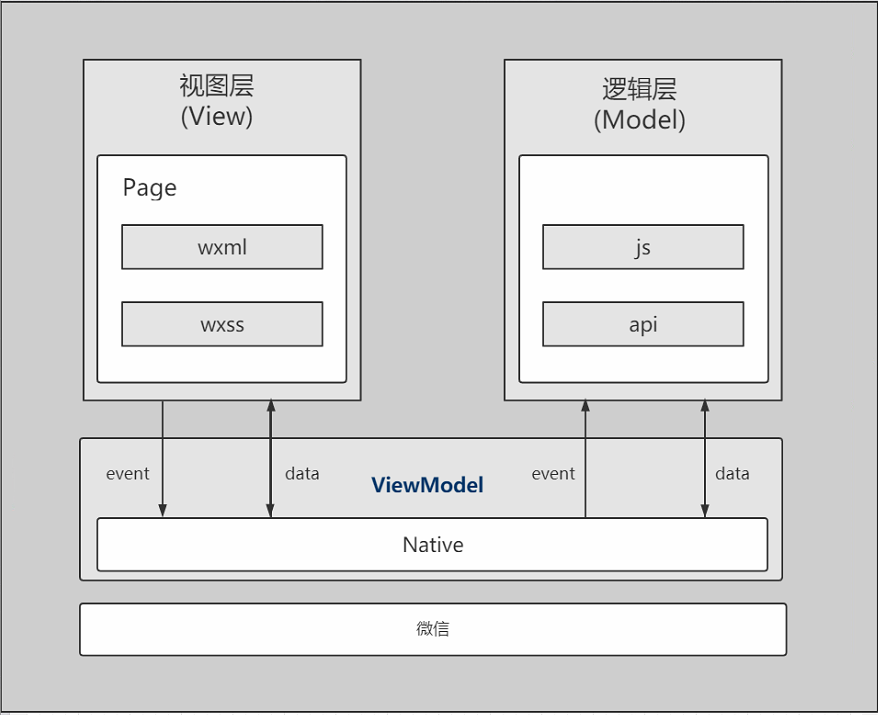

## 小程序工作原理浅析

### 小程序是什么

  2016年，"微信之父"张小龙在维系公开课上介绍了小程序，他说：小程序是一种不需要下载安装即可使用的应用，它实现了应用"触手可及"的梦想，用户扫一扫或搜一下即可打开应用。也体现了用完即走的理念，但又无需安装卸载。

### 小程序与普通网页开发的区别

- 普通网页开发

    网页开发渲染线程和脚本线程是互斥的，开发者可以使用各种浏览器暴露出来的DOM API，进行DOM选中和操作；而且网页开发者需要面对的环境是各式各样的浏览器，PC端需要面对IE、Chrome、360、FireFox等浏览器，在移动端需要面对Safari、Chrome以及IOS、Android系统中各式WebView。

- 小程序

    渲染层和逻辑层是分别运行在不同的线程当中，逻辑层运行在JSCore中，并没有一个完整浏览器对象，因而缺少相关的DOM API和BOM API。这一区别导致了前端开发非常熟悉的一些库，例如jQuery、Zepto等，在小程序中是无法运行的。同时JSCore的环境同NodeJS环境也不尽相同，所以一些NPM的包在小程序中也是无法运行的。小程序开发过程中需要面对的的两大操作系统IOS和Android的微信客户u，以及用于辅助开发的哦程序开发者工具。
    
### 小程序的原理

小程序的框架包含两部分，分别是渲染层和AppService逻辑层，渲染层的界面使用了WebView进行渲染;逻辑层采用JsCore线程运行js脚本，进行逻辑处理、数据请求及接口调用等，一个小程序存在多个界面，所以渲染层存在多个WebView线程，这两个线程的通信会经由微信客户端进行中转，逻辑层把数据变化通知到渲染层，触发渲染层页面更新，渲染层把触发的时间通知到逻辑层进行业务处理。

解析(从下往上看)：

1. 最底层是微信，当我们发版时小程序开发工具会把我们的代码和框架一起进行打包，当我们在微信里打开小程序时其实微信会把打包好的代码下载到微信app里，这样我们就可以想开发工具里一样在微信里运行我们的小程序了

2. native层是小程序的框架，这个框架里封装了ui层组件和逻辑层组件，这些组件可以通过微信app提供的接口调用手机硬件信息。

3. 最上层的两个框，是我们真正需要进行操作的视图层和逻辑层，视图层和逻辑层的交互是通过数据经由native层进行交互的。视图层和逻辑层都可以调用native框架里封装好的组件和方法。

### 小程序的生命周期

关于小程序的生命周期，可以分为两个部分来理解:应用声明周期和页面生命周期

应用的声明周期
 - 用户首次打开小程序，触发onLaunch(全局只触发一次)。
 - 小程序初始化完成后，触发onShow方法，监听小程序显示。
 - 小程序从前台进入后台，触发onHide方法。
 - 小程序从后台进入前台显示，触发onShow方法
 - 小程序后台运行一定时间，或系统资源占用过高，会被销毁。
 
页面的生命周期
 - 小程序注册完成后，加载页面，触发onLoad方法。
 - 页面载入后触发onShow方法，显示页面。
 - 首次显示页面，会触发onReady方法，渲染页面元素和样式，一个页面只会调用一次。
 - 当小程序后台运行或跳转到其他页面时，触发onHide方法。
 - 当小程序由后台进入到前台运行时或重新进入页面时，触发onShow方法。
 - 当使用重定向方法wx.redirectTo或关闭当前页返回上一页wx.navigataBack(),触发onUnload。
 
同时，应用声明周期会影响到页面声明周期。

[参考地址]（https://www.cnblogs.com/SophiaLees/p/11409339.html）