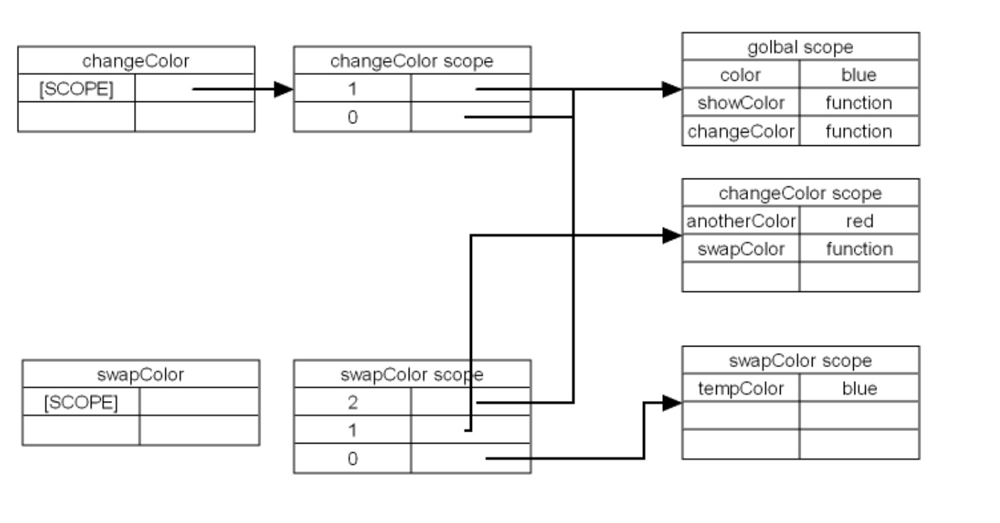
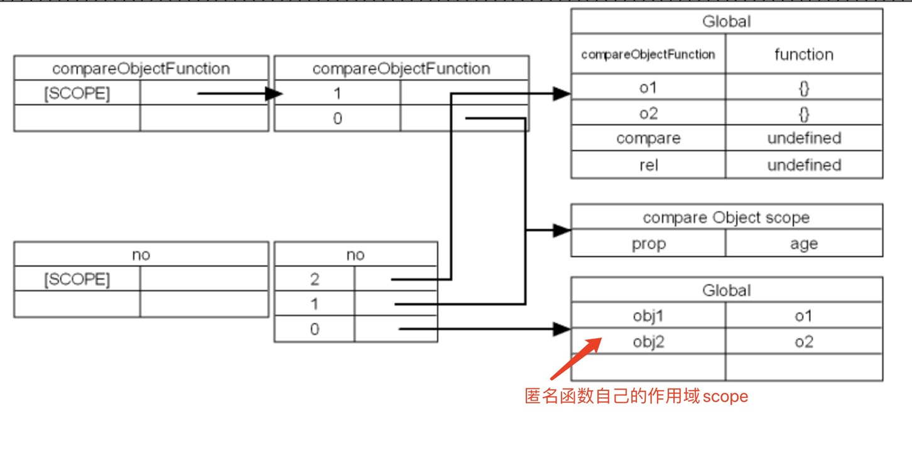

```js
for(var i = 0; i < 10; i++) {
  setTimeout(()=> {
    console.log(i);
  })
}

// demo2
var fn = null;
var foo = function() {
    var a = 1;
    function innerfoo() {
        console.log(a); // 1
        console.log(b); // ReferenceError: b is not defined
    }
    fn = innerfoo;
}
var bar = function() {
    var b = 2;
    fn();
}
foo();
bar(); 
```
## 概念
- <span style="color: blue">闭包函数： 声明在一个函数中的函数，叫做闭包函数</span>
- <span style="color: blue">闭包：内部函数总是可以访问其所在外面函数的参数和变量，即使在外面函数被返回(销毁)了之后</span>

特点
1. 让外部访问函数内部变量变成可能
2. 局部变量会常驻在内存中
3. 可以避免使用全局变量，防止全局变量污染
4. 会造成内容泄露(有一块内容长期占用，而不被释放)

```js
function funA(){
  var a = 10;  // funA的活动对象之中;
  return function(){   //匿名函数的活动对象;
        alert(a);
  }
}
var b = funA();
b();  //10


// 二
function outerFn(){
  var i = 0; 
  function innerFn(){
      i++;
      console.log(i);
  }
  return innerFn;
}
var inner = outerFn();  //每次外部函数执行的时候,都会开辟一块内存空间,外部函数的地址不同，都会重新创建一个新的地址
inner();
inner();
inner();
var inner2 = outerFn();
inner2();
inner2();

```
## 闭包的作用域
### 作用域链
<span style="color: blue">在js中当进行函数的调用，会为每一个函数增加一个属性SCOPE，通过这个属性指向一块内存</span>

<span style="color: blue">这块内存包含有所有的上下文的变量，当在某个函数中调用了新函数之后，新函数依然会有一个作用域执行原有函数的scope和自己的scope，这样就形成了一个链式的结构 => 这就是js中的作用域链</span>

```js
var color = 'red';
var showColor = function() {
  alert(this.color);
}
function changeColor() {
  var anotherColor = 'blue';
  function swapColor() {
    var tempColor = anotherColor;
    anotherColor = color;
    color = tempColor;
  }
  swapColor();
}
changeColor();
showColor()
```



### 闭包
```js
/**
* 通过以下操作带来的最大好处是，compareObjectFunction的作用域变大了
* 当compareObjectFunction结束之后，prop这个变量依然存在
*/
function compareObjectFunction(prop) {
  // 匿名函数
  return function(obj1, obj2) {
    if (obj1[prop] > obj2[prop]) return 1;
    else if (obj[prop] < obj2[prop]) return -1;
    else if return 0
  }
}
var o1 = { name: 'Leon', age: 23 }
var o2 = { name: 'Ada', age: 28 };
// 次数就是基于name来进行比较
/**
* 在java或者C++中，以下代码执行完成之后，需要进行内存释放
* 此时对于java和c++这些静态语言而言，prop会被释放
* 但是在js中，这个作用域却被放大了
*/
var compare = compareObjectFunction('age');
// 此时比较了o1和o2
/**
* 在js中，prop在这里依然可以被访问，这种通过返回函数来扩大函数作用域的方法就是闭包 
*/
var re1 = compare(o1, o2);
console.log(re1) // 1
```


使用闭包虽然可以延长作用域，但是会占用更多的内存，一般非特殊情况不要使用闭包

## 闭包的变量问题&this-经典问题
this指向调用它的外部

1. 问题1
  ```js
  function test() {
    var fns = new Array();
    for (var i = 0; i < 10; i++) {
      fns[i] = function() {
        return i;
      }
    }
    return fns;
  }
  var fn = test();
  for (var i = 0; i < fn.length; i++) {
    console.log(fn[i]())
  }
  ```
  解决问题
  ```js
  function test() {
    var fns = new Array();
    for (var i = 0; i < 10; i++) {
      // num这个变量是保存在fns这个tf这个作用域，每个闭包的num都是不一样的
      var tf = function(num) {
        fns[num] = function() {
          return num;
        }
      }
      tf(i)
    }
    return fns;
  }
  var fn = test();
  for (var i = 0; i < fn.length; i++) {
    console.log(fn[i]())
  }
  ```
2. 问题二
  ```js
  var name = 'window';
  var person = {
    name: 'zhangsan',
    age: 23,
    say: function() {
      return function() {
        return this.name;
      }
    }
  }
  /**
  * 当完成person.say()之后，这个函数就调用结束了，这个函数调用结束之前
  * this是指向person，但是在调用匿名函数之后，this就指向window,所以得到的结果是window
  */
  console.log(person.say()())
  ```
3. <span style="color: red">**问题三**</span>
```js
function timer() {
    this.s1 = 0;
    this.s2 = 0
    setInterval(() => {
        this.s1++;
    }, 1000)
    setInterval(function(){ 
        this.s2++; // this == window
    }, 1000)
}

var t = new timer()
setTimeout(() => console.log(t.s1), 3100); // 3
setTimeout(() => console.log(t.s2), 3100); // 0
```
4. 问题四
    ```js
    const fn1 = {
        name: '1',
        foo: function() {
            return this.name;
        }
    }
    const fn2 = {
        name: '2',
        foo: function() {
            return fn1.foo();
        }
    }
    const fn3 = {
        name: '2',
        foo: function() {
            let fn = fn1.foo;
            return fn()
        }
    }
    console.log(fn1.foo()) // 1
    console.log(fn2.foo()) // 1
    console.log(fn3.foo()) // 1
    ```
[参考](/front-end/interview/demo4.html#第九题1)
## 块作用域和私有变量
### 块作用域
```js
for (var i= 0; i < 10; i++) {

}
// 在js中没有块作用域，不管是 使用循环还是判断之后，这个变量一直存在
/**
* 所以当在全局使用某个变量进行循环或者判断之后，这个变量可能会影响到函数中的变量
* 所以在特殊情况下不要使用全局变量，而且使用全局变量在作用域链的最上层，访问是最慢的
*/ 
var i; 此时会任务是无效语句，变量提升 除非var i = 0
alert(i) // 10
```
**解决方式就是闭包**

```js
// i 的作用域在函数内部
/**
* 在团队开发时，可能会涉及到定义同名的全局变量，所以在开发中一定养成习惯，将全局变量的代码放到一个匿名函数中，并且马上调用匿名函数
* 这样也可以执行全局变量的代码，但是这些变量就会被控制在开发人员想要控制的作用域中
*/
(function() {
  for (var i = 0; i < 10; i++) {

  }
})()
```
### 私有变量
```js
function Person(name) {
  /**
  * 此时就没有办法直接访问name这个属性，因为没有this.name
  * 要访问name只能通过this.getName this.setName
  * 但是使用这种方式创建私有变量带来的问题，就是每个对象都要存储大量的函数
  * 解决的办法是通过静态私有变量来解决
  */
  this.getName = function() {
    return name;
  }
  this.setName = function(value) {
    name = value;
  }
}
var p = new Person('xz');
console.log(p.name) // undefined
```
解决
```js
var Person;
(function() {
  var name = '';
  Person = function(value) {
    name = value; // 赋值给函数外的name
  }
  Person.prototype.getName = function() {
    return name;
  }
  Person.prototype.setName = function(value) {
    name = value;
  }
}())
var p1 = new Person('aa');
console.log(p1.getName())
p1.setName('bb')
console.log(p1.getName())
```

[class 严格模式](/front-end/JavaScript/es6-strict.html#严格模式)

[一道算法题](/front-end/JavaScript/tips-foo.html#简介)

[一道js闭包面试题的学习](/front-end/interview/demo3-2.html)