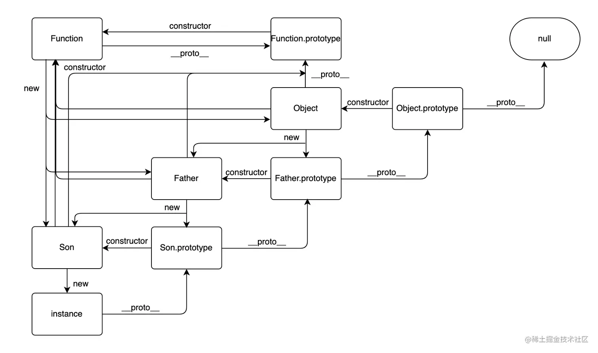

js作为前端的中坚力量。那么javascript三座大山，你知道有哪些？


## 1.作用域和闭包
<span style="color: red">作用域指代码当前上下文，控制着变量和函数的可见性和生命周期。最大的作用是隔离变量，不同作用域下同名变量不会冲突。</span>

<span style="color:red">作用域链指如果在当前作用域中没有查到值，就会向上级作用域查找，直到全局作用域，这样一个查找过程所形式的链条被称之为作用域链</span>

作用域可以堆叠成层次结构，子作用域可以访问父作用域，反之不行。

<span style="color:blue">作用域具体可以细分为四种：全局作用域、模块作用域、函数作用域、块级作用域</span>
- 全局作用域: 代码在程序的任何地方都能被访问，例如window对象。但全局变量会污染全局命名空间，容易引起命名冲突
- 模块作用域：早期js语法中没有模块的定义，因为最初的脚本小而简单。后来随着脚本越来越复杂，就出现了模块化方案(AMD、CommonJS、UMD、ES6).通常一个模块就是一个文件或者一段脚本，而这个模块拥有自己的独立的作用域
- 函数作用域:顾名思义由函数创建的作用于。闭包就是在该作用域下产生，后面我们会单独介绍
- 块级作用域：由于JS变量提升存在变量覆盖、变量污染等设计缺陷，所以ES6引入了块级作用域关键字解决这些问题。典型的案例就是let的for循环和var的for循环

```js
// var demo
for(var i = 0; i < 10; i++) {
    console.log(i);
}
console.log(i); // 10

// let demo
for(let i = 0; i < 10; i++) {
    console.log(i); 
}
console.log(i); // ReferenceError: i is not defined
```
了解万作用域再来谈谈闭包:函数A里包含了函数B，而函数B使用了函数A的变量，那么函数B被称为闭包或者闭包就是能够读取函数A内部变量的函数。

可以看出闭包是函数作用域下的产物，闭包会随着外层函数的执行而被同时创建，它是一个函数以及其捆绑的周边环境状态的引用的组合。换而言之，<span style="color: red">闭包是内层函数对外层函数变量的不释放</span>

### 闭包的特征
- 函数中存在函数；
- 内部函数可以访问外层函数的作用域
- 参数和变量不会GC，始终主流在内存中
- 有内存地方才有闭包

所以使用闭包会消耗内存、不正当使用会造成内存溢出的问题，在退出函数之前，需要将不使用的局部变量全部删除。如果不是某些特定需求，在函数中创建函数是不明智的，闭包在处理速度和内存消耗方面对脚本性能具有负面影响

### 整理闭包的应用场景
```js
// demo1 输出 3 3 3
for(var i = 0; i < 3; i++) {
    setTimeout(() => {
        console.log(i);
    }, 1000)
}

// demo2 输出0 1 2
for(let i = 0; i < 3; i++) {
    setTimeout(() => {
        console.log(i);
    } 1000);
}

// demo3 输出 0 1 2
for(let i = 0; i < 3; i++) {
    (function(i) {
        setTimeout(() => {
            console.log(i)
        }, 1000)
    })(i)
}
```

```js
// 模拟私有方法
// 模拟对象的get和set方法
var Counter = (function() {
    var privateCounter = 0;
    function changeBy(val) {
        privateCounter += val;
    }
    return {
        increment: function() {
            changeBy(1);
        },
        decrement: function() {
            changeBy(-1);
        }, 
        value: function() {
            return privateCounter
        }
    }
})();
console.log(Counter.value()); /* logs 0 */
Counter.increment();
Counter.increment();
console.log(Counter.value()); /* logs 2 */
Counter.decrement();
console.log(Counter.value()); /* logs 1 */
```

```js
// setTimeout中使用
// setTiemout(fn, number): fn是不能带参数的。使用闭包绑定一个上下文可以在闭包中获取这个上下文的数据。
function func(param) {return function() {alert(param)}}
const f1 = func(1);
setTimetout(fn1, 1000)
```

```js
// 生产者/消费者模型
// 不适用闭包

// 生产者
function producer() {
    const data = new(...)
    return data;
}
// 消费者
function consumer(data) {
    // do consume...
}
const data = producer();

// 使用闭包
function process() {
    var data = new (...);
    return funtion comsumer() {
        // do consume data...
    }
}
const processer = process();
processer();
```

```js
// 实现继承
// 以下两种方式都可以实现继承，但是闭包方式每次构造器都会被调用且重新赋值一次,所以实现继承原型优于闭包

// 闭包
function MyObject(name, message) {
    this.name = name.toString();
    this.message = message.toString();
    this.getName = function() {
        return this.name;
    }
    this.getMessage = function() {
        return this.message;
    }
}
// 原型
function MyObject(name, message) {
    this.name = name.toString();
    this.message = message.toString();
}
MyObject.prototype.getName = function() {
    return this.name;
}
MyObject.prototype.getMessage = function() {
    return this.message;
}
```
对于闭包的概念好像懂了但又好像缺少了啥？我也曾也闭包中迷失，但是看完闭包的生命周期让我重新找回自己


学完就来一波牛刀小试
```js
function test(a, b) {
    console.log(b);
    return {
        test: function(c) {
            return test(c, a);
        } 
    }
}
var a = test(100); a.test(101); a.test(102);
var b = test(200).test(201).test(202);
var c = test(300).test(301);c.test(302);

// undefined 100, 100;
// undefined 200 201
// undefined 300 301
```
## 原型和原型链
有对象的地方就有原型，每个对象都会在其内部初始化一个属性，就是prototype(原型),原型中存储共享的属性和方法。当我们访问一个对象的属性时，js引擎会先看当前对象中是否有这个属性，如果没有的就会查找他的prototype对象是否有这个属性，如此递推下去，一直检索到Object内建对象。这么一个寻找的过程就形成了原型链的概念。

理解原型最关键的是要理清楚__proto__、prototype、constructor三者的关系，我们先看看几个概念。

- <span style="color: red">__proto__属性在所有对象中都存在，指向其构造函数的prototype对象;prototype对象只存在(构造)函数中，用于存储共享属性和方法；constructor属性只存在于(构造)函数的prototype中，指向(构造)函数本身</span>
- 一个对象或者构造函数中的隐式原型__proto__的属性值指向其其构造函数的显示原型prototype属性值，关系表示为：instance.__proto__ === instance.constructor.protottype;
- 除Object，所有对象或构造函数的prototype均继承自Object.prototype,原型链的顶层指向null:Object.prototype.__proto__ === null;
- Object.prototype中也有constructor:Object.prototype.constructor === Object;
- 构造函数创建的对象(Object、Function、Array、普通函数等)都是Function的实例，它们的__proto__均指向Function.prototype；

看起来是不是有点乱？？别慌！！ 一张图帮你整理他们之间的关系



相同的配方在来一刀
```js
let arr = [1,2,3];
arr.__proto__ = Array.prototype // true;
arr.__proto__.__proto__ === Object.prototype; // true
Array.__proto__ ==== Function.prototype; // true;
```
## 3.异步和单线程
Javascript是单线程语言，意味着只有单独的一个调用栈，同一时间只能处理一个任务或一段代码。队列、堆、栈、事件循环构成了并发模型，事件循环是javascript的执行机制。

<span style="color: red">为什么js是一门单线程语言呢？最初设计JS是用来在浏览器验证表单以及操控DOM元素，为了避免同一时间对同一个DOM元素进行操作从而导致不可预知的问题，Javascript从一诞生就是单线程。</span>

既然单线程也就意味着不存在异步，只能自上而下执行，如果代码阻塞只能一直等下去，这样导致很差的用户体验，所以事件循环的出现让js拥有异步的能力。


[原文](https://juejin.cn/post/7182571660003213370)