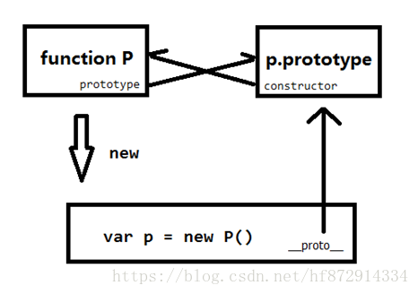
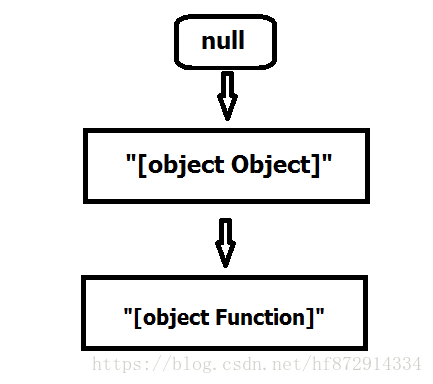
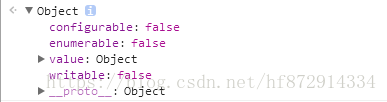
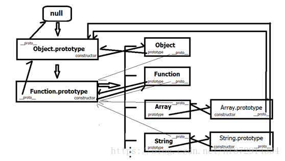
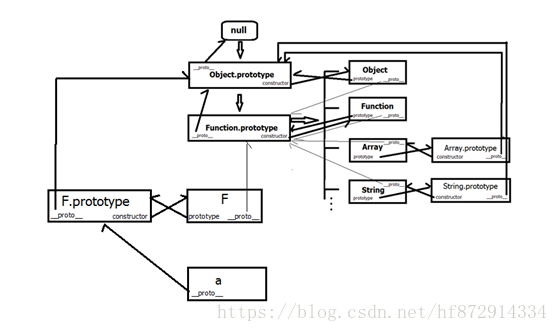

## 设计模式
+ 工厂模式
```js
function Person(name, age) {
	var o = new Object();
    o.name = name;
    o.age = age;
    o.say = function() {
    	console.log(`${this.name},${this.age}`);
    }
    return o;
}
//调用
var p1 = Person('lean', 22);
var p2 = Person('Ada',33)
```
<span style="color: red">使用工厂模式虽然解决了子类的问题，但是无法检测子类的数据类型</span>

[工厂模式&抽象工厂模式](/front-end/JavaScript/model-design-factory.html#工厂模式)

+ 构造函数
```js
function Person(name, age) {
	this.name = name;
    this.age = age;
    this.say = function() {
    	console.log(`${this.name},${this.age}`);
    }
}
//调用
var p1 = new Person('Ada', 33);
var p2 = new Person('xx', 23);
```
问题：p1.say === p2.say 返回false<br/>
<span style="color: red">每一个对象都会生成一个方法的拷贝，如果对象行为很多的话，空间占用率会大大增加。所以将行为设置全局行为=>但破坏对象的封装</span>

```js
function say(){
	console.log('xxx');
}
```
+ 原型模式
```js
function Person(){};
Person.prototype.name = 'len';
Person.prototype.age = 23;
Person.prototype.say = function(){
	console.log(`${this.name},${this.age}`)
}
//调用
var p1 = new Person();
var p2 = new Person();
```
会改变应用类型的值

> - 检测某个对象是否是某个函数的原型<br/>
> Person.prototype.isPrototypeof(p1)
> - 检测某个对象的constructor<br/>
> p1.constructor === Person
> - 检测某个某个属性是否是自身属性<br/>
> p1.hasOwnProperty('name')
> - 检测某个对象在原型或自己中是否包含某个属性通过in<br/>
> console.log("name" in p1)

## 继承

+ 简单原型继承
```js
function Super() {
	this.name = 'hzzly';
    this.obj = {a:1}
}
function Sub() {}
Sub.prototype = new Super();
//修改sub1.obj.a后,sub2.obj.a也变了
```
+ 构造函数式继承
```js
function Super(name) {
	this.name = name;
    this.fun = function() {}
}
function Sub() {
	Super.call(this,name)
}
//无法实现函数的复用，每个子类实例都持有一个新的fun函数，太多影响性能，内存爆炸
```
+ 组合式继承
```js
function Super(){
	this.name = 'hzzly';
}
Super.prototype.fun = function(){};
function Sub() {
	Super.call(this)
}
Sub.prototype = new Super();//核心
//子类原型上有一份多余的父类实例熟悉感，因为父类构造函数被调用了两次，而子类实例上那一份屏蔽了子类原型上的父类的 内存浪费
```
+ 寄生组合式继承
```js
function Super() {};
Super.prototype.fun = function() {}
function Sub() {
	Super.call(this);
}
Sub.prototype = new Object(Super.prototype);
Sub.prototype.constructor = Sub;
```
+ ES6的class继承方式

```js
class A{};
class B extends A{};
B.__proto__ === A;
B.prototype.__proto__ === A.prototype
```

## 从js数据类型到原型原型链
[原文地址](https://blog.csdn.net/hf872914334/article/details/79843420)

### 一、数据类型
<span style="color: blue">在JavaScript中，数据类型可以分为原始类型以及引用类型。原始类型：Number,String,Boolean, null, undefined,Symbol(ES6新增，表示独一无二的值)，这6种数据类型是按照值进行分配的，是存放在栈内存中的简单数据段，可以直接访问，数据大小确定，内存空间大小可以分配。</span>

<span style="color: blue">引入数据类型包括function,object,array等可以使用new创建的数据，又叫对象类型，他们是存放在堆内存中，如var a = {},变量a实际保存的是一个指针，这个指针指向内存中的数据{}</span>

JavaScript中的变量具有动态类型这一特性，意味着相同的变量可用做不同的类型
```js
var x;
x = 6;
x = 'hfhan'
```
JavaScript中可以用typeof操作符来检测一个数据的数据类型，<span style="color: red">但是需要注意的是**typeof null结果是Object**,这个是历史遗漏bug</span>
```js
typeof 123 // numbner
typeof 'hfhan' // string
typeof true // boolean
typeof null // object 独一份的与众不同
typeof undefined // undefined
typeof Symbol('hfhabn') // symbol
typeof function() {} // function
typeof {} // object
```
### 对象类型

<span style="color: blue">宿主环境:由Web浏览器或者桌面应用系统造就的js引擎执行的环境即宿主环境</span>

**1. 本地对象**

ECMA-262把本地对象定义为"独立于宿主环境的ECMAScript实现提供的对象"

本地对象包含但不限于Object, Function, Array, String, Boolean, Number,Data, RegExp,各种错误类对象(Error, EvalError...)

注意：这里的Object,Function, Array等不是指构造函数，而是指对象的类型

**2. 内置对象**

ECMA-262把内置对象定义为'由ECMAScript实现提供的、独立于宿主环境的所有对象，在ECMAScript程序开始执行时出现'。意味着开发者不比明确实例化内置对象，它已经被实例化了

其中Global对象是ECMAScript中最特别的对象，因为实际上它根本不存在，但大家要清楚，在ECMAScript中，不存在独立的函数，所有函数都必须是某个对象的方法。类似于isNaN()、parseInt()和parseFloat()方法等，看起来都是函数，而实际上，它们都是Global对象的方法。而且Global对象的方法还不止这些。有关Global对象的具体方法和属性，感兴趣的同学可以看一下这里：JavaScript 全局对象参考手册

对于web浏览器而言，Global有一个代言人window，但是window并不是ECMAScripta规定的内置对象，因为window对象是相对于web浏览器而言的，而js不仅仅可以用在浏览器中。

Global与window的关系可以看这里：概念区分：JavaScript中的global对象，window对象以及document对象

可以看出，JavaScript中真正的内置对象其实只有两个：Global 和 Math，可是观看网上的文章资料，千篇一律的都在讲JavaScript的11大内置对象（不是说只有11个，而是常用的有11个：Object、Function、Array、String、Boolean、Number、Date、RegExp、Error、Math、Global，ES6中出现的Set 、Map、Promise、Proxy等应该也算是比较常用的），这是不严谨的，JavaScript中本地对象、内置对象和宿主对象一文中，把本地对象、内置对象统称为“内部对象”，算是比较贴切的。

更多“内部对象”可以查看MDN>JavaScript>引用>内置对象 内容，或者通过浏览器控制台打印window来查找。

**3. 宿主对象**

由ECMAScript实现的宿主环境提供的对象，可以理解为：浏览器提供的对象。所有的BOM和DOM都是宿主对象。


**4. 自定义对象**

顾名思义，就是开发人员自己定义的对象。JavaScrip允许使用自定义对象，使JavaScript应用及功能得到扩充


**5. 判断对象的类型**

对象的类型不能使用typeof来判断，因为除了Function外其他类型的对象所得到的结果全为”object”

```js
typeof function(){} // function
typeof {} // object
typeof new RegExp; //object
typeof new Date // object
typeof Math // object
typeof new Error //object
```
一个使用最多的检测对象类型的方法是Object.prototype.toString;

```js
Object.prototype.toString.apply(new Function);// "[object Function]"
Object.prototype.toString.apply(new Object);// "[object Object]"
Object.prototype.toString.apply(new Date);// "[object Date]"
Object.prototype.toString.apply(new Array);// "[object Array]"
Object.prototype.toString.apply(new RegExp);// "[object RegExp]"
Object.prototype.toString.apply(new ArrayBuffer);  // "[object ArrayBuffer]"
Object.prototype.toString.apply(Math);// "[object Math]"
Object.prototype.toString.apply(JSON); // "[object JSON]"
var promise = new Promise(function(resolve, reject) {
    resolve();
});
Object.prototype.toString.apply(promise);// "[object Promise]"
…
```
##### 构造函数

构造函数是描述一类对象统一结构的函数--相当于图纸

**1. 对象的创建**

生成一个函数可以通过Function关键字
```js
function a() {
	console.log(1);
}
// 或者
var b = function() {
	console.log(2);
}
```

此外创建一个对象(类型为Object的对象)，可以通过{};创建一个数组，可以通过[];创建一个正则对象可以通过/.*/。但是那些没有特殊技巧的对象，就只能老老实实使用构造函数来创建了

JavaScript语言中，生成实例对象的传统方法是通过构造函数，即我们通过函数来创建对象，这也证明了函数在JavaScript中具有非常重要的地位，因此函数是一等公民

**2. 构造函数创建对象**

js中对象在使用的时候，大部分需要先进行实例化(除了已经实例化完成的Math对象以及Json对象)
```js
var a = new Function('console.log(a)'); // 构造函数创建Function对象

var b = new Object({a:1}) // 构造函数创建Object对象
 
var c = new Data() //构造函数创建Data对象

var d = new Set();  // 构造函数创建Set对象

var e = new Array(10); // 构造一个初始长度为10的数组对象
```

使用构造函数创建的数据全是对象，即使用new关键字创建的数据全是对象，其中new做了四件事
```js
1) 创建一个空对象

var obj = new Object();

2)让Person中的this指向obj，并执行Person的函数体

var result = Person.apply(obj, arguments);

3）设置原型链，将obj的__proto__成员指向Person函数对象的prototype成员对象

obj.__proto__ = Person.prototype;

4)判断Person的返回值类型，如果是值类型，返回obj；如果是引用类型，就返回这个引用类型的对象；

if(typeof resule === 'object') {
	person = result;
} else {
	person = obj;
}
```
除了浏览器本身自带的构造函数，我们还可以使用一个普通的函数来创建对象

```js
function Person() {};
var p1 = new Person();
```
这个例子Person就是一个普普通通的空函数，但是依然可以作为构造函数来创建对象，我们打印下p1的类型，可以看出使用自定义的构造函数，所创建的嗯对象类型为Object
```js
Object.prototype.toString.apply(p1); // "[object object]"
```

3. **构造函数和普通函数**

<span style="color: red">实际上并不存在创建构造函数，其与普通函数唯一的区别在于调用方法。对于任意函数，使用new操作符调用，那么它就是构造函数，又叫工厂函数；不使用new操作符调用，那么它就是普通函数。</span>

按照惯例，我们约定构造函数名以大写字母开头，普通函数以小写字符开头，这样有利于显性区分二者


### 原型与原型链

**1.prototype 与__proto__

原型是指原型对象，原型对象从哪里来？

每个函数在被创建的时候，会同时在内存中创建一个空对象，每个函数都有一个prototype属性，这个属性指向这个空对象，那么这个空对象就叫做函数的原型对象，每一个原型对象中都会有一个constructor属性，指向该对象

```js
function b(){console.log(1)};
b.prototype.constructor === b;
```
抽象理解：<span style="color: orange">**构造函数是妻子，原型对象是丈夫，prototype是找丈夫，constructor是找妻子**</span>

手动更改函数的原型对象
```js
var a = {a: 1};
b.prototype = a; // 更改b的原型对象为a
a.constructor // function Object() {native code}
```
为什么这里a.constructor不指向B函数？

<span style="color: red">**这是因为变量a所对应的对象是事先声明好的，不是跟随函数一起创建的，所以他没有constructor属性，这时候寻找construcotor属性就会到父对象上去找，而所有对象默认都继承自己Object.Prototype,所以最后找的就是Object.Prototype.Contructor,也就是Object函数**。</span>

继承又是怎么一回事呢？？？
所有对象都有一个__proto__属性，这个属性指向其父元素，也就是所继承的对象，一般为构造函数的prototype对象



prototype是函数独有的；__proto__是所有对象都有的，是继承的。调用一个对象的某一个属性，如果该对象上没有该属性，就去其原型链上找。

比如上例中，调用p.a，对象p上找不到a属性，就会去找p.__proto__.a,p__ptoto__a找不到，就会去找p.__proto__.__proto__.a，以此类推，直到找到Object.prototype.a也没找到，就会返回undefined；

原型链是由各级子对象的__proto__属性连续引用形式的结构，所有对象原型链的顶部都是Object.prototype

我们知道，当子对象被实例化之后在去修改构造函数的prototype属性是不会改变子对象与原型对象的继承关系的，但是通过修改子对象的__proto__属性，我们可以解除子对象与原型对象之间的继承关系
```js
var A = function(){} //构造函数
A.prototype = {a:1} //修改原型对象
var a = new A; // 实例化子对象a,此时a继承自{a: 1}
a.a // 1
A.prototype = {a: 2} // 更改构造函数的原型对象
a.a // 1 此时，a仍然继承自{a: 1}
a.__proto__ = {a: 3} // 更改构造函数的原型对象
a.a // 3 此时 a继承自{a:3}
```

**Object.prototype与Function.prototype**

一切诞生于虚无

上面讲了，所有对象原型链的顶部都是Object.prototype,那么Object.prototype是怎么来的，凭空造的嘛 ？？还真是！！
```js
Object.prototype.__proto__ === null; // true
```
上面讲了，我们可以通过修改对象的__proto__属性来更改继承关系,但是，<span style="color: red">Object.prototype的__proto__属性不允许更改，这是浏览器对Object.prototype的保护措施，修改Object.prototype的__proto__属性会抛出错误</span>。同时，Object.prototype.__proto__ 也只能进行取值操作，因为null和undefined没有对应的包装类型，因此不能调用任何方法和属性。


Object.prototype与Function.prototype是原型链中最难理解也是最重要的两个对象。下面我们用抽象的方法来理解这两个对象

天地伊始，万物初开，诞生了一个对象，不知其姓名，只知道他的类型为"[object Object]",他是一切对象的先祖，为初代对象，继承与虚无(null)

后来，又诞生了一个对象，也不知其姓名，只知道他的类型为"[object Function]",他是一切函数的先祖，继承于对象先祖，为二代对象



经年流转，函数先祖发挥特长，制造出了一系列的函数，如Object,Function,Array, Date, String, Number等，都说龙生九子，这些函数虽说各个都貌美如花，神通通天，但功能上还是有很大的去别的

其中最需要关注的是Object以及Function。原来函数先祖在创造Function的时候，悄悄的把Function的prototype属性指向了自己，也把自己的constructor属性指向了Function。如果说Function是函数先祖为自己创造的妻子，那么Object就是函数先祖为对象先祖创造的妻子，同样的，Object的prototype属性指向了对象先祖，对象先祖也把自己的constructor属性指向Object，表示他同意了这门婚事。

此后，世人都称对象先祖为Object.prototype，函数先祖为Function.prototype。

从上可以看出，对象先祖是一开始就存在的，而不是同Object一起被创建的，所以手动更改Object.prototype的指向后：

```js
Object.prototype = {a:1};    //修改Object.prototype的指向
var a = {};                  //通过字面量创建对象
a.a                          //undefined 此时a仍然继承于对象先祖
var b = new Object();        //通过new来创建对象
b.a                          //结果是???
```

<span style="color: red">**这里我原本以为会打印1，但是实际上打印的还是undefined，然后在控制台打印下Object.prototype，发现Object.prototype仍然指向对象先祖，也就是说Object.prototype = {a:1}指向更改失败，我猜测和上面Object.prototype的__proto__属性不允许更改，原因是一样的，是浏览器对Object.prototype的保护措施。**</span>

  在控制台打印下Object.prototype的保护属性：
```js
Object.getOwnPropertyDescriptor(Object,"prototype"); 
```


可以看到，其writable、enumerable、configurable属性均为false，也就是其prototype属性不可修改，不可删除，不可修改属性特性。

  其实不光Object.prototype不能修改，Function. Prototype、String. Prototype等内部对象都不允许修改。



因为Object、Function、Array、String等都继承自Function.prototype，所以有
```js
Object.__proto__ === Function.prototype;       // true
Function.__proto__ === Function.prototype;     // true
Array.__proto__ === Function.prototype;        // true
String.__proto__ === Function.prototype;       // true
```
所有的对象都继承于Object.prototype，所以有
```js
Function.prototype.__proto__ === Object.prototype;     // true
Array.prototype.__proto__ === Object.prototype;        // true
String.prototype.__proto__ === Object.prototype;       // true

```

**3.自定义构造函数创建对象**

当我们自定义一个对象的时候，这个对象在整个原型链上的位置是？

这里我们不对对象的创建方式多做讨论，仅以构造函数为例

<span style="color: red">当我们使用字面量创建一个对象的时候，其父对象默认为对象先祖，也就是Object.prototype</span>

```js
var a = {};
a.__proto__===Object.prototye //true
```
上面讲了，自定义构造函数所创建的对象他的类型均为”[object Object]”，在函数建立的时候，会在内存中同步建立一个空对象，其过程可以看作：
```js
function F(){};  // prototype 赋值  F.prototype = {}，此时{}继承于Object.prototype

```
当我们使用构造函数创建一个对象时，会把构造函数的prototype属性赋值给子对象的__proto__属性，即：
```js
var a = new F();   //__proto__赋值 a.__proto__ = F.prototype;
```
因为F.prototype继承于Object.prototype，所以有
```js
a.__proto__.__proto__ === Object.prototype;  // true
```



综上我们可以看出，原型链就是根据__proto__维系的由子对象-父对象的一条单向通道，不过要理解这条通道，我们还需要理解构造对象，类，prototype，constructor等，这些都是原型链上的美丽的风景。


## demo

```js
Function.prototype.a = function() {
    alert(1);
}
Object.prototype.b = function() {
    alert(2);
}
function A () {}
const a = new A();
a.a(); // 不存在 报错
a.b();// a.a()注释 可以执行alert(2)


// 第二题
function Foo(a) {
    function baz() {
        console.log(a)
    }
    this.biz = function() {
        console.log(a, 111);
    }
}
Foo.prototype.bfz = function() {
    // console.log(a);
}
var f = new Foo(3);
// console.log(f.baz());
console.log(f.biz());
console.log(f.bfz());
console.log(Foo.biz())
```