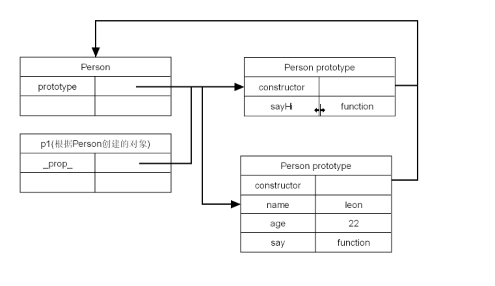
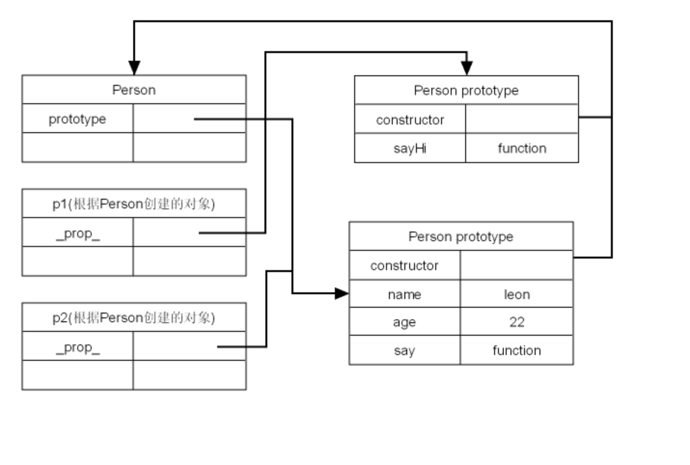

## 原型内存分析
:::tip
原型是js中非常特殊一个对象，当一个函数创建之后，会随之就产生一个原型对象。
当通过这个函数的构造函数构建了一个具体的对象之后，在这个具体的对象中就会有一个属性指向原型

以下演示了通过原型的创建方式，使用基于原型的创建可以将属性和方法，设置为Person专有的，不能在通过window来调用
:::
```js
// 第一种装填
function Person() {}
// 第二种状态
Person.prototype.name = 'Leaon';
Person.prototype.age = 23;
Person.prototype.say = function() {
    console.log(`${this.name}, ${this.age}`);
}
// 第三种状态，创建了一个对象之后会有一个_prop_的属性指向原型
// 使用时如果在对象内部没有找到属性会去原型中找，__proto__属性是吟唱的
var p1 = new Person();
p1.say();// Leaon,23
// 以下方法可以检测出p1是否有__proto__指向Person的原型
console.log(Person.prototype.isPrototypeOf(p1));

// 第四种状态
let p2 = new Person();
p2.name = 'Ada';
p2.say(); // Ada, 23

// 检测某个对象是否是某个函数的原型
alert(Person.prototype.isPrototypeOf(p2));
// 检测某个对象的constructor
alert(p1.constructor === Person)
// 检测某个属性是否是自己的属性
alert(p1.hasOwnProperty('name')); // false
alert(p2.hasOwnProperty('name')); // true
// 检测某个对象在原型或者自己中是否包含某个属性，通过in检测
alert('name' in p1) // true

// 通过如下方法检测某个是性是否在原型中存在
function hasPrototypeProperty(obj, prop) {
    return (!obj.hasOwnProperty(prop)) && (prop in obj)
}
console.log(hasPrototypeProperty(obj, 'name'))
```


## 原型重写
```js
// demo
function A() {}
A.prototype.n = 1;
var b = new A();
A.prototype = {
    n:2, 
    m :3
}
var c = new A();
console.log(b.m) // undefined
console.log(b.n) // 1
console.log(c.m) // 2
console.log(c.n) // 3
```

```js
// 第一种装填
function Person() {}
/**
 * 使用如下方式编写代码，当属性和方法特别多时，编写起来不是很方便，可以通过json格式来编写
*/
Person.prototype.name = 'Leaon';
Person.prototype.age = 23;
Person.prototype.say = function() {
    console.log(`${this.name}, ${this.age}`);
}

// json
/**
 * 以下方式将会重写原型
 * 由于原型重写，而且没有通过Person.prototype来指定
 * 此时constructor不会在指向Person而是指向Object
 * 如果constructor真的比较重要，可以在json中说明原型的指向
 * 测试三 隐藏Person.prorotype = {...}
 */
Person.prototype = {
    // constructor: Person, // 重要 手动指定constructor
    name: 'Leon',
    age: 23,
    say: function() {
        console.log(this.name + ',' + this.age)
    }
}
var p1 = new Person();
// 测试一
p1.say();
console.log(p1.constructor === Person) // false; 构造函数不相等 p1.constructor 构造函数指向了Object

// 测试二
Person.prototype.sayHi = function() {
    console.log(this.name + ':Hi')
}
p1.sayHi() // Leon:Hi

// 测试三
// 如果把重写放置在new Person之后，注意内存模型
Person.prototype = {
    // constructor: Person, // 重要 手动指定constructor
    name: 'Leon',
    age: 23,
    say: function() {
        console.log(this.name + ',' + this.age)
    }
}
p1.sayHi(); // 不会报错，但是没有this.name
var p2 = new Person();
p2.sayHi(); // 此时没有sayHi，所以就会报错
p2.say(); // leon, 23
p1.say(); // 报错
```


