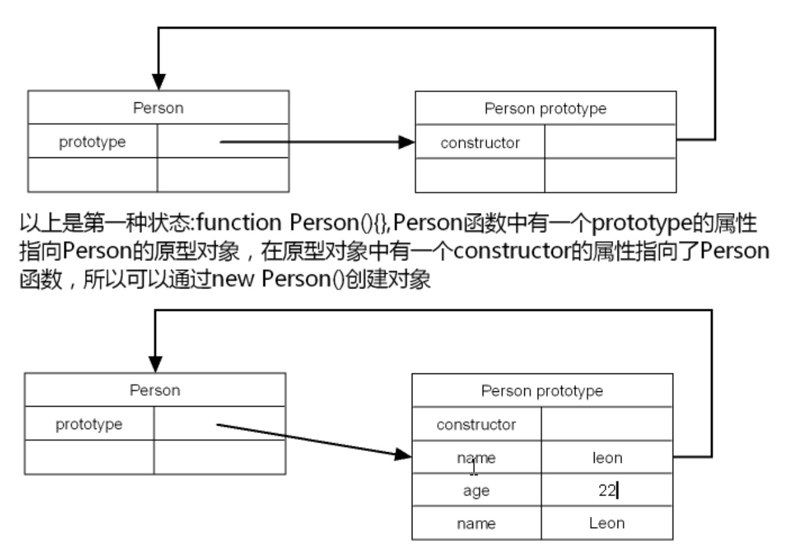
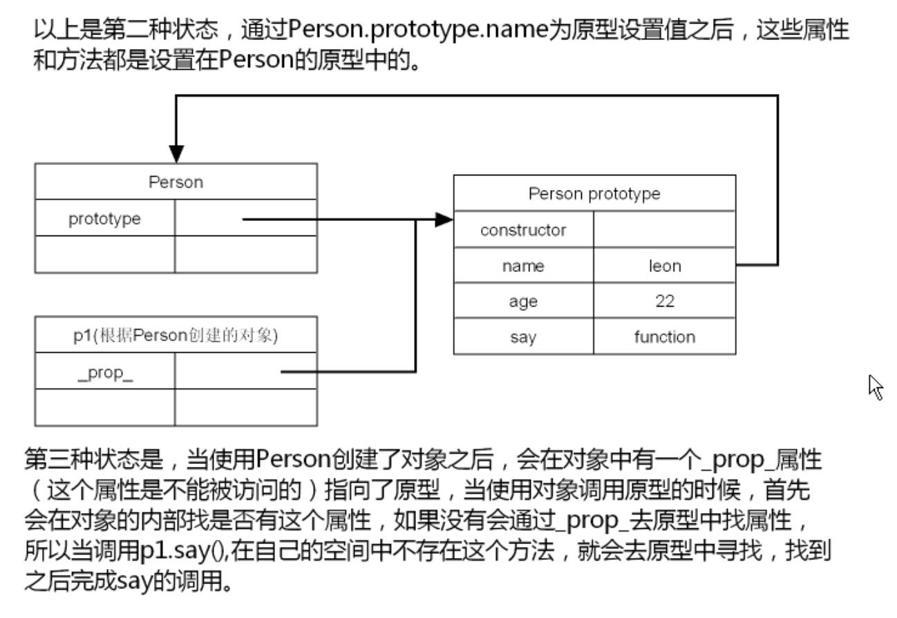
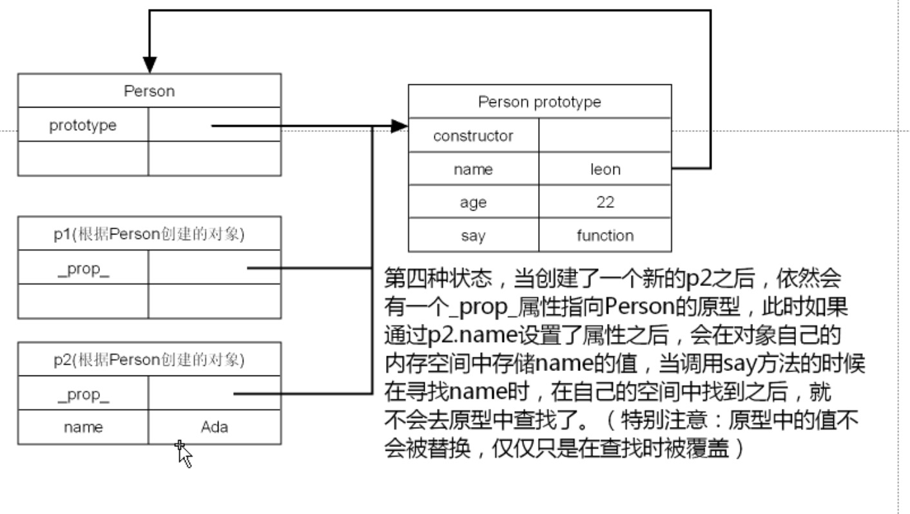

:::tip
原型是js中非常特殊一个对象，当一个函数创建之后，会随之就产生一个原型对象。
当通过这个函数的构造函数构建了一个具体的对象之后，在这个具体的对象中就会有一个属性指向原型

以下演示了通过原型的创建方式，使用基于原型的创建可以将属性和方法，设置为Person专有的，不能在通过window来调用
:::
```js
// 第一种装填
function Person() {}
// 第二种状态
Person.prototype.name = 'Leaon';
Person.prototype.age = 23;
Person.prototype.say = function() {
    console.log(`${this.name}, ${this.age}`);
}
// 第三种状态，创建了一个对象之后会有一个_prop_的属性指向原型
// 使用时如果在对象内部没有找到属性会去原型中找，__proto__属性是吟唱的
var p1 = new Person();
p1.say();// Leaon,23
// 以下方法可以检测出p1是否有__proto__指向Person的原型
console.log(Person.prototype.isPrototypeOf(p1));

// 第四种状态
let p2 = new Person();
p2.name = 'Ada';
p2.say(); // Ada, 23
```



