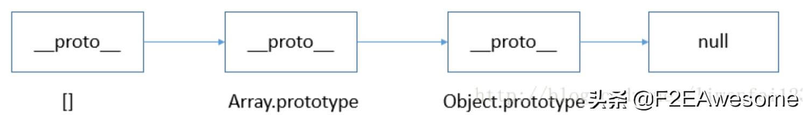

## 问题
```js
var a = 1
console.log(a instanceof Object); // false; 
console.log([] instanceof Object) // true
```
<span style="color: red;font-weight: 700">instaceof 不能用作基本类型</span>

## typeof 
typeof 其实就是判断参数是什么类型的实例，就一个参数，用例：typeof A

返回值： "number"、『string』、「boolean」、'object'、'function'、undefined

```js
typeof 123; // number;
typeof 'jartto'; // string;
typeof !!'0'; // boolean
typeof new Function(); // function
typeof name; // undefined
```
这里我们扩展一下，加入我们要判断某个变量是否存在
```js
if(!a) {console.log('error')}
```
这时候控制台就会报错
```js
Uncaught ReferenceError: a is not defined
```
**所以我们可以使用typeof 来判断**
```js
if(typeof a === 'undefined') {
    console.log('error')
}
```
> 这样，就能避免代码异常，是一种比较严谨的处理方式

<span style="color: red">ES6中let和const会形成「暂时性死区」也意味着typeof 不再是一个百分之百安全的操作</span>

```js
typeof x; // ReferenceError
let x;
```
上面代码中，变量 x 使用 let 命令声明，所以在声明之前，都属于 x 的「死区」，只要用到该变量就会报错。因此，typeof 运行时就会抛出一个 ReferenceError。

如果用 typeof 来判断引用类型，会有怎样的结果？
```js
let arr = [1,2,3];
let obj = {name: 'jartto'};
let obj1 = null;

typeof arr; // object
typeof obj; // object
typeof obj1; // object
```
如上所示，引用类型的数据，都返回了 object，我们无法做到精确判断。我们来总结一下：

1. 对于基本类型，除 null 以外，均可以返回正确的结果。
2. 对于引用类型，除 function 以外，一律返回 object 类型。
3. 对于 null ，返回 object 类型。
4. 对于 function 返回 function 类型。

> 这就需要用到 instanceof 来检测某个对象是不是另一个对象的实例。
## instanceof
instanceof 是用来判断A是否为B的实例，表达式为:A instanceof B,如果A是B的实例，则返回True，否则返回false
```js
[] instanceof Array; //true
({}) instanceof Object;//true
new Date() instanceof Date;//true
```
js 中万物皆对象的思想
```js
[] instanceof Object // true;
function Person(){};
new Person() instanceof Person; // true
new Person instanceof Object; // true

// 例二
function Parent(){};
function Child(){};
function Other(){};

Child.prototype = new Parent();
let child = new Child();

child instanceof Child; // true
child instanceof Parent; // true
child instanceof Object; // true
child instanceof Other; // false
```
很简单，我们只需要理解下面这行代码就可以了：
```js
Parent.prototype.__proto__ === Object.prototype;
```
## 扩展
我们来分析一下 []、Array、Object 三者之间的关系：

从 instanceof 能够判断出 [].proto 指向 Array.prototype，而 Array.prototype.proto 又指向了Object.prototype，最终 Object.prototype.proto 指向了 null，标志着原型链的结束。

因此，[]、Array、Object 就在内部形成了一条原型链：



依次类推，类似的 new Date()、new Parent() 也会形成一条对应的原型链 。

> instanceof 只能用来判断两个对象是否属于实例关系，而不能判断一个对象具体属于哪种类型

## 巩固只是
- 如何判断一个变量是否为数组

    ```js
    [] instanceof Array
    Array.isArray([])
    ```
- 下面函数输出什么

    ```js
    var name = 'World!';
    (function () {
        if (typeof name === 'undefined') {
            var name = 'Jartto';
            console.log('Hi~ ' + name);
        } else {
            console.log('Hello ' + name);
        }
    })();
    ```
    这里需要注意变量声明提升，所以上面代码等效于
    ```js
    var name = 'World!';
    (function () {
        var name;
        if (typeof name === 'undefined') {
            var name = 'Jartto';
            console.log('Hi~ ' + name);
        } else {
            console.log('Hello ' + name);
        }
    })();
    ```

[JavaScript中为什么null==0为false而null>=0为true](/front-end/JavaScript/a-null-undefined.html)

[typeof](/front-end/JavaScript/tips-typeof.html)