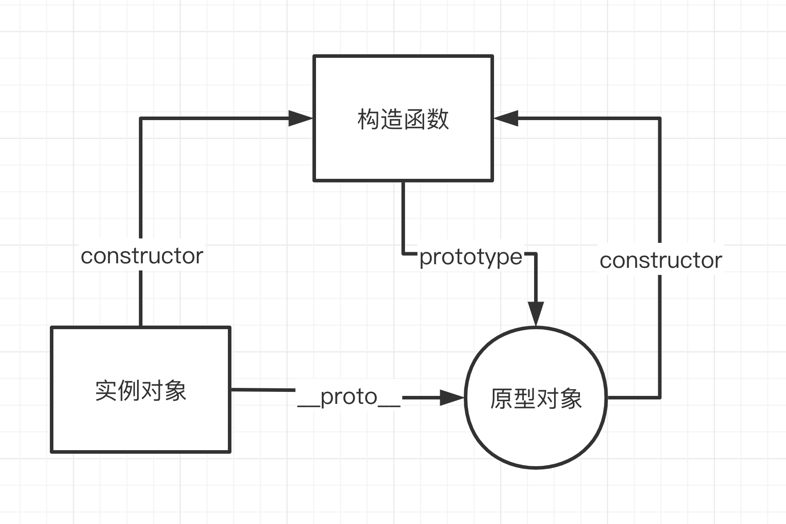

## 面向对象的Javascript(OOP)--面向对象(OOP)
面向对象三大特性
- 封装
- 继承
- 多态

## 封装
「封装」把客观事物封装成抽象的类，隐藏属性和方法，仅对外公开接口

### 私有属性和方法
只有在构造函数内访问不能被外部所访问(在构造函数内使用var声明的属性)

### 公有属性和方法(或实例方法)
对象外可以访问到对象内的属性和方法(在构造函数内使用this设置，或者设置在构造函数原型对象上比如:Person.prototype.xxx)

### 静态属性和方法
定义在构造函数上的方法(比如Person.xxx)，不需要实例就可以调用

### ES6之前的封装(非Class)
- 函数(function)

    首先来看零散的语句
    ```js
    var oDiv = document.getElementsByTagName('div')[0];
    var p = document.createElement('p');
    body.style.backgroundColor = 'green';
    p.innerText = '我是新增的标签内容';;
    oDiv.appendChild(p)
    ```
    <p>缺点很明显</p>

    - 每次都会执行这段代码，造成浪费资源

    - 用以被同名变量覆盖掉--因为是在全局作用域下申明的，所以容易被同名变量覆盖
    
    接下来将零散的语句写进函数的花括号内，成为函数体

    ```js
    function createTag() {
        var oDiv = document.getElementByTagName('div')[0];
        var p = document.createEleent('p');
        body.style.backgroundColor = 'green';
        p.innerText = '我是新增的标签内容';
        oDiv.appendChild(p)
    }
    ```
    <p>优点也很明显</p>

    - 提高了代码的复用性
    
    - 按需执行--解析器读到此处，函数并不会立即执行，只有当被调用才会执行

    - 避免全局变量--因为存在函数作用的问题

- 原始模式

    ```js
    var p1 = {};
    p1.name = 'a';
    p.sex = 'male';

    var p2 = {};
    p2.name = 'b';
    p.sex = 'female'
    ```
    - 优点:一般梭
    - 缺点:生成几个实例，相似的对象，代码重复；而且实例与原型之间没有什么联系

- 工厂模式

    ```js
    function Person(name, sex) {
        return {name, sex}
    }
    var p1 = new Person('a', 'male')
    ```
    - 优点:解决代码重复的问题
    - 缺点:p1和p2没有内在联系，不能反映出同一个原型的实例
- 构造函数模式

    <span style="color: red">构造函数其实就是一个普通函数，但是内部有this指向，对构造函数使用new运算符就可以生成构造函数的实例。并且this会指向新生测实例</span>

    ```js
    // 比如工厂模式中的Person改造成构造函数
    function Person(name, sex) {
        this.name = name;
        this.sex = sex;
        this.getName = function() {
            console.log(this.name)
        }
    }
    // 通过new运算符
    var p1 = new Person('a', 'male');
    var p2 = new Person('b', 'female');
    p1.getName();
    console.log(p1); // {name: 'a', sex:'male', getName: function(){}}
    console.log(p2)
    ```
    - 优点:解决代码重复的问题，反应出p1和p2是同一个原型的实例
    - 缺点:多个实例有重复的属性和方法，占用内存.（所有的实例都会有getName方法）
- Prototype模式

    每一个构造函数都有一个ptototype属性，指向另一个对象。这个对象的所有属性和方法，都会被构造函数继承。这意味着那些不变的属性和方法，可以直接定义在prototype对象上
    ```js
    function Person(name, sex) {
        this.name = name;
        this.sex = sex;
    }
    Person.prototype.getName = function() {
        console.log(this.name);
    }
    var p1 = new Person('a', 'male');
    var p2 = new Person('b', 'female');
    p1.getName();
    ```
    - 优点：所有实例的getName方法指向都是同一个内存地址，指向prototype对象，减少内存占用，提高效率

- 一个完整的例子
    ```js
    function Person(name, sex) {
        // 私有属性和方法
        var id = +new Date();
        var getId = function() {
            return id;
        }
        // 公有属性和方法
        this.name = name;
        this.sex = sex;
        this.description = '我是共有属性';
        this.getInfo = function() {
            var id = getId();
            return { id, name, sex }
        }
    }
    // 静态属性和方法
    Person.description = '我是静态属性';
    Person.work = function() {
        return 'freelancer'
    }
    // 原型上的属性和方法
    Person.prototype.description = '我是原型上的属性';
    Person.prototype.hobby = ['游泳','跑步'];
    Person.prototype.getHobby = function() {
        console.log(this.hobby)
    }
    var p1 = new Person('小明', 'male');
    // 试着输出私有属性
    console.log(p1.id); // undefined
    // 输出公有属性和方法
    console.log(p1.name, p1.sex, p1.description, p1.getInfo());
    // 输出静态属性或者方法
    console.log(Person.description, Person.work());
    // 输出原型上的属性或方法
    console.log(p1.hobby, p1.getHobby())
    ```
### ES6之后的封装
在ES6之后,新增了class这个关键字，代表传统面向对象语言的类的概念。<span style="color: red">但是并不是真的JavasScript中实现了类的概念，还是一个构造函数的语法糖。存在只是为了让对象的原型功能更加清晰，更加符合面向对象语言的特点</span>
```js
class Person {
    constructor(name, sex) {
        this.name = name;
        this.sex = sex;
    }
    getInfo() {
        console.log(this.name, this.sex)
    }
}
```
:::danger
注意class内部的属性和方法都是不可枚举的

类的数据类型就是函数，类本身指向构造函数即Person.prototype.constructor === Person 成立
:::

- 类的公有属性和方法

    ```js
    class Person {
        constructor(name, sex) {
            // 共有属性和方法
            this.name = name;
            this.sex = sex;
            this.getInfo = function() {
                return {name, sex}
            }
        }
    }
    ```
- 类的私有属性和方法

    ```js
    class Person {
        constructor(name, sex) {
            this.name = name;
            this.sex = sex;
            this.getInfo = function() {
                return {name, sex}
            }
            // 私有属性和方法
            var id = +new Date();
            var getID = function() {
                return id;
            }
        }
    }
    var p = new Person('小明', 'male');
    console.log(p.getInfo())
    ```
- 原型上的属性和方法

    ```js
    class Person {
        constructor(name, sex) {
            this.name = name;
            this.sex = sex;
            // 原型上的属性和方法
            a = 1;
            getInfo() {
                console.log(this.name, this.sex)
            }
        }
    }
    let p = new Person('小明', 'male');
    console.log(p.a)
    ```
- 静态属性和静态方法
    ```js
    class Person {
        constructor(name, age) {
            this.name = name;
            this.age = age;
        }
        static description = '我是一个静态属性'
        static getDescription() {
            console.log('我是一个静态方法')
        }
    }
    // 或者
    class Person {
        constructor(name, age) {
            this.name = name;
            this.age = age;
        }
    }
    Person.description = '我是一个静态属性';
    Person.getDescription = function() {
        console.log('我是一个静态方法')
    }
    // 我是一个静态属性
    console.log(Person.description)；
    // 我是一个静态方法
    Person.getDescription();
    ```
- 类的实例属性

    ```js
    class Person {
        constructor(name, age) {
            this.name = name;
            this.age = age;
            this.getName = function() {
                console.log(this.name)
            }
        }
        // 实例的属性和方法
        myProp = '我是实例属性'
        getMyProp = function() {
            console.log(this.myProp + '=');
        }
        // 类的原型上的方法
        getMyProp() {
            console.log(this.myProp)
        }
        getInfo() {
            console.log('获取信息')
        }
    }
    let p = new Person('小明', 'male')
    // 我是实例属性
    p.getMyProp(); // 我是实例属性=，实例属性优先于类的原型上的属性和方法

    console.log(p.hasOwnProperty('getName')); // true
    console.log(p.hasOwnProperty('getMyProp')); // true
    console.log(p.hasOwnProperty('getInfo')); // false
    ```
- 注意事项
    - <span style="color: red">class不会变量提升new Foo(); class Foo{}会报错</span>
    - <span style="color: red">class 中如果存在同名的属性或者方法，用 this 定义的方法会覆盖用”等号“定义的属性或方法；</span>

## 继承
继承是是面向对象语言中最优意思的概念

<span style="color: red">许多面向对象语言都支持两种继承方式，继承通常包括"实现继承"和『接口继承』</span>

由于JS中没有签名，所以无法实现接口继承，只有实现继承，依赖原型链实现

### 原型和实例的关系
- 构造函数.prototype指向原型对象
- 原型对象.constructor指向构造函数
- 实例对象.proto指向原型对象



### 看一个简单的原型链实现继承的例子
```js
function Father(name) {
   this.fatherName = name; 
}
Father.prototype.getFatherValue = function() {
    return this.fatherName;
}
function Son(name) {
    this.sonName = name;
}
// 继承Fater
Son.prototype = new Fater('Dad'); // Son.prototype被重写，导致Son.prototype.constructor也一同被重写
// Son.prototype.constructor为 
// ƒ Father(name) {
//    this.fatherName = name; 
// }
Son.prototype.getSonValue = function() {
    return this.sonName;
}
// 实例化
var son = new Son('son');
console.log(son.getFatherValue())
```
- 原型链实现继承存在的问题
    - 当原型链中包含引用类型值的原型时，该引用类型值会被所有实例共享
    - 在创建子类型时，不能向超类(例如父类)的构造函数传递参数
> 实践中很少会单独使用原型链，有几种办法你补原型链的不足

### 借助构造函数/经典继承
在子类构造函数的内部调用超累构造函数
```js
// 构造函数
function Father() {
    this.colors = ['red', 'blue', 'green'];
    // 添加超类方法
    this.test = function() {
        console.log('测试添加超类方法')
    }
}
function Son(name, age) {
    this.name = name;
    this.age = age;
    // 相当于调用Father函数将父类的属性和方法添加到子类上，原型没有被改变
    return Father.call(this); // 继承了Father，且想父类型传递参数
}
var son1 = new Son('son1', 12);
son1.colors.push('black');
console.log(son1.colors); // // "red,blue,green,black"

var son2 = new Son('son2', 13)
console.log(son2.colors) // "red,blue,green" 可见引用类型值是独立的
```
- 优点
    - 原型链中引用类型值不再被所有实例共享
    - 子类型创建的时候也能够想父类传递参数
- 缺点
    - 方法都在构造函数里定义，函数无法复用
    - 超类中定义的方法，对子类不可见,即子类无法直接调用父类的方法

### 组合继承/伪经典继承
使用原型链实现对原型属性和方法的继承，通过借用构造函数来实现对实例属性的继承
```js
function Father(name) {
    this.name = name;
    this.colors = ['red', 'blue', 'green']
}
Father.prototype.sayName = function() {
    console.log(this.name)
}

function Son(name, age) {
    Father.call(this, name); // 第二次调用Father()使用构造函数来继承实例属性
    this.age = age;
}
// 第一次调用Father()使用原型链实现对原型属性和方法的继承
Son.prototype = new Facher();
Son.prototype.sayAge = function() {
    console.log(this.age);
}
var son1 = new Son('son1', 10)
son1.colors.push('black')
son1.sayName(), son1.sayAge()

console.log('son1.colors', son1.colors)

var son2 = new Son('son2', 12)
son2.sayName(), son2.sayAge()
console.log('son2.colors', son2.colors)
```
组合继承避免了原型链和借用构造函数的缺陷，融合了它们的优点，成为Javascript中最常用的模式。而且，instanceof和isPrototypeOf()也能识别基于组合继承创建的对象。<span style="color: red">。同时我们还注意到组合继承其实调用了两次父类构造函数，造成了不必要的消耗。</span>

### 规范化原型继承
<span style="color: red">**在es5中,通过Object.create()方法规范化了上面的原型式继承，接收了两个参数，一个用作新对象原型的对象、一个为新对象定义额外属于的对象(可选的)**</span>

>提醒:因为对传入的对象使用的是浅拷贝，所以包含引用类型值的属性始终都会共享响应的值，就想使用原型模式一样
```js
var person = {
  friends: ["Van","Louis","Nick"]
}

var anotherPerson = Object.create(person, {
  name: {
    value: "Louis"
  }
})
anotherPerson.friends.push("Rob")
// 在创建一个人，修改朋友列表
var yetAnotherPerson = Object.create(person)
yetAnotherPerson.friends.push("Style")

console.log(person.friends) // "Van,Louis,Nick,Rob,Style” 不同实例对象始终共享引用类型值
```
### 寄生式继承
构造函数+工厂模式:创建一个仅用于封装继承过程的函数，该函数在内部以某种方式来增强对象，最后再像真的是它制作了所有工作一样返回对象
```js
function createAnother(origin) {
    var clone = Object.create(origin);
    clone.sayHi = function() {
        console.log('hi')
    }
    return clone;
}
var a = {
    test: 1
}
var a1 = createAnother(a);
console.log(a1)
```
输出

```js
a1: {
  sayHi: f(),
  __proto__: {
    test: 1,
    __proto__: {
     constructor: f Object()
    }
  }
}
```
使用寄生式继承来为对象添加函数，无法做到函数复用而降低效率。
### 寄生组合继承
组合继承是最常用的，但是会调用两次父类构造函数

一是在创建子类型原型的时候，另一次是在子类型的构造函数内部

寄生组合式继承就是为了降低父类构造函数的开销而出现的。

集寄生式继承和组合式继承的优点于一身，是最有效的实现类型继承的方法。

```js
// 寄生继承
function extend(subClass, superClass) {
    // 基于超类(构造函数)的原型对象创建新的原型对象
    var prototype = Object.create(superClass.prototype);
    subClass.prototype = prototype;
    prototype.constructor = subClass;
} 
function Father(name) {
    console.log('调用了 father');
    this.name = name;
    this.colors = ['red', 'blue', 'green']
}
Father.prototype.sayName = function() {
    console.log(this.name);
}

// 组合继承
fuction Son(name, age) {
    Father.call(this, name); // 继承实例属性，第一次调用Father();
    this.age = age;
}
extends(Son, Father); // 继承父类方法，此处并不会第二调用Father

Son.prototype.sayAge = function() {
    console.log(this.age)
}
```

## 多态
### 概念
<span style="color: red">**同一操作作用域不同的对象，可以有不同的解释，产生不同的执行结果**</span>

### 在强类型语言中，如C++,C#，Java
通常采用抽象类或者接口，进行更高一层的抽象，从而可以直接使用该抽象，即"向上转型"。本质上是为了弱化具体类型带来的限制

### 在弱类型语言中 如Javascript
在 JavaScript 中，万物皆对象，对象的多态性是与生俱来的。多态可以把过程化的条件分支语句转化为对象的多态性，从而消除条件分支语句。

### 常见的两种实现方式
- 覆盖，子类重新定义父类方法，不同的子类可以自定义实现父类的方法
- 重载，多个同名但参数不同的方法

### JavaScript中的两种多态
- 通过子类重写父类方法的方式实现多态
    ```js
    function Person(name, sex) {
        this.name = name;
        this.sex = sex;
    }
    Person.prototype.getInfo = function() {
        return `I am ${this.name} and sex is ${this.sex}`
    }
    function Employee(name, sex, age) {
        this.name = name;
        this.sex = sex;
        this.age = age;
    }
    Employee.prototype = new Person(); // 这里继承
    Employee.prototype.getInfo = function() {
        return "I am " + this.name +
        " and sex is " + this.sex +
        " and age is " + this.age
    }
    var person = new Person('xiaoming', 'male')
    var employee = new Employee('xiaoming', 'male', 12)

    console.log(person.getInfo())
    console.log(employee.getInfo())
    ```
- 鸭子类型

    一个Javascript对象，即可以表示Duck类型的对象，又可以表示Children类型的对象，这意味着Javascript对象的多态性是与生俱来的
    ```js
    var makeSound = function(animal) {
        animal.sound();
    }
    var Duck = function() {};
    Duck.prototype.sound = function() {
        console.log('gagaga')
    }
    var Children = function() {};
    Children.prototype.sound = function() {
        console.log('gegege')
    }
    makeSound(new Duck())
    makeSound(new Children())
    ```
## 总结
在Javascript中，会很难看到多态性的影响。因为Javascript具有动态类型系统，因此在编译时没有函数重载或者自动类型强制。由于语言的动态特性，我们甚至都不需要Javascript中的参数多态性

但是Javascript仍具有两种多态的形式
- 类型继承的形式，来模仿类型多态性
- 鸭子类型(duck typing)的形式，关注的是对象行为而不是对生本身

总而言之，多态的设计是为了面向对象编程时共享对象的行为


## 附录

### 模拟Object.create();
先创建一个零食的构造函数，然后将传入的对象作为这个构造函数的原型，最后返回这个构造函数的一个新的实例
```js
function objectCreate(o) {
    var f = function() {};
    f.prototype = o;
    return new f();
}
subClass.prototype = objectCreate(superClass.prototype)
```

## 资料
[理解 JavaScript 面向对象的 封装、继承、多态 三大特性](https://github.com/hawtim/hawtim.github.io/issues/41)


