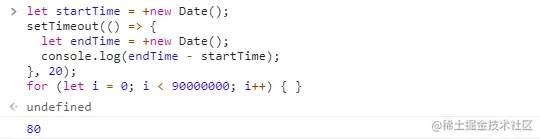

为什么说定时器setTimeout不能准时执行呢？

本文从一端代码的执行时间开始,去了解setTimeout的基本使用，深入浅出的剖析浏览器是怎么实现setTimeout的，之后在去探索定时器setTimeout为什么不能够准时执行

## 从一段代码执行时间讲起
```js
let startTime = +new Date();
setTimeout(() => {
    let endTime = +new Date();
    console.log(endTime - startTime);
}, 20)
for(let i = 0; i < 90000000; i++) {}
```
在看到这段代码的第一时间你是否会认为 setTimeout 会在 20ms 后执行，然后 console.log() 打印的是 20 呢？
我一开始的时候也认为打印的是 20 的，就算 JS 引擎计算 endTime - startTime 的时间需要花个 1ms 或 2ms ，那也应该是打印 21 或者 22 的。

但是结果远远出乎我的意料，当我把这段代码放到浏览器控制台上面执行的时候，结果是下面这样子的：



console.log()打印的结果是80,这跟我给setTimeout定下的20ms后执行的时间相差的太多了吧，难怪都说定时器setTimeout 不能够准时执行

那为什么setTimeout不能够准时执行呢？

## setTimeout的基本使用


## 浏览器是怎么实现setTimeout的？

## 有哪些原因会导致setTimeout不准时呢？

### 当前任务执行时间过久

### 嵌套调用setTimeout存在最小延迟4ms

### 未激活的页面，setTimeout的最小执行间隔是100ms

### 延迟执行时间有最大值

## 既然setTimeout不准时那么还可以用吗？

## 有什么可以替代setTimeout的吗

## 一道Event Loop的面试题

## 总结
- setTimeout()方法用于指定的毫秒后调用函数或或计算表达式
- 浏览器通过维护一个延迟队列来实现setTimeout,有一个ProcessDelayTask函数来检查到期的任务然后依次执行
- 导致定时器不准时的原因有四个
    - JS是单线程执行任务，如果当前任务执行时间过久会导致定时器设置的任务被延迟执行。
    - 如果setTimeout存在嵌套且超过5次,那么系统设置最短时间间隔为4ms
    - 未激活页面，setTimeout的最小执行间隔是1000ms
    - setTimeout的延迟时间有最大值2147483647ms
- setTimeout不宜用于对于时间精度要求较高的场景，可以用requestAnimationFrame去替代执行。

## 资料
[为什么都说定时器 setTimeout 不能准时执行呢？](https://juejin.cn/post/6982081539249012766#heading-9)

[前端动画性能优化](/front-end/JavaScript/browser-animation-frame.html)

[解决setInterval和setTimeout越来越慢的问题](https://blog.csdn.net/qq_44318215/article/details/126927341)