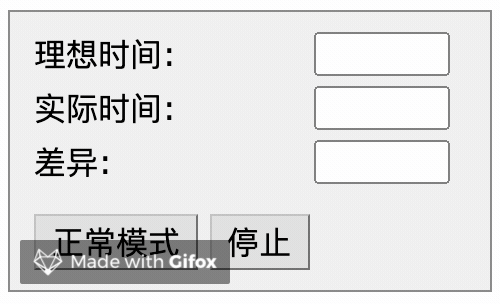
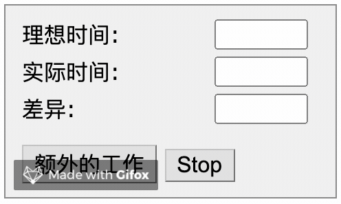
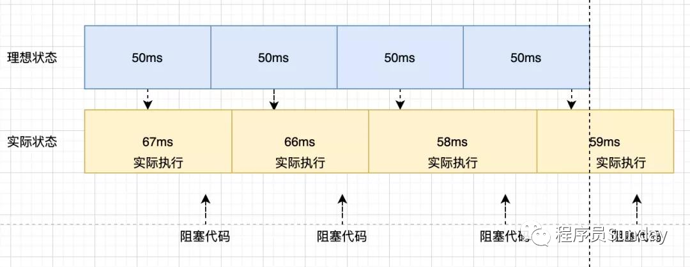
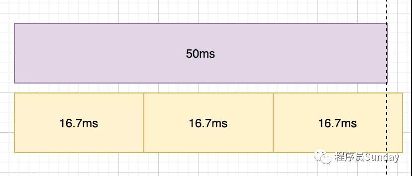
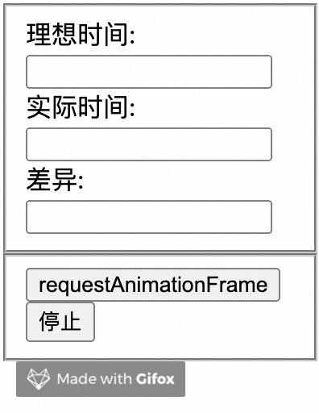
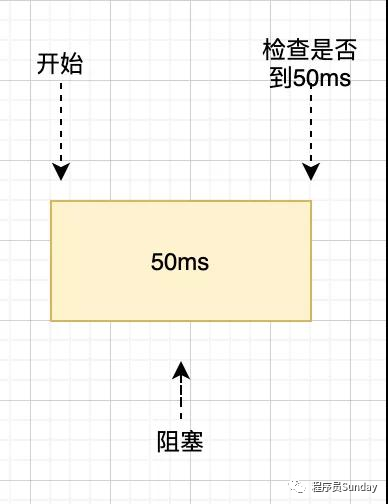
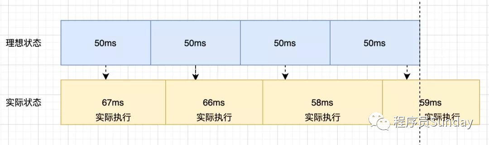
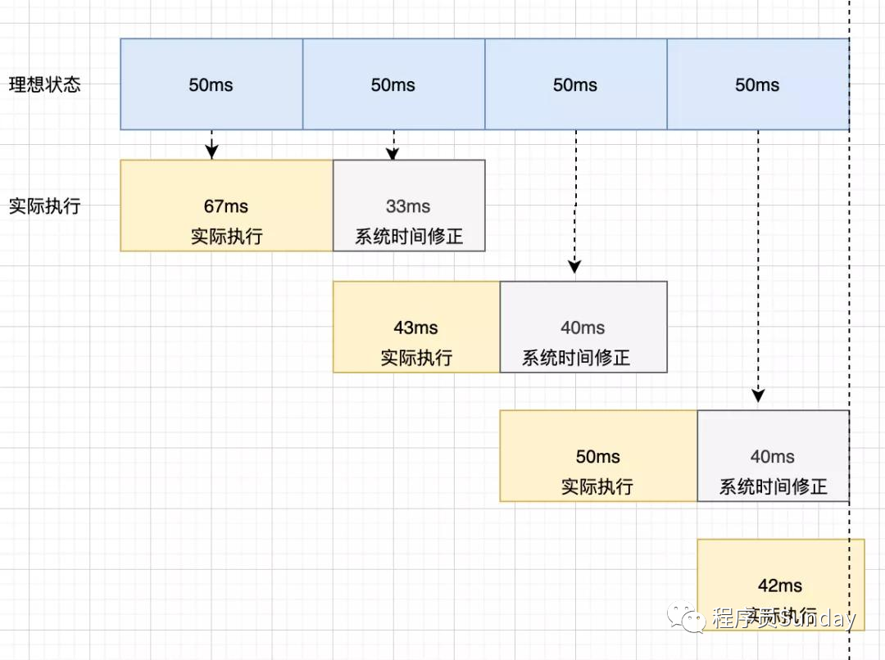

## 背景
setTimeout是不准的。因为 setTimeout 是一个宏任务，它的指定时间指的是：**进入主线程的时间**

```js
setTimeout(callback, 进入主线程的时间);
```
所以什么时候可以执行callback,需要看 **主线程前面还有多少任务待执行**

由此，才有了这个问题

我们可以通过这个场景来进行演示



运行代码如下，通过一个计数器来记录每一次 setTimeout 的调用，而设定的 间隔 * 计数次数，就等于理想状态下的延迟，通过以下例子来查看我们计数器的准确性

```js
function timer() {
    var speed = 50, // 设定间隔
        counter = 1, // 计数
        start = new Date().getTime();
    
    function instance() {
        var ideal = (counter * speed),
            real = (new Date().getTime() - start);
        
        counter++;
        form.ideal.value = ideal; // 记录理想值
        form.real.value = real; // 记录真实值

        var diff = (real - ideal);
        form.diff.value = diff; // 差值
    }  
    window.setTimeout(function() {instance()}, speed)
}
timer();
```
而我们如果在 setTimeout 还为执行期间加入一些额外的代码逻辑，再来看看这个差值

```js
... 
window.setTimeout(function() { instance(); }, speed); 
for(var x=1, i=0; i<10000000; i++) { x *= (i + 1); } 
} 
... 
```


可以看出，这大大家居了误差。

可以看到随着时间的推移，setTimeout 实际执行的时间和理想的时间差值会越来越大,这就不是我们预期的样子。类比真实的场景，对于一些倒计时以及动画来说都会造成时间的偏差都是不理想的。

这张图可以很好的描述以上问题



## 如何实现准时的 setTimeout
### requestAnimationFrame
:::tip
window.requestAnimationFrame() 告诉浏览器--你希望执行一个动画，并且要求浏览器在下次重回之前调用指定的回调函数更新动画
:::

该方法需要传入一个回调函数作为参数，该回调函数会在浏览器下一次重绘之前执行,回调函数执行次数通常是每秒60次，也就是15.7ms 执行一次，但是并不一定保证为16.7ms.

我们也可以尝试一下将它来抹蜜setTimeout

```js
// 模拟代码
function setTimeout2(cb, delay) {
    let startTime = Date.now();
    loop();

    function loop() {
        const now = Date.now();
        if(now - startTime >= delay) {
            cb();
            return;
        }
    }
    requestAnimationFrame();
}
```

发现由于 16.7 ms 间隔执行，在使用间隔很小的定时器，很容易导致时间的不准确。



再看看额外代码的引入效果。

```js
... 
 window.setInterval2(function () { instance(); }, speed); 
} 
for (var x = 1, i = 0; i < 10000000; i++) { x *= (i + 1); } 
... 
```



略微加剧了误差的增加，因此这种方案仍然不是一种好的方案

### while
想的到准确的，我们第一反应就是如果我们能够主动触发,获取到最开始的时间，以及不断去轮训当前时间，如果差值是预期的时间，那么这个定时器肯定是准确的，那么用while可以实现这个功能

理解起来也很简单：



```js
function timer(time) {
    const startTime = Date.now();
    while(true) {
        const now = Date.now();
        if(now - startTime >= time) {
            console.log('误差', now - startTime - time);
            return;
        }
    }
}
```
打印: 误差 0

<span style="color: red">显然这样的方式很精确，但是我们知道JS是单线程运行，使用这样的方式强行霸占线程会使得页面进入卡死状态，这样的结果显然是不合适的</span>

### setTimeout 系统时间补偿
这个方案是在 stackoverflow 看到的一个方案，我们来看看此方案和原方案的区别



setTimeout系统时间补偿



当每一次定时器执行时后,都去获取系统的时间来进行修正，虽然每次运行可能会有误差，但是通过系统时间对每次运行的修复，能否让后面每一次是都得到补偿.

```js
function timer() {
    var spead = 500;
    counter = 1;
    start = new Date().getTime();

    function instance() {
        var real = (counter * spead);
        ideal = (new Date().getTime() - start);

        counter++;

        var diff = (ideal - real);
        form.diff.value = diff;

        window.setTimeout(function() { instance(); }, (speed - diff)); // 通过系统时间进行修复 
    }
    window.setTimeout(function() { instance()}, spead);
}
```
依旧非常的稳定，因此通过系统的时间补偿，能够让我们的setTimeout 变得更加准时，至此我们完成了如何让 setTimeout 准时的探索


好了我们最后来总结一下四种方案的优缺点

while、Web Worker、requestAnimationFrame、setTimeout 系统时间补偿

''| while | Web Worker | requestAnimationFrame | setTimeout系统时间补偿
---|---|---|---|---
准确度| 高 | 高 | 低 | 高
主线程阻塞 | 阻塞 | 一般 | 不阻塞 | 不阻塞
评分|⭐️⭐️|⭐️⭐️⭐️|⭐️| ⭐️⭐️⭐️⭐️⭐️