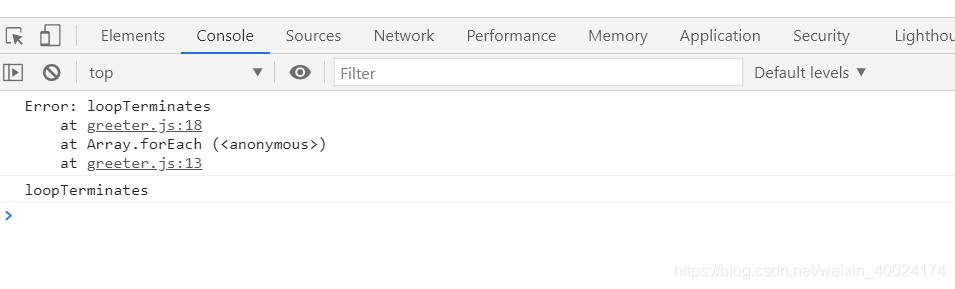
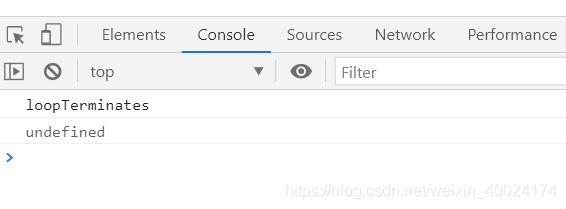

抛出错误一般都是与try catch同时出现
1. throw new Error(error)；这个是创建错误，创造出一个错误类型抛出；
2. throw error 这个是抛出错误

## throw new Error(error)--- 注意Error首字母大写

```javascript
var a = 5;

try {
    if (a === 5) {
        throw new Error('loop Terminates'); // Error要大写
    }
} catch(e) {
    console.log(e); // 打印出Error对象：Error:loop Terminates
    cosnole.log(e.message); // 打印 loop Terminates
}
```
打印结果



## throw error
```javascript
var a = 5;

try {
    if (a === 5 ) {
        // 抛出错误
        throw 'loop Terminates'
    }
} catch(e) {
    console.log(e); // loop Terminates
    console.log(e.message); // undefined
}
```
打印结果



## 总结
这里是使用了throw来抛出异常，并且还是使用
```javascript
throw new Error('error message')
```
这样的实例化写法，是很规范的，是[js规范](https://standardjs.com/rules-zhcn.html#javascript-standard-style)推崇的。但是这里需要注意的是，throw出去的是一个<span style="color: red">Error对象</span>，而
```javascript
throw 'error message'; // 不建议的写法
```
throw出去的是一个字符串

