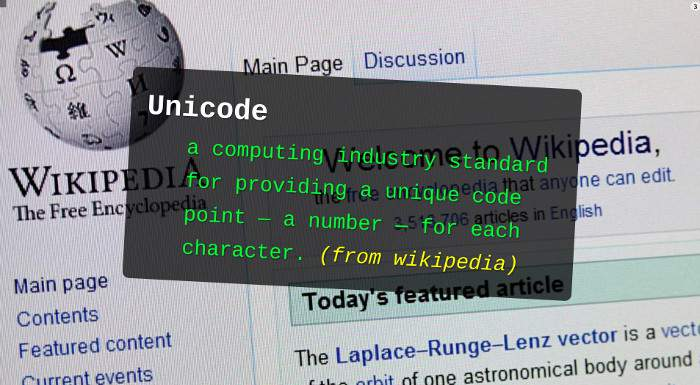
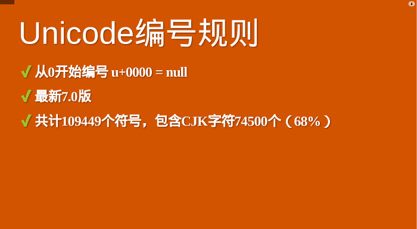
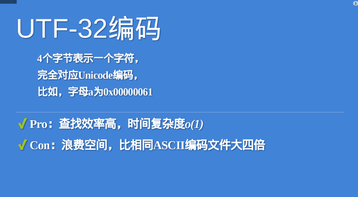
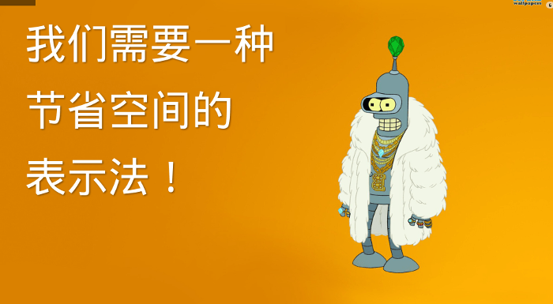
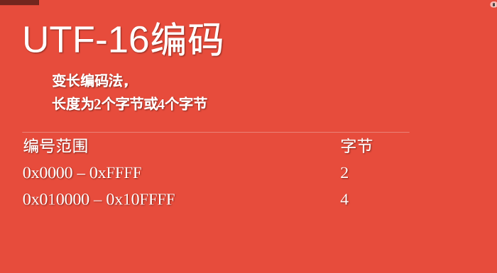
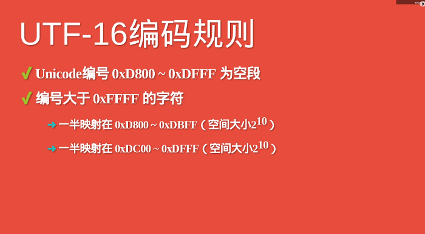
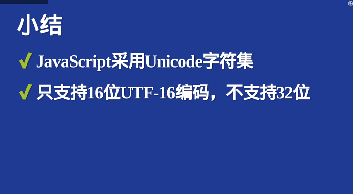
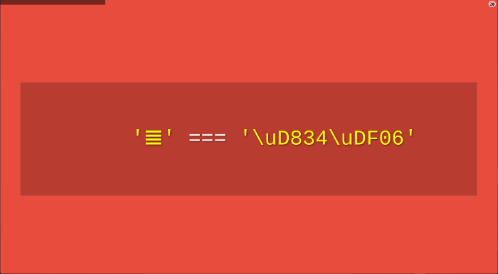
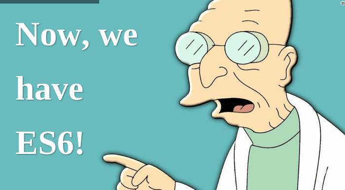
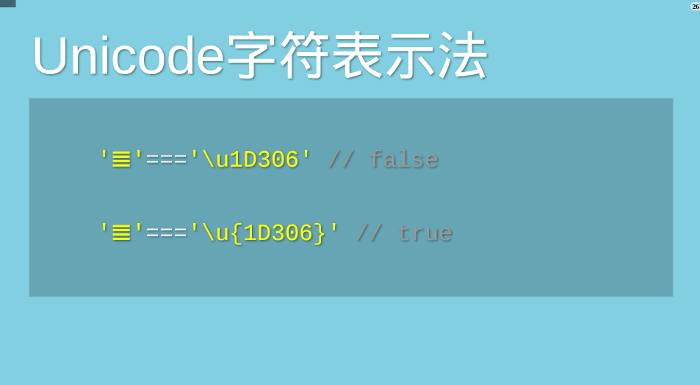

## Unicode是什么？
Unicode源于一个很简单的想法：<span style="color: blue">将全世界所有的字符包含在一个集合里，计算机只要支持这一个字符集，就能显示所有的字符，再也不会有乱码了</span>



**它从0开始，为每个符号指定一个编号，这叫做"码点"(code point)**。比如码点0的符号就是null(表示所有二进制都是0)
```js
U+0000 = null
```
上式中，U+表示紧跟在后面的十六进制树是Unicode的码点



目前Unicode的最新版本是7.0版，一共收入了109449个符号，其中的中日韩文字为74500个。可以近似认为，全世界现有的符号当中，三分之二以上来自东亚文字。比如：中文"好"的码点是十六进制的597D

```js
"好".charCodeAt(0).toString(16) // 597D

U+597D = 好
```
这么多符号，Unicode不是一次性定义的，而是分区定义。每个区可以存放65526个（2<sup>16</sup>）字符,称为一个平面(plane)。目前，一共有17个(2<sup>5</sup>)平面(目前只定义了17个，其他都没用使用)，也就说，整个Unicode字符集的大小现在是2<sup>21</sup>

最前面的65536个字符位，称为基本平面(缩写BMP)，它的码点范围是从0一直到2<sup>16</sup> - 1，写成16进制就是从U+0000到U+FFFF.所以最常见的字符都放在这个平面，这是Unicode最先定义和公布的一个平面

剩下的字符都放在辅助平面(缩写SMP)，码点范围从U+010000一直到U+10FFFF;


## UTF-32与UTF-8
<span style="color: red;font-weight:bold">Unicode只规定了每个字符的码点，到是用什么样的字节序表示这个码点，就涉及到编码方法</span>。

<span style="color: blue">**最直观的编码方法是，每个码点使用四个字节表示，字节内容一一对应码点。这种编码方法就叫做UTF-32**</span>。比如，码点0就用四个字节的0表示，码点597D就在前面加两个字节0

```js
U+0000 = 0x0000 0000
U+597D = 0x0000 597D
```


UTF-32的有点在于，转换规则简单直观，查找效率高。缺点在于浪费空间，同样的内容的英语文本，它会比ASII编码大四倍。这缺点很致命，导致实际上没有人使用这种编码，HTML5标准就明文规定，网页不得编码成UTF-32



人们真正需要的是一种节省空间的编码方法，这导致了UTF-8的诞生。**UTF-8是一种变长的编码方法，字符长度从1个字节到4个字节不等**。越是常用的字符，字节越短，最前面的128个字符，只使用1个字节表示，与ASCII码完全相同。

编码范围|字节
---|---
0x0000 - 0x007F | 1
0x0080 - 0x07FF |2
0x0800 - 0xFFFF | 3
0x010000 - 0x10FFFF |4

由于UTF-8这种节省空间的特性，导致它成为互联网上最常见的网页编码。不过，它跟今天的主题关系不大，我就不深入了，具体的转码方法，可以参考我多年前写的[《字符编码笔记》](https://www.ruanyifeng.com/blog/2007/10/ascii_unicode_and_utf-8.html)。

## UTF-16简介
UTF-16编码介于UTF-32与UTF-8之间，同时结合了定长和变长两种编码方法的特点。

它的编码规则很简单：基本平面的字符占用2个字节，辅助平面的字符占用4个字节。也就是说，UTF-16的编码长度要么是2个字节（U+0000到U+FFFF），要么是4个字节（U+010000到U+10FFFF）。



于是就有一个问题，当我们遇到两个个字节，怎么看出它本身是一个字符，还是需要跟其他两个字节放在一起解读？？

说来很巧妙，我也不知道是不是故意的设计，在基本平面内，从U+D800到U+DFFF是一个空段，即这些码点不对应任何字符。因此，这个空段可以用来映射辅助平面的字符。

具体来说，辅助平面的字符位共有2<sup>20</sup>个，也就是说，对应这些字符至少需要20个为二进制位。UTF-16将这20位拆成两半，前10位映射在U+D800到U+DBFF（空间大小210），称为高位（H），后10位映射在U+DC00到U+DFFF（空间大小210），称为低位（L）。这意味着，一个辅助平面的字符，被拆成两个基本平面的字符表示。



<span style="color: red">所以,当我们遇到两个字节，发现它的码点在U+D800到U+DBFFF之间，就可以断定，紧跟在后面的两个字节的码点，应该在U+DCOO到U+DFFF之间，这四个字节必须放在一起解读</span>

## UTF-16的转码公式
Unicode码点转成UTF-16的时候，首先要区分是基本平面字符，还是辅助平面字符。如果是前者，直接将码点转为对应的十六进制形式，长度为两字节。
```js
U+597D = 0x597d
```

## JavaScript使用哪一种编码---UCS-2

## UCS-2编码


## JavaScript的诞生背景

## JavaScript字符函数的局限
《span style="color: red">由于JavaScript只能处理UCS-2编码，造成所有字符在这门语言中都是2个字节，如果是4个字节的字符，会当作两个双字节的字符处理</span>。JavaScript的字符函数都受到这一点的影响，无法返回正确结果。



还是以字符亖为例，它的UTF-16编码是4个字节的oxD834 DF06,问题就来了，4个字节的编码不属于UCS-2，JavaScript不认识，只会把它看作单独的两个字符U+D834和U+DF06。前面说过，这两个码点是空的，所以JavaScript会认为是两个空字符组成的字符串！


上面代码表示，JavaScript认为字符的长度是2，取到的第一个字符是空字符，取到的第一个字符的码点是0xDB34。这些结果都不正确！



解决这个问题，必须对码点做一个判断，然后手动调整。下面是正确的遍历字符串的写法
```js
while(++index < length) {
    // ...
    if (charCode >= 0xD800 && charCode <= 0xDBFF) {
        output.push(character + string.charAt(++index));
    } else {
        output.push(character);
    }
}
```
上面代码表示，遍历字符串的时候，必须对码点做一个判断，只要落在只要落在0xD800到0xDBFF的区间，就要连同后面2个字节一起读取。

类似的问题存在于所有的JavaScript字符操作函数。
```JS
String.prototype.replace();
String.prototype.substring();
String.prototype.slice();
//...
```
## ECMAScript 6

JavaScript的下一个版本ECMAScript 6（简称ES6），大幅增强了Unicode支持，基本上解决了这个问题。

- 1.正确识别字符

    ES6可以自动识别4字节的码点。因此，遍历字符串就简单多了。
    ```js
    for(let s of string) {
        // ...
    }
    ```
    但是，为了保持兼容，length属性还是原来的行为方式。为了得到字符串的正确长度，可以用下面的方式
    ```js
    Array.from(string).length;
    ```
- 2.码点表示法

    JavaScript允许直接用码点表示Unicode字符，写法是"反斜杠+u+码点"。
    ```js
    '好' === '\u597D' // true
    ```
    但是，这种表示法对4字节的码点无效。ES6修正了这个问题，只要将码点放在大括号内，就能正确识别。
    

- 3.字符串处理函数

    ES6新增了几个专门处理4字节码点的函数
    ```js
    String.fromCodePoint()； // 从Unicode码点返回对应字符
    String.prototype.codePointAt(); // 从字符返回对应码点
    String.prototype.at(); // 返回字符串给定位置的字符
    ```
- 4.正则表达式

    ES6提供了u修饰符，对正则表达式添加4字节码的支持
    

- 5.Unicode正规化

    有些字符除了字母以外，还有附加符号。比如，汉语拼音的Ǒ，字母上面的声调就是附加符号。对于许多欧洲语言来说，声调符号是非常重要的。

    

    Unicode提供了两种表示方法。一种是带附加符号的单个字符，即一个码点表示一个字符，比如比如Ǒ的码点是U+01D1；另一种是将附加符号单独作为一个码点，与主体字符复合显示，即两个码点表示一个字符，比如Ǒ可以写成O（U+004F） + ˇ（U+030C）。
    ```js
    // 方法一
    '\u01D1'
    // 'Ǒ'

    // 方法二
    '\u004F\u030C'
    // 'Ǒ'
    ```
    这两种表示方法，视觉和语义都完全一样，理应作为等同情况处理。但是，JavaScript无法辨别。
    ```js
    '\u01D1'==='\u004F\u030C' 
    //false
    ```
    ES6提供了normalize方法，允许"Unicode正规化"，即将两种方法转为同样的序列。
    ```js
     '\u01D1'.normalize() === '\u004F\u030C'.normalize() 
    // true
    ```
    关于ES6的更多介绍，请看[《ECMAScript 6入门》](https://es6.ruanyifeng.com/#docs/string)。

## js方法
-  <span style="color: red">charCodeAt方法可返回指定位置的字符的Unicode编码，返回值是0-65535之间的整数，表示给定索引处的UTF-16代码单元</span>
```js
'好'.charCodeAt(); // 得到的是十进制？
'好'.codePointAt().toString(16) //'597d'
'符' == '\u7B26' // true
```
## 资料
[原文](https://www.ruanyifeng.com/blog/2014/12/unicode.html)

[bililli--编码](https://www.bilibili.com/video/BV1cB4y177QR/?spm_id_from=333.934.0.0&vd_source=de30ac81210d4a5cbe5f60dc49fcb9a3)

[计算机组成](/wander/Life/)

<!-- unicode--字符集-->