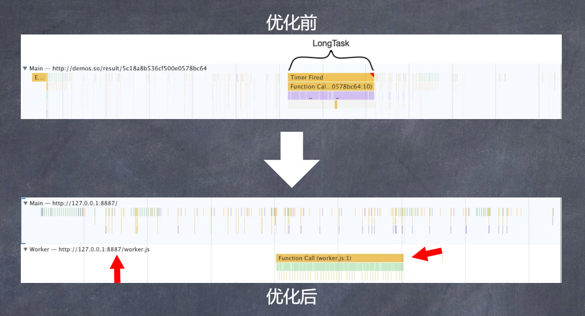

根据[W3C性能小组](https://www.w3.org/webperf/)的介绍，<span style="color:red">超过50ms的任务就是长任务</span>

|延迟|用户反应
---|---
0-16ms| 人们特别擅长追踪运动，如果动画不流畅，他们就会对运行心生反感。用户可以感知每秒渲染60帧的平滑动画转场。也就是每帧16毫秒(包括浏览器将新帧会知道屏幕上所需的时间)，留给应用大约10毫秒的时间来生成一帧
0-100ms|在此时间窗口内响应用户操作，他们会觉得可以立即获得结果。时间在长，操作与反应的连接就会中断
100-300ms|用户会遇到轻微可觉察的延迟
300-1000ms|在此窗口内，延迟感觉像是任务自然和持续发展的一部分。对于网络上的大多数用户，加载页面或者更改视图代表一个任务
1000ms+|超过1秒，用户的注意力将会离开他们正在执行的任务
10，000+ms|用户感到失望，可能会放弃任务；之后他们或许不在回来

数据来自[使用RAIL模型评估性能](https://web.dev/rail/)

根据上图我们可以知道，当延迟超过100ms，用户就会察觉到轻微的延迟

所以为了避免这种情况，我们可以使用两种方案，一种是web worker 另一个中是时间分片(Time Slicing)

## Web Worker
我们都知道，JS是单线程，所以当我们在运行长任务时，容易造成页面假死的状态，虽然我们可以将任务放在任务队列中，通过异步的方式执行，但是这并不能改变JS的本质

所以为了改变这种现状，[whatwg](https://html.spec.whatwg.org/multipage/workers.html)推出了[Web Worker](https://html.spec.whatwg.org/multipage/workers.html)

具体的语法不会进行说明，有兴趣的童鞋可以查看[MDN Web Worker](https://developer.mozilla.org/en-US/docs/Web/API/Web_Workers_API/Using_web_workers)。

我们可以看看使用了Web Worker之后的优化效果：
```js
const testWorker = new Worker('./worker.js');
setTimeout(_ => {
    testWorker.postMessage({});
    testWorker.onmessage = function(ev) {
        console.log(ev.data);
    }
}, 5000);

// worker.js
self.onmessage = function() {
    const start = performance().now();
    while(performance.now() - start < 1000) {}
    postMessage('done!')
}
```


代码以及截图来自于让你的[网页更丝滑](https://ppt.baomitu.com/d/b267a4a3)

## 时间分片
<span style="color: blue">时间分片是一项使用比较广的技术方案，它的本质就是将长任务分割为一个个执行时间很短的任务，然后在一个个的执行。</span>

这个概念在我们日常的性能优化上是非常有用的。

例如我们需要在页面中一次插入一个长列表时(当然，通常这种情况下，我们会使用分页去做)

如果利用时间分片的概念来实现这个功能，我们可以使用requestAnimationFrame + DocumentFragment;

关于这两个api,我们不做详细介绍，有兴趣可以查看[MDN requestAnimationFrame](https://developer.mozilla.org/en-US/docs/Web/API/window/requestAnimationFrame)跟[MDN DocumentFragment](https://developer.mozilla.org/en-US/docs/Web/API/DocumentFragment)。

这个有两个demo，大家可以对比下流畅程度
```html
<style>
    *{
        margin: 0;
        padding: 0;
    }
    .list {
        width: 60vw;
        position: absolute;
        left: 50%;
        transform: translateX(-50%)
    }
</style>
<ul class="list"></ul>
<script>
    'use strict';
    let list = document.querySelector('.list');
    let total = 10000;
    for(let i = 0; i < total; ++i) {
        let item = document.createElement('li');
        item.innerText = `我是${i}`;
        list.appendChild(item);
    }
</script>
```
<span style="color: red">使用时间分片</span>
```html
<style>
    * {
        margin: 0;
        padding: 0;
    }
    .list {
        width: 60vw;
        position: absolute;
        left: 50%;
        transform: translateX(-50%)
    }
</style>
<ul class="list"></ul>
<script>
    let list = document.querySelector('.list');
    let total = 100000;
    let size = 20;
    let index = 0;
    const render = (total, index) => {
        if(total <= 0) return;
        let curPage = Math.min(total, size);
        window.requestAnimationFrame(() => {
            let fragment = document.createDocumentFragment();
            for(let i = 0; i < curPage; ++i) {
                let item = document.createElement('li');
                item.innerText = `我是${index + i}`;
                fragment.appendChild(item);
            }
            list.appendChild(fragment);
            render(total - curPage, index + curPage);
        })
    }
    render(total, index)
</script>
```
没有做太多的测评，但是从用户视觉上的感受来看就是，第一种方案，我就是想刷新都要打好几个转，往下滑的时候也有白屏的现象。

除了上述的生成DOM的方案，我们同样可以利用Web Api requestIdleCallback 以及ES6 API Generator]来实现。

同样不会做太多的介绍，详细规则可以看[MDN requestIdleCallback](https://developer.mozilla.org/zh-CN/docs/Web/API/Window/requestIdleCallback)以及[MDN Generator](https://developer.mozilla.org/en-US/docs/Web/JavaScript/Reference/Global_Objects/Generator)。

```html
<style>
    * {
        margin: 0;
        padding: 0;
    }
    .list {
        width: 60vw;
        position: absolute;
        left: 50%;
        transform: translateX(-50%);
    }
</style>
<ul class="list"></ul>
<script>
    'use strict';
    function gen(task) {
        requestIdleCallback(dealine => {
            let next = task.next();
            while(!next.done) {
                if(dealine.timeRemaining() <= 0) {
                    gen(task);
                    return;
                }
                next = task.next();
            }
        })
    }
    let list = document.querySelector('.list');
    let total = 10000;
    function* loop() {
        for(let i = 0; i < total; ++i) {
            let item = document.createElement('li');
            item.innerText = `我是${i}`;
            list.appendChild(item);
            yield;
        }
    }
    gen(loop())
</script>
```
:::tip
window.requestIdleCallback;

- callback

    一个事件循环空闲时即将被调用的函数的引用。函数会接收到一个名为IdleDealine的参数，这个参数可以获取当前空间时间以及回调是否超时时间前已经执行的状态
- options(可选)

    包括可选的配置参数。具有如下属性：
    - timeout： 如果指定了 timeout，并且有一个正值，而回调在 timeout 毫秒过后还没有被调用，那么回调任务将放入事件循环中排队，即使这样做有可能对性能产生负面影响。


:::


## 资料
[原文](https://blog.csdn.net/weixin_37615279/article/details/104687024)