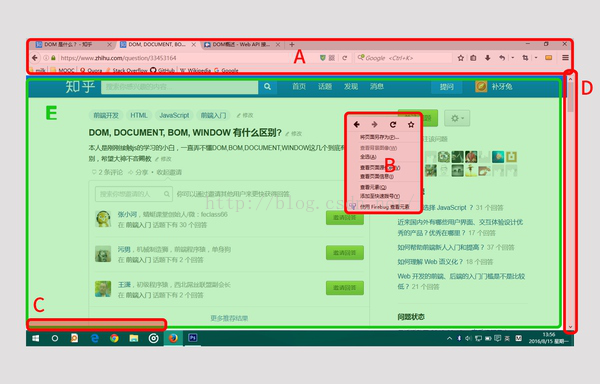
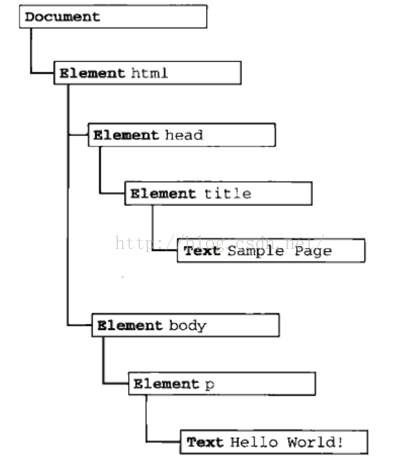
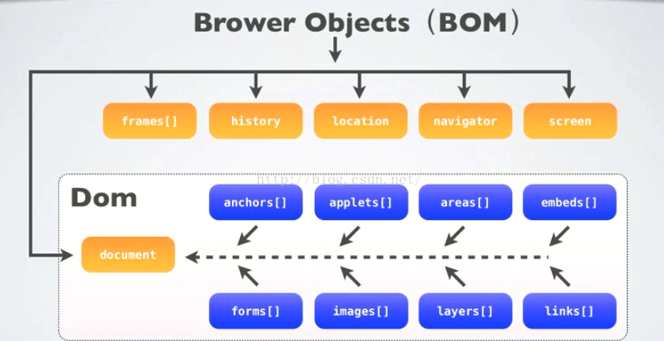
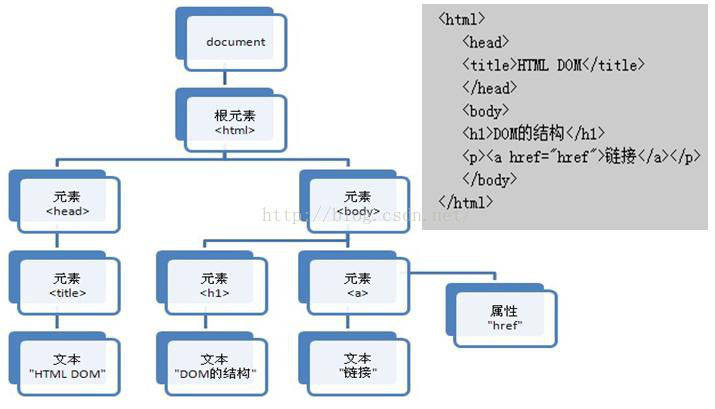
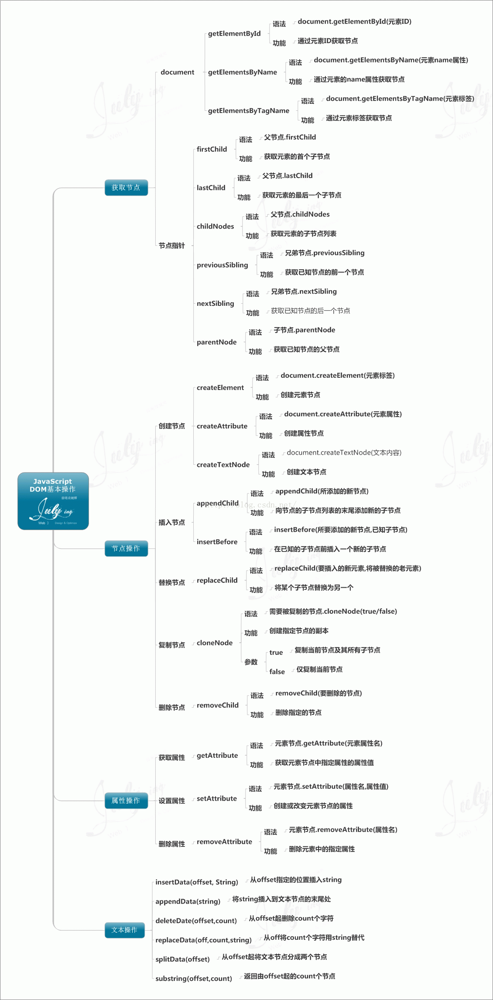

## Javascript组成
Jvascript的实现包括以下3个部分
name|描述
---|---
ECMAScript(核心)|描述了JS的语法和基本对象
文档对象模型|处理网页内容的方法和接口
浏览器对象模型|与浏览器交互的方法和接口

javascript有三部分组成，ECMAScript，DOM和BOM，根据宿主(浏览器)的不同，具体的表现形式也不尽相同,IE和其他浏览器风格迥异，IE扩展了BOM，加入了ActiveXObject类，可以通过Javascript实例化ActiveX对象.

1. DOM是W3C的标准(所有浏览器公共遵守的标准)
2. BOM是各个浏览器厂商根据DOM在各自浏览器上的实现(表现为不同浏览器定义有差别，实现方式不同)
3. window是BOM对象，而非JS对象；Javascript是通过BOM(Browser Object Model)对象来访问、控制、修改客户端(浏览器)

**<span style="color: red">ECMAScript扩展知识</span>**
1. ECMAScript是一个标准，JS只是它的实现，其他实现包括ActionScript
2. ECMAScript可以为不同种类的宿主环境提供核心的脚本编程能力，即ECMAScript不与具体的宿主环境相邦定，如JS的宿主环境是浏览器，AS的宿主环境是Flash
3. ECMAScript描述了一下内容：语法、类型、语句、关键词、保留字、运算符、对象

## DOM,DOCUMENT,BOM,WINDOW区别
DOM是为了操作文档出现的API，document是其的一个对象；

BOM是为了操作浏览器出现的API，window是其的一个对象。

BOM是浏览器对象模型，DOM是[文档对象模型](https://www.baidu.com/s?wd=%E6%96%87%E6%A1%A3%E5%AF%B9%E8%B1%A1%E6%A8%A1%E5%9E%8B&tn=44039180_cpr&fenlei=mv6quAkxTZn0IZRqIHcvrjTdrH00T1Y4mvn3mWKWmWT4nW99myRv0ZwV5Hcvrjm3rH6sPfKWUMw85HfYnjn4nH6sgvPsT6KdThsqpZwYTjCEQLGCpyw9Uz4Bmy-bIi4WUvYETgN-TLwGUv3EnHTvPH6Ln1DzPH0snWR1P1fvn0),前者是对浏览器本身进行操作，而后者是对浏览器(可看成容器)内的内容进行操作



**<span style="color:orange">归DOM管的</span>**

E区(就是你说的document。由web开发人员呕心沥血写出来的一个文件夹，里面有index.html，css和JS什么的，部署在服务器上，我们可以通过浏览器的地址栏输入URL然后回车将这个document加载到本地，浏览，右键查看源代码等)

**<span style="color:orange">归BOM管的</span>**

A区(浏览器的标签页，地址栏，搜索栏，书签栏，窗口放大还原关闭按钮，菜单栏等)

B区(浏览器的右键菜单)

C区(document加载时的状态栏，显示http状态码)

D区(滚动条scroll bar)

### DOM
DOM全称是Document Object Model，也就是文档对象模型。是针对XML的基于树的API。描述了处理处理网页内容的方法和接口，是HTML和XML的API，DOM把整个页面规划成由节点层级构成的文档。

这个DOM定义了一个<span style="color: blue">HTMLDocument</span>和<span stle="color: blue">HTMLElement</span>作为这种实现的基础，就是说为了能以编程方法操作这个HTML的内容(比如添加某些元素、修改元素的内容、删除某些元素),我们把这个HTML看做一个对象树(DOM树)，它本身和里面的所有东西比如&lt;dev&gt;&lt;/div&gt;这些标签都看做一个对象，每个对象都叫做一个节点(node)，节点可以理解为DOM中所有Object的父类



<span style="color: blue">DOM有什么用？就是为了操作HTML中的元素，比如说我们要通过JS把这个网页的标题给改了，直接这样就可以</span>

```js
document.title = 'how to make love'
```
这个API使得网页被下载到浏览器之后改变网页的内容成为可能

### document
当浏览器下载到一个网页，通常是HTML，这个HTML就叫document(当然，这也是DOM树中的一个node),从上图可以看到，document通常是整个DOM树的根节点。这个document包含了标题(document.title)、URL(document.URL)等属性，可以直接在JS中访问到

在一个浏览器窗口中可能有多个document,例如，通过iframe加载的网页，每一个都是一个document.

在JS中，可以通过document访问其子节点(其实任何节点都可以)，如
```js
document.body.getElementById('xxx')
```

### BOM
BOM是Browser Object Model,浏览器对象模型。

刚才说DOM是为了操作文档出现的接口，那BOM顾名思义其实就是为了控制浏览器的行为而出现的接口。

浏览器可以做什么呢？比如跳转到另一个页面、前进、后退等等，程序还可能需要获取屏幕大小之后的参数。

所以BOM就是为了解决这些事情出现的接口。比如我们要让浏览器跳转到另一个页面，只需要location.href = 'http://www.xxx.com',这个location就是BOM里的一个对象。

由于BOM的window包含了document，因此可以直接使用window对象里的document属性，通过document属性就可以访问、检索、修改XHTML文档内容与结构。因为document对象有是DOM(Document Object Model)模型的根节点

可以说BOM包含了DOM(对象)，浏览器提供出来给予访问的是BOM对象，从BOM对象在访问DOM对象，从而js可以操作浏览器以及浏览器读取到的文档。

### window
window也是BOM的一个对象，除去编程意义上的"兜底对象"外，通过这个对象可以获取窗口位置、确定窗口大小、弹出对话框等等。例如我要关闭当前窗口
```js
window.close();
```

## 浏览器对象模型(BOM)
BOM与DOM的结构关系示意图


BOM的核心是window，而Window对象又具有双重角色，它即是通过js访问浏览器窗口的一个接口，又是一个Global(全局)对象。这意味着在网页中定义的任何对象，变量和函数，都以window作为其global对象

<span style="color:red">window对象包含属性：document,location,navigator,screen,history,frames</span>

document根节点包含子节点：forms，location,anchors,images,links

从window.document已然可以看出，DOM的最根本的对象是BOM的window对象的子对象

区别：DOM描述了处理网页内容的方法和接口，BOM描述了与浏览器进行交互的方法和接口

### window对象
window对象是Javascript层级中的顶层对象

window对象代表一个浏览器窗口或一个框架。

window对象会在&lt;body&gt;或&lt;frameset&gt;每次出现时候被自动创建


## 文档对象模型(DOM)
DOM节点树模型(以HTML DOM树为例)



DOM模型将整个文档(XML文档和HTML文档)看成一个属性结构，

在DOM中，HTML文档文档的层次结构呗表示为一个树形结构。并用document对象表示该文档，树的每个子节点表示HTML文档中不同的内容

每个载入浏览器的HTML文档都会成为Document对象，Document是探索DOM的入口，利用全局变量document可以访问Document对象


### 附:DOM基本操作思维导图


## 其他 
### window.open 和window.location.href区别
<span style="color: red">window.location是window对象的属性，而window.open是window对象的方法</span>

window.location是你对当前浏览器窗口的URL地址对象的参考

window.open是用来打开一个新窗口的函数！

[JavaScript中window.open（）和Window Location href的区别](https://blog.csdn.net/qq_41694906/article/details/88224861)

## 资料
[Javascript之BOM与DOM讲解](https://blog.csdn.net/qq877507054/article/details/51395830)

[BOM与DOM解释与分析](https://blog.csdn.net/qq_41908550/article/details/83060780)