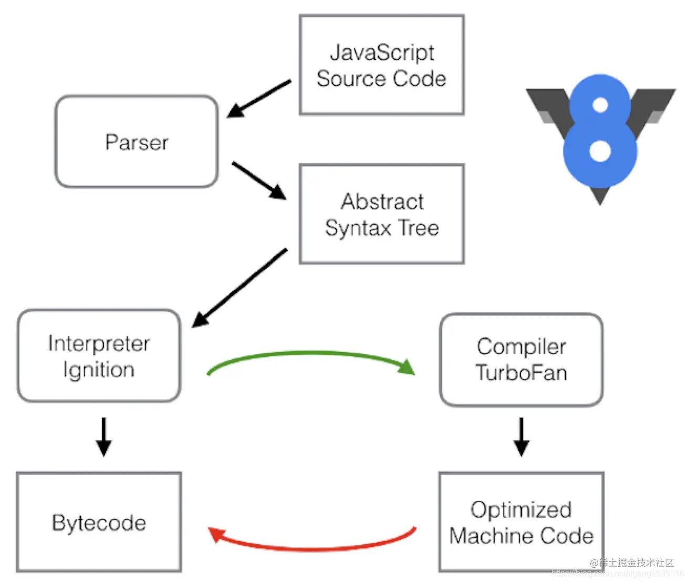

## V8
### V8是什么？
Google V8是开源高性能Javascript和WebAssembly引擎，被用于Chrome和Node.js等。

Chrome的市场占有率高大60%,而Node.js是JS后端编程的事实标准。国内的众多浏览器，其实都是基于Chromium浏览器开发，而Chrominum相当于开源版本的Chrome,自然也是基于V8引擎的。

神奇的是，就连浏览器界独树一帜的Microsoft也投靠了Chromium阵营。另外，Electron是基于Node.js与Chromium开发桌面引用，也是基于V8的

### 内部结构
V8是一个非常复杂的项目，使用cloc统计克制，它竟然有超过100万行C++代码。

V8由许多子模型构成，其中4个模块是最重要的

- <span style="color: red">**Parse**: 语法分析器，将Javascript源码转换为 Abstract Syntax Tree(AST)</span>
- <span style="color: red">**Ignition**: 解释器，将AST转换为Bytecode, 解释并执行 Bytecode ;同时收集 TurboFan 优化编译所需的信息，比如函数参数的类型；</span>
- <span style="color: red">**TurboFan**: 编译器，利用 Ignitio 所收集的类型信息，将Bytecode 转换为优化的汇编代码(计算机课识别)</span>
- <span style="color: red">**Orinoco**: 垃圾回收，负责将程序不在需要的内存空间回收</span>

### Ignition: 解释器
<span style="color: red">在V8出现之前，所有的Javascript虚拟机所采用的都是计时器来解释执行的方法，这是Javascript执行速度过慢的主要原因之一</span>

<span style="color: red">**解释器的工作方式**: 边解释，边执行。解析器解析代码，生成对应的字节码，然后解释器直接解释执行字节码。这样子虽然启动快，但对于循环等会存在解释多次的情况。从而导致运行速度变慢，影响到js的执行效率</span>

```js
for(let i = 0;i < len; i++) {
    doSomething(i);
}
```
<span style="color: red">**如何看到解释器生成的 Bytecode:** Node.js是基于V8引擎实现的，因此node命令提供了很多V8引擎的选项，使用node的 --print-bytecode 选项，可以打印出Ignition生成的Bytecode</span>

factorial.js如下，**由于V8不会编译没有被调用的函数，因此最后一行调用factorial函数**

```js
function factorial(N) {
    if(N === 1) {
        return 1;
    } else {
        return N * factorial(N - 1);
    }
}
factorial(10)
```
使用node命令(node版本为12.6.0)的 --print-bytecode 选项，打印Ignition生成的byteCode

```js
node --print-byteCode
```
然后就可以看到bytecode结果了

### TurboFan:编译器
这留到下一章讲解

## JIT
### JIT是什么？
<span style="color: red;font-weight:bold">为了解决解释器的低效问题，V8把编译器 引入进来，结合了解释器和编译器两者优点设计了即使编译(JIT)的双轮驱动设计，形式混合模式</span>， 给JavaScript的执行速度带来了极大的提升

<span style="color: red;font-weight;">JIT,全称是Just In Time，混合使用编译器和解释器的技术</span>

- 编译器启动速度慢，执行速度快
- 解释器启动速度快，执行速度慢(之前的JS虚拟机采用方式)

:::tip
绝大多数编译器以预先编译(AOT)或实时编译(JIT)形式工作
- 使用命令行或集成开发环境(IDE)调用预先编译(AOT)的编译器，如gcc
- 实时编译器是用来提高性能的，令你没有感知的，如V8
:::

### 实现思想
<span style="color: red;font-weight;">在JavaScript引擎中增加了一个监视器(也叫分析器)。在解释器解释字节码的时候增加一个监视器(monitor)，记录代码一共运行了多少次、如何运行的等信息。如果发现一段代码会被重复执行，则监视器会将此段代码标记为热点代码，同时交给V8提供的编译器对这段字节码进行编译，便宜为二进制代码，然后在对编译后的二进制代码执行优化操作，从而提高其执行效率。。等后面V8再次执行这段代码，则会跳过解释器，采用优化后的代码进行编译执行，从而提高代码的执行效率</span>

### 转码过程
<span style="color: red;font-weight: bold">整个代码转换过程:Javascript -> AST -> ByteCode -> Machine Code</span>



1. Paser：使用Parse将JavaScript源码转换为Abstract Syntax Tree(AST);
2. Interpreter:使用解释器将AST 转换为Bytecode,解释执行Bytecode.同时监视器发现某一行被执行了几次后，这行代码被打伤 Warm 的标签；当某一行代码被执行了很多次，这行代码会被打上Hot 的标签
3. Baseline Compiler： 被打上 Wram 标签的代码会被传给 Baseline Compiler编译且存储，同时按照行数(line number)和变量类型(Variable type)被索引。当发现执行的代码命中索引，会直接取出编译后的代码给浏览器执行，从而不需要重复编译已经编译过的代码
4. Optimizing Compiler: 被打上 Hot 标签的代码会被传给 Optimizing compiler，这里会对这部分代码做更优化的编译（类型假设）。在执行前会做类型检查，看是假设是否成立，如果不成立执行就会被打回 interpreter 或者 baseline compiler 的版本，Optimized Machine Code会被还原为Bytecode，这个过程叫做Deoptimization，也就是 “去优化”

### 总结如下
- <span style="color: red">如果函数没有被调用，则V8不会去编译它</span>
- <span style="color: red">如果函数只被调用1次，则Ignition将其编译ByteCode就直接解释执行了。TurboFan不会进行优化编译，因为它需要Ignition收集函数执行时的类型信息。这就要求函数至少需要执行1次，TurboFan才有用可能进行优化编译</span>
-  <span style="color: red">如果函数被调用多次，则它可能被识别为热点函数，且Ignition收集的类型信息证明可以进行优化编译的话，这是TurBoFan则会将ByteCode编译为Optimized Machine code，以提高代码的执行性能</span>

### 编译优化过程
<span style="color: red">**如何看到编译器生成的汇编代码**:使用node命令 --print-code 以及 --print-opt-code 选项</span>
```js
node --print-code --print-opt-code
```
最后生成的汇编代码可读性很差，而且，机器的CPU类型不一样的话，生成的汇编代码也不一样。

我们先不管这些汇编代码，通过 add 函数来看看编译器具体是如何运作的
```js
function add(x, y) {  
  return x + y;  
}  
  
add(1, 2);  
add(3, 4);  
add(5, 6);  
add("7", "8");
```
由于JS的变量是没有类型的，所以add函数的参数可以是任意类型：Number、String、Boolean等，如果直接编译的话，生成的汇编代码会有很多if...else分支，伪代码如下
```js
if (isInteger(x) && isInteger(y)) {
    // 整数相加
} else if (isFloat(x) && isFloat(y)) {
    // 浮点数相加
} else if (isString(x) && isString(y)) {
    // 字符串拼接
} else {
    // 各种其他情况，很长
}
```
Ignition 在执行add(1, 2),已经知道add函数的两个参数都是证书，那么 TurboFan 在编译Bytecode时，就可以假定add函数的参数是证书，这样可以极大简化生成的汇编代码，伪代码如下
```js
if (isInteger(x) && isInteger(y)) {
    // 整数相加
} else {
    // Deoptimization
}
```
接下来的add(3,4)与add(5,6)可以执行优化的汇编代码，但是add("7", "8)只能 Optimized 为Bytecode来执行。当然 TurboFan 所做也不只是根据类型信息来简化代码执行流程，它还会进行其他优化，比如减少冗余代码等更复杂的事情

:::tip
我们可以看出，如果我们的JS代码中变量的类型变来变去，是会给V8引擎增加不少麻烦的，为了提高性能，我们可以尽量不要去改变变量的类型，少使用delete等操作，同时使用typescript这种静态语言支持的语言进行编码
:::

### JIT弊端
JIT混合了编译器，必然会少一些开销
- 优化和去优化开销
- 监视器记录信息对内存的开销
- 发生去优化情况时恢复信息的记录对内存的开销
- 对基线版本和优化后版本记录的内存开销

所以整理来看是一个空间换时间的优化方案

### 疑惑
1. 是否命中热点代码，取决于不同的语言的实现，JS中是如何的？
2. 热点代码的生成，跟代码重复执行次数有关。目前是几次？次数是否可以调整？


## 资料
[JavaScript深入浅出第4课：V8引擎是如何工作的？](https://kiwenlau.com/2019/07/16/how-does-v8-work/)

[V8引擎与JIT原理](https://juejin.cn/post/7179130165262286885#heading-5)