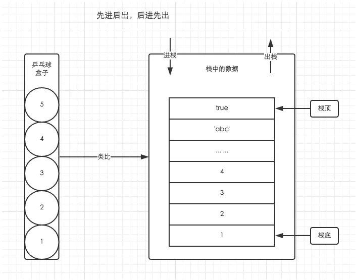
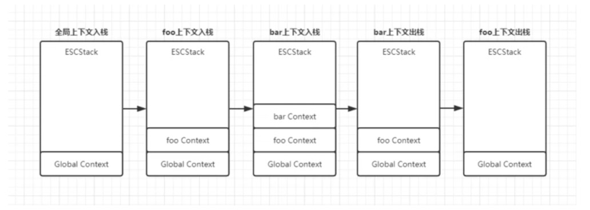

## 理解执行上下文

:::tip
执行上下文(Execution Context):函数执行前进行的准备工作(也称执行上下文环境)
:::
<span style="color: blue">运行Javascript代码时，当代码执行进入一个环境时，就会为该环境创建一个执行上下文，它会在你运行代码前做一些准备工作，如确定作用域，创建局部变量对象等。</span>

具体做了什么先按下不表，先来看下Javascript执行环境有哪些？

### Javascript中执行环境
1. <span style="color: blue">全局环境</span>
2. <span style="color: blue">函数环境</span>
3. <span style="color: blue">eval函数环境(已不推荐使用)</span>

那么与之对应的执行上下文类型同样有3种

1. <span style="color: blue">**全局执行上下文**</span>
2. <span style="color: blue">**函数执行上下文**</span>
3. <span style="color: blue">**eval函数执行上下文**</span>

<span style="color: red">Javascript运行时首先会进入全局环境，对应会生成全局上下文。程序代码中基本都会存在函数，那么调用函数，就会进入函数执行环境，对应就会生成函数的执行上线文</span>

先播一个知识点： **JS是单线程！！单线程！！单线程！！**

简单理解下单线程，就是同个时间段只能做一件任务，完成之后才可以继续下一个任务。正如女朋友只有一个，各位面向对象的小伙伴你们说对不对？有女朋友的必须说没毛病

既然这样，必须要有一个排队机制，不然就会出现几个流氓霸着扯到不让过？还有王法吗？？？

## JS中管理多个执行上下文
函数编程中，代码中会声明多个函数，对应的执行上下文也会存在多个。在Javascript中，通过栈的存取方式来管理执行上下文，我们可称其是执行栈，或函数调用栈(Call Stack)。

在说明执行栈之前，先来补丁"**栈数据结构**"知识点

### 栈数据结构



借助前端大神的例子，用乒乓球盒子来理解栈的存取方式。（这个例子让我彻底记住了栈数据结构）

栈遵循"先进后出，后进先出"的规则，或称LIFO ("Last In First Out") 规则。

如图所示，我们只能从栈顶取出或者放入乒乓球，最先放入盒子的总数最后才取出。

栈中"放入、取出"，也可以成为 **"入栈、出栈"**

总结栈数据结构的特点
1.  <span style="color: blue">后进先出，先进后出</span>
1.  <span style="color: blue">出口在顶部，且仅有一个</span>

### 执行栈
理解完栈的存取方式，我们接着分析Javascript中如何通过栈来管理多个执行上下文

程序执行进入一个**执行环境**中，它的执行上线文就会被创建，并被推入执行栈中(入栈)；

**程序执行完成时，它的执行上下文就会被销毁，并从栈顶被推出(出栈)，控制权交由下一个执行上下文**

因为JS执行中最先进去全局环境，所以处于 **"栈底的永远是全局环境的执行上下文"**。而处于 **"栈顶的是当前正在执行函数的执行上下文"**，当函数调用完成后，它就会从栈顶被推出(理想的情况下，闭包会阻塞该操作，闭包后续文章深入详解)

<span style="color:blue">**全局环境只有一个，对应的全局执行上下文也只有一个，只有当页面被关闭之后它才会从执行栈中被推出，否则一直存在于栈底**</span>

```js
function foo() {
    function bar() {
        return 'I am bar'
    }
    return bar;
}
foo()
```


### 执行上下文的生命周期
执行上下文的生命周期有两个阶段

1. <span style="color: blue">创建阶段(进入执行上下文)</span>
2. <span style="color: blue">执行阶段(代码执行)</span>

创建阶段:函数被调用时，进入函数环境，为其创建一个执行上下文，此时进入创建阶段

执行阶段:执行函数中代码时，此时执行上下文进入执行阶段

#### 创建阶段操作
1. 创建变量对象
    - 函数环境会初始化创建Arguments对象(并赋值)
    - 函数声明(并赋值)
    - 变量声明，函数表达式声明(未赋值)
2. 确定this执行(this由调用者确定)
3. 确定作用域(词法环境决定，哪里声明定义，就在哪里确定)

#### 执行阶段的操作
1. 变量对象赋值
    - 变量赋值
    - 函数表达式赋值
2. 调用函数
3. 顺序执行其他代码

看到这里，我们不经会问变量对象是什么鬼，它与代码中常见的函数声明，变量声明有神马关系？？？

### 变量对象和活动对象的区别
当进入到一个执行上下文后，这个变量对象才会被激活，所以叫活动对象(AO),这时候活动对象上的各种属性才能被访问

<span style="color: blue">**创建阶段对函数声明做赋值，变量及函数表达式仅作声明，真正赋值操作要等到执行上下文代码执行阶段**</span>

- 代码例子1：变量提升
    
    ```js
    function foo() {
        console.log(a); // 输出undefined
        var a = 'I am here'; // 赋值
    }
    foo();

    // 实际执行过程
    function foo() {
        var a; // 变量声明，var初始化undefined
        console.log(a);
        a = 'I am here'; // 变量重新赋值
    }
    ```
- 代码例子2： 函数声明优先级

    ```js
    function foo() {
        console.log(bar);
        var bar = 20;
        function bar() {
            return 10;
        }
        var bar = function() {
            return 30;
        }
    }
    foo(); // 输出bar() 整个函数声明
    ```
### 函数声明，变量声明，函数表达式优先级
1. 函数声明，如果有同名属性，会被替换掉
2. 变量，函数表达式
3. 函数声明优先 > 变量，函数表达式

## 执行上下文的数量限制(堆栈移除)
执行上线文可存在多个，虽然没有明确的数量限制，但如果超出栈分配的空间，会造成堆栈移除。常见于递归调用，没有终止条件造成死循环场景
```js
// 递归调用自身
function foo() {
    foo();
}
foo(); 报错： Uncaught RangeError: Maximum call stack size exceeded
```
## 文末总结
1. Javascript是单线程
2. 栈顶的执行上下文处于执行中，其他需要排队
3. 全局上下文只有一个处于栈底，页面关闭时出栈
4. 函数执行上下文可存在多个，但应避免堆栈移除
5. 函数调用时就会创建新的上下文，即使调用自身，也会创建不同的执行上下文


## 资料
[前端进击的巨人（一）：执行上下文与执行栈，变量对象](https://segmentfault.com/a/1190000017890535)

[理解JavaScript 中的执行上下文和执行栈](https://github.com/yygmind/blog/issues/12)