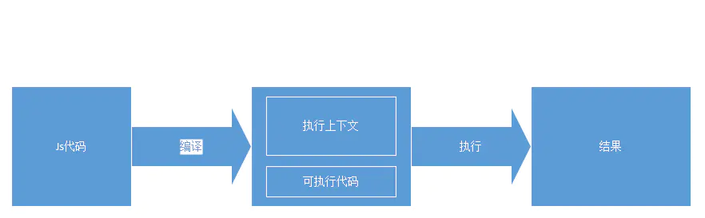
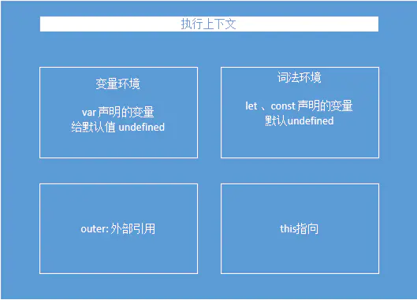
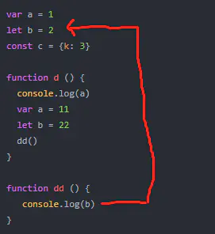
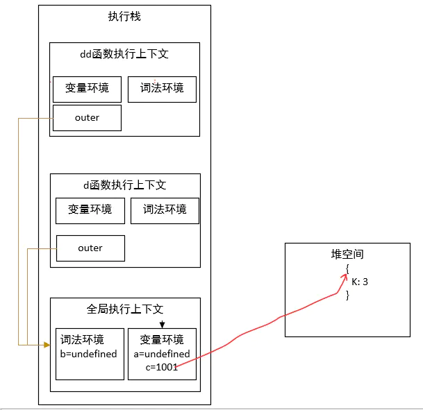
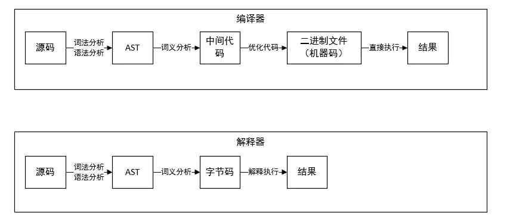
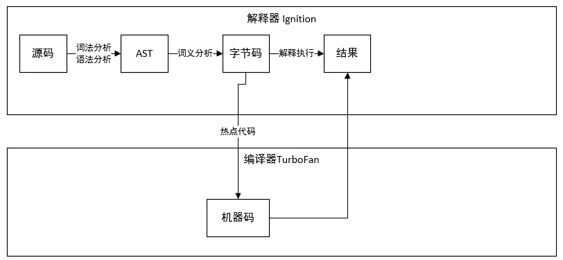

## 运行时解析

```js
var a = 1;
let b = 2;
const c = { k: 3 }

function d() {
    console.log(a);
    var a = 11;
    let b = 22;
    dd();
}
function dd() {
    console.log(b);
}
d() // undefined 2
```

如果你是js老手，一看d()执行结果就知道是啊变量提升打印undefined,dd方法执行打印2，那a为什么会提升呢，怎么不是打印外面的变量a = 1 呢？ b怎么不打印22呢，要弄清楚这些问题就要了解js的执行机制了。

js运行时有两个阶段：编译阶段、执行阶段。

**编译阶段**：js通过编译生成执行上下文和可执行代码两部分

**执行阶段**：执行可以执行代码，输入结果



执行上下文是啥？可执行代码又是啥？

执行上下文是JavaScript执行一段代码时的运行环境，比如调用一个函数，就会进入这个函数的执行上下文，确定该函数在执行期间用到的诸如this、对象以及函数等。

可执行代码就是指js引擎可以执行的代码，这些代码可以是【字节码、机器码】。我们写的js代码它看不懂，也不会执行，它要先把js编译成字节码、机器码才行。

其实不管是什么高级语言代码都需要编译才可以执行，后面再说。

了解这两个概念还不够，执行上下文里面有哪些内容？



看上图，这是编译阶段的输出，可以了解到一些重要的信息：

**变量环境：执行上下文中var声明的变量，且赋值默认值undefined;注意，浏览器并没有把变量声明放到作用域的顶部，在编译阶段,控制流进入域，该域所有的变量和函数的声明先进入到内存；代码位置不会变动**

**词法环境**：执行上下文中let const声明的变量，这是解决变量提升问题，重点这是在es6加入的，es5并没有词法环境。

**outer**: 外部引用，其实在每个执行上下文中，都包含了一个外部引用，用来指向外部的执行上下文，我们把这个外部引用称为outer。在js中有全局执行上下文、函数上下文之说，每个上下文的外部引用都是在**编译时**决定的，这个和代码编译时位置有关，也成为词法作用域。词法作用域是指作用域是由代码中函数声明的的位置来决定，所以词法作用域是静态作用域，通过它就能够预测代码在执行过程中如果查找标识符，理解可以参考下图



**this**: this是一套和作用域无关的独立机制，这个你可以另外找到相关文章深入理解

变量提升其实就是函数运行的编译阶段，把所有var声明的变量统一提升到该作用域顶部，并赋默认值undefined

所以执行d()函数的时候相当于以下流程，先编译在执行

```js
var a = undefined;
console.log(a);
a = 11;
```

而dd()执行的时候其实就是按照上面说的，由于dd上下文没有声明b变量，根据作用域链查找外部引用，知道首次找到b,而作用域在**编译阶段**就确定了外部引用



所以，就例子而言无论d方法还是dd方法，它们的外部引用都是指向全局上下文，在执行阶段，如果发现函数作用域没有变量声明就会沿着作用域往外部引用查找。

总结一些

1. <span style="color: blue">js运行时有两个阶段：编译阶段和执行阶段</span>
2. <span style="color: blue">变量提升的根本原因是在js编译阶段确定的</span>
3. <span style="color: blue">执行上下文有变量环境和词法环境，变量环境存储var声明的变量，词法环境存储let,const声明的变量</span>
4. <span style="color: blue">每个作用域的外部引用在编译阶段更具代码位置确定</span>

## V8引擎角度看javascript运行时

上面说到js运行时有编译阶段 和执行阶段两个阶段，那么从js引擎的角度看来，这是怎么一回事

### 编译器和解释器
之所以存在编译器和解释器，是因为机器不能直接理解我们所写的代码，所以在执行程序之前，需要将我们所写的代码翻译成机器能读懂的机器语言

按语言的执行流程，可以把语言划分为编译型语言和解释型语言。编译型语言在程序执行之前，需要经过编译器的编译过程，并且编译之后会直接保留机器能读懂的二进制文件，这样每次运行程序时，都可以直接运行该二进制文件，而不需要在次重新编译了，比如c/c++,GO都是编译型语言。而由解释型语言编写的程序，在每次运行时都需要通过解释器对程序进行动态解释和执行，比如Python，javascript等都是解释型语言。



了解上面的概念之后，V8引擎就是走的基于解释器的路径，但是又与他不同，是一个改进版



从图中可以看出v8解释器，编译器一起用了的

通常，如果有一段第一次执行的字节码，解释器lgnition会逐条解释执行。解释器lgnition除了负责生成字节码之外，它还有另外一个作用，就是解释执行字节码。在lgnition执行字节码的过程中，如果发现有热点代码(HotSpot)，比如一段代码被重新执行多次，这种称为热点代码，那么后台的编译器TurboFan就会把改段的字节编译为高效的字节码，然后当再次执行这段被优化的代码时候，只需要执行编译后的机器码就可以了，这样大大提升了代码的执行效率。

**回到上面的js运行时两个阶段，编译阶段和执行阶段，编译阶段就是源码->AST->字节码，执行阶段就是基于字节码、机器码执行**

## 资料
[探究javascript的运行时](https://www.jianshu.com/p/672d512fdbae)