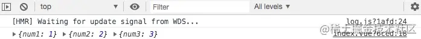

es6提供了非常好的特性，即变量的解构赋值。从而我们可以方便的从数组和对象中提取数据并将他们赋值给变量。这是非常必要的。先来看在这个新特性发布之前我们如何从数组中提取数据的。
```js
let nums = [1,2,3,4,5];
let nums1 = nums[0];
let nums2 = nums[1];

console.log(num1); // 1
console.log(num2); // 2
```
为了从nums数组中提取到数据，我们多次重复着相同的代码。es6的解构赋值将会让这个操作变得非常的容易切易于理解

## 数组的解构赋值
从数组中取值并按照对应位置对变量进行赋值 如下：
```js
let [num1, num2, num2] = [1, 2,3];
console.log({num1}, {num2}, {num3});
```


### "模式匹配"赋值
这属于"模式匹配"，只要等号两边的模式相同，左边的变量就会被赋予对应的值
```js
let [num_s, nums, num_e] = [1, [2,3,4], 5];
console.log(num_s); // 1
console.log(nums); // [2,3,4]
console.log(num_e); // 5
```
### 用逗号跳过元素
```js
let [num1,,,num4] = [1,2,3,4];
console.log(num1); // 1
console.log(num4); // 4

let [, num2, , num4] = [1,2,3,4];
console.log(num2); // 2
console.log(num4); // 4
```
查看变量赋值左侧的数据。注意这里不是只有一个逗号，而是三个。逗号分隔符用于跳过数组的值。所以如果你想要跳过数组的一个项，只要用逗号就可以了

### 数组的其余部分的赋值
如果我们想将数组中的一些元素赋值给变量，而将数组中的其余元素存为一个数组赋值给指定的变量怎么办？在这种情况下，我们可以这么做
```js
let [num1, ...nums] = [1,2,3,4];
console.log(num1); // 1
console.log(nums); // [2,3,4]
```
应用这种方式，你可以轻松的把剩余的元素赋值给一个指定的变量

### 解构失败，赋值undefined
```js
let [num1] = [];
let [num2, num3] = [1];
console.log(num1); // undefined
console.log(num3); // undefined
```
代码中的变量num1与变量num3按照模式匹配的原则，并没有对应的值与之匹配，故而返回undefined.而变量num2按照模式匹配原则，被赋值1.

### 函数的解构赋值
解构赋值还可以从函数返回的数组中提取数据。假设我们有一个返回数组的函数，如下所示
```js
function getLists() {
    let lists = [1,2,3,4, 5];
    return lists;
}
let [num1, ...nums] = getLists();
console.log(num1); // 1
console.log(nums); // [2,3,4, 5] 
```
### 使用默认值
数组的解构赋值可以给变量设定默认值，以防万一从数组中提取的值是undefined(防止解构失败的情况)
```js
let [name = '暂无姓名', sex='女'] = ['April'];
console.log(name); //April
console.log(sex); // 女
```
代码中变量name默认的值为『暂无姓名』但是按照左右模式匹配的原则，name被赋值为"April",因为变量sex病危匹配到值，所以它的值依旧是默认值"女"。

<span style="color: blue">**注意点1：**ES6内部使用严格相等运算符(===),判断一个位置是否有值。所以，只有当一个数组成员严格等于undefined,默认值才会生效</span>

```js
let [num1 = 1] = [undefined];
console.log(num1); // 1

let [num2 = 2] = [null];
console.log(num2); // null
```
代码中，因为null不严格等于undefined,默认值就不会生效。故而输出了null

<span style="color: blue">**注意点2**: 如果默认值是函数，这个函数就会非常的懒，即只有在用到的时候，才会执行函数</span>

```js
function getLists() {
    let lists = [1, 2, 3, 4, 5];
    return lists;
}
let [lists = getLists()] = [1];
console.log(lists); // 1
// 因为变量lists可以匹配的到值，所以函数getLists()并不会执行

function getLists() {
    let lists = [1,2,3,4,5];
    return lists
}
let [lists = getLists()] = [];
console.log(lists); // [1,2,3,4,5]
// 因为变量 lists 无法匹配到值，函数getLists()就会执行。故而返回数据[1,2,3,4,5]

// 区别********************************
let xx 
var {obj = xx} = {obj: {a: 1}} // obj: {a: 1} xx undefined
var {obj : xx} = {obj: {a: 1}} // obj: {a: 1} xx: {a: 1}
```
<span style="color: blue">**注意点:** 默认值可以引用解构赋值的其他变量，但该变量必须已经声明</span>

```js
let [x = 1, y = x] = [] // x = 1, y = 1;
let [x = 1, y = x] = [2]; // x = 2, y = 2;
let [x = 1, y = x] = [1, 2]; // x = 1, y = 2
let [x = y, y = 1] = [] // 这就会报错，因为x用y做默认值，y还没有声明
```
### 交换变量
```js
let num1 = 1;
let num2 = 2;

[num1, num2] = [num2, num1];
console.log(num1); // 2
console.log(num2); // 1
```
## 对象的解构赋值
为什么要用对象的结构赋值呢？
```js
let profiles = {
    name: 'April',
    nickname: '二十七刻',
    sign: '不以物喜不以己悲'
}
let name = profiles.name;
let nickname = profiles.nickname;
let sign = profiles.sign;

console.log({name}); // {name: 'April'}
console.log({nickname}); // {nickname: '二十七刻'}
console.log({sign}); // {sign: '不以物喜不以己悲'}
```
假设我们要从对象profiles中获取数据并赋值给变量。就得不断的重复着取值和赋值。代码冗长切不利于维护。利用对象的结构赋值，就不存在这一问题了

### 同属性名赋值
对象的解构赋值变量必须与属性同名，才能取到正确的值。如下
```js
let profiles = {
    name:'April', 
    nickname:"二十七刻", 
    sign:"不以物喜，不以己悲。"
}
console.log(name)    // logs "April"
console.log(nickname)// logs "二十七刻"
console.log(sign)    // logs "不以物喜，不以己悲。"
```
### 结构失败，赋值undefined
```js
let profiles = {
    name:'April',
    nickname:"二十七刻",
    sign:"不以物喜，不以己悲。"
}
let {name,sex} = profiles;

console.log(name) // logs "April"
console.log(sex) // logs undefined
```
上面代码中，因为profiles对象没有 sex属性，所以变量sex取不到值，所以就赋值undefined。

### 在赋值之前声明变量
在对象的解构赋值中，变量可以在赋值之前声明。如下：
```js
let profiles = {
    name: 'April',
    nickname: '二十七刻',
    sign: '不以物喜,不以已悲'
}
let name, nickname, sign;
{name, nickname, sign} = profiles

console.log(name); // Error: "Unexpected token = "
```
哎呀报错了 为什么？？

原因：因为忘记在{}外层写()了

<span style="color:red">**注意1**: 当使用没有声明的对象字面量解构赋值时，必须使用()的赋值语句。因为Javascript引擎会将{name, nickname, sign}理解成一个代码块，而不是对象字面量</span>

<span style="color:red">**注意2**: 使用此语法时，上一行代码一定要以;结束掉，否则的话会被当做函数，执行上一行的代码</span>

<span style="color:red">**就是这个奇怪的语法: ({} = '');**</span>

正确的做法如下
```js
let profiles = {
    name: 'April',
    nickname:"二十七刻",
    sign:"不以物喜，不以己悲。"
}
let name, nickname, sign;
({name,nickname,sign}) = profiles;

console.log({name}, {nickname}, {sign});
// logs {name: "April"} {nickname: "二十七刻"} {sign: "不以物喜，不以己悲。"}
```
### 使用新的变量名
如果我们想用新的变量名来替代对象的属性名怎么办呢？代码如下
```js
let profiles = {
    name: 'April',
    age: '27'
}
let {name: userName, age: userAge} = profiles;

console.log(userName); // April
console.log(userAge); // 27
```
<span style="color: red">由此可知，对象的结构赋值其实就是let {name:name, age: age} = {name: 'April', age: '27'}代码的简写。也就是说，对象的解构赋值的内部机制，是先找到同名属性，然后在赋给对应的变量。真正被赋值的是后者，而不是前者。</span>

<span style="color: blue">上面的代码中，name是匹配模式，userName才是变量。真正被赋值的是变量userName，而不是模式name</span>

### 使用默认值
对象的解构赋值可以给变量设置默认值，以防止万一从对象中获取的值是undefined(防止解构失败的情况)需要注意的是：默认值生效的条件是，对象的属性值严格等于undefined。

```js
let staff = { name: 'April', country: 'China', job: 'Developer'};
let { name = '暂无姓名', age = '暂无年龄' } = staff;

console.log({name}); // {name: 'April'}
console.log({age}); // {age: '暂无年龄'}
```
代码中变量name的默认值为"暂无姓名"，但是对象staff中有属性name的字段，所以就被赋值April，而对象staff中没有age这个属性，这个被赋值为"暂无年龄"，取了它自己的默认值

### 计算属性名称
计算属性名称是另一个对象特性，也适用于对象的解构赋值。你可以通过一个表达式指定一个属性的名称，把它放在[]中，如下
```js
let staff = {name: 'April', country: 'China', job: 'Developer'};
let prop = 'name';
let {[prop]: name} = staff;

console.log({name})
```
### 对象中其余部分的赋值
解构运算也可以被应运到解构赋值当中，来获取那些还没有被赋值的键值对，这些键值对都被放在一个新的对象里。如下：
```js
let staff = {name: "April", country: "China", job: "Developer",nickname:"二十七刻"};
let {country,...infos} = staff;

console.log(country) //logs "China"
console.log(infos) // logs {name: "April", job: "Developer", nickname: "二十七刻"}
```

### 嵌套对象的解构赋值
```js
let staffs = {
    group1:[ { id:"007", name:"April"}]
}
let {group1,group1:[{id,name}]} = staffs;

console.log(group1) // logs [{ id:"007", name:"April"}]
console.log(id) // logs "007"
console.log(name) // logs "April"
```
注意，代码中group1是模式，不是变量。如果想把group1也作为变量赋值，就需要先进行定义在去赋值

## 资料
[深入的理解数组和对象的解构赋值](https://juejin.cn/post/6844904119342202888)