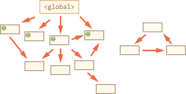

- 堆(heap) 堆(heap)是动态分配的内存,大小补丁也不会自动释放
- 栈(stack) 栈(stack)为自动分配的内存空间，它由系统自动释放

> JavaScript中的变量分为基本类型和引用类型

- 基本类型(undefined、null、Boolean、Number和String)
    基本类型在内存中占据空间小，大小固定，他们的值保存在栈(stack)空间，是按值来访问
- 引用类型(对象、数组、函数)
    引用类型占据空间大、大小不固定，栈内存中存放地址指向堆(heap)内存中的对象。是按引用访问的

如下图所示:栈内存中存放的至少该对象的访问地址，在堆内存中为这个值分配空间。由于这种值的大小不固定，因此不能把他们保存到栈内存中。但是内存地址大小的固定的，因此可以将内存地址保存在栈内存中。这样当查询引用类型的变量时，先从栈中读取内存地址，然后在通过地址找到堆中的值。


当我们看到一个变量是已知的，就分配在栈里面,比如INT，Double等。其他未知的类型，比如自定义的类型，因为系统不知道需要多大，所以程序自己申请，这样就分配在堆里面

## 栈内存&堆内存

为了使程序运行时占用的内存最小，通常要实现垃圾回收机制

当一个方法执行时，每个方法都会建立自己的内存栈，在这个方法内定义的变量将会逐个放入这块栈内存里，随着方法的执行结束，这个方法的栈存也将自然销毁了。因此，所有在方法中定义的变量都是放在栈内存中的

当我们在程序中创建一个对象时候，这个对象将被保存到运行时数据区中，以便反复利用(因为对象的创建开销交大)，这个运行时数据区就是堆内存。堆内存中的对象不会随着方法的结束而销毁，既然方法结束后，这个对象还可能被另一个引用变量所引用(方法的参数传递很常见)，则这个对象依然不会被销毁，只有当一个对象没有任何应用变量引用它时，系统的垃圾回收机制才会在核实的时候回收它

思考问题
```
demo1
var a = 1;
var b = a;
b = 2

// 这时候a  a = 1;
```
demo1中的变量对象中的数据发生复制行为，系统会自动为新的变量分配一个新值。var b = a执行后，b虽然重新赋值为2，但是他们其实已经是相互独立互不影响的值了。

```
demo2

var m = {a: 1, b: 2};
var n = m;
n.a = 2;

// 这时候m.a的值2
```
demo2中我们通过var n = m 执行一次复制应用类型的操作。引用类型的复制同样也会为新的变量自动分配一个新的值保存在变量对象中，但不同的是，这个新的值，仅仅只是引用类型的一个地址指针。当地址指针相同时，尽管他们相互独立，但是在变量对象中访问到的具体对象实际上是同一个。因此当我改变n时，m也发生变化。这就是引用类型的特性

### 垃圾回收--内部算法
基本的垃圾回收算法被称为"标记清除"，定期执行以下垃圾回收步骤

- 垃圾回收器获取根并"标记"(记住)他们
- 然后它访问并"标记"所有来自他们的引用
- 然后它访问标记的对象并标记他们的引用。所有被访问的对象都被记住，以便以后不再访问同一个对象两次
- 依次类推，直到有未访问的引用(可以从根访问)为止
- 除标记的对象外，素有对象都被删除

例如：对象结构如下

我们可以清楚的看到右边有一个'不可以达到的块'。现在让我们看看'标记清楚'垃圾回收器如何处理它

**第一步标记根**


**然后标记他们的引用**

以及子孙代的引用

现在进程中不能访问的对象被认为是不可访问的，将被删除


这就是垃圾收集的工作原理。Javascript引擎应用了许多优化，使其运行的更快，并且不影响执行。

一些优化

- **分代回收**--对象分为两组：新对象和旧对象。许多对象出现，完成他们的工作并迅速技术，他们很快就会被清理干净。那些获得足够久的对象，会变老，并且很少接受检查
- **增量回收**--如果有很多对象，并且我们试图以此遍历并标记整个对象集，那么可能会话费一些时间，并在执行中会有一定的延迟。因此引擎试图将垃圾回收分解为多个部分。然后各个部分分别执行。这需要额外的标记来跟踪变化，这样有很多微笑的延迟，而不是很大的延迟
- **空闲时间收集**-- 垃圾回收器只在CPU空闲时运行，以减少执行的可能影响


## 资料
[JavaScript中的堆栈](https://segmentfault.com/a/1190000009693516)

[js垃圾回收机制](https://segmentfault.com/a/1190000018605776)