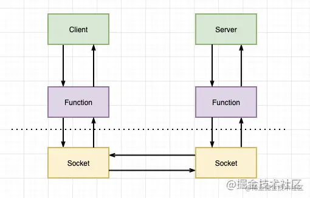
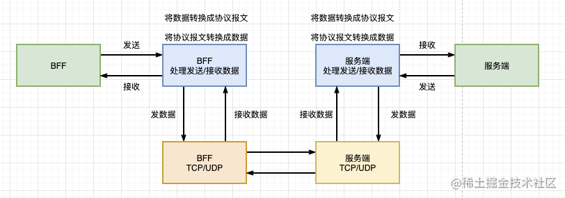
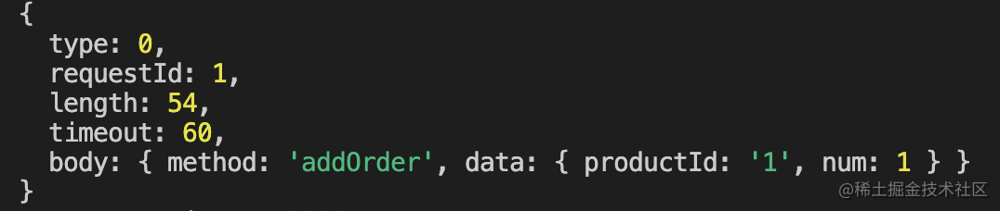
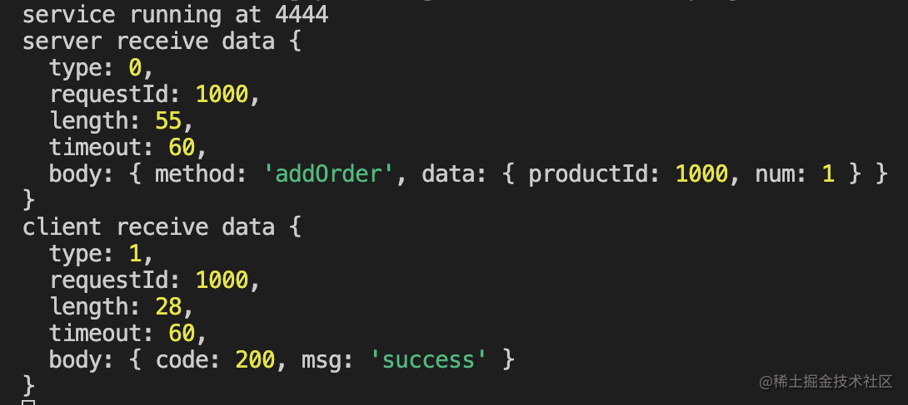
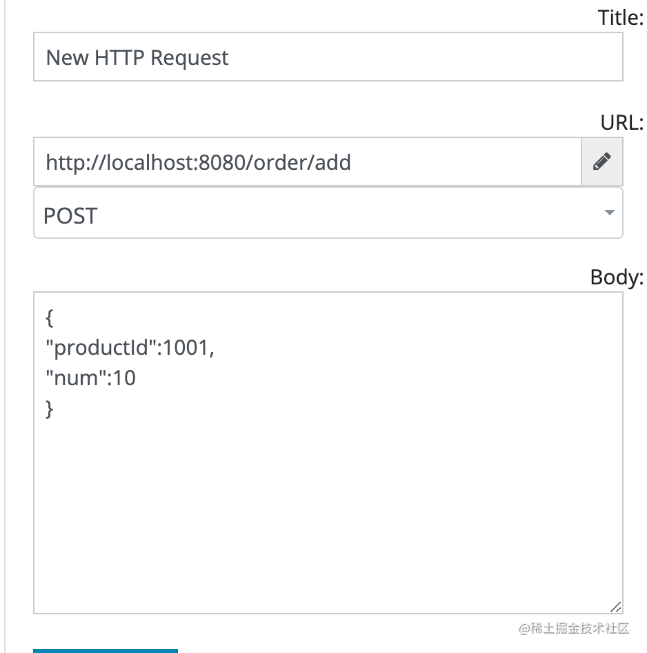
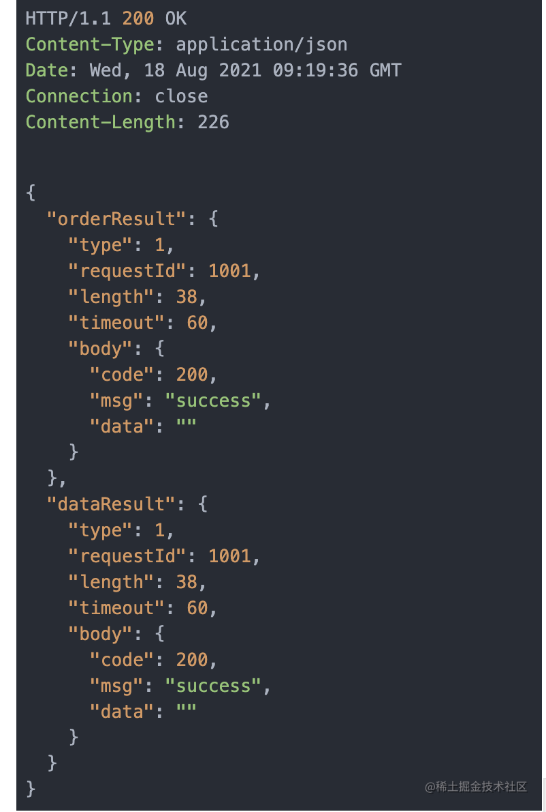

## 前言
[上一篇文章](/front-end/JavaScript/basics-5.html#前言)介绍了BFF的概念和应用场景,并且做了一个简单的BFFdemo。接下来可以讨论一下如何优化BFF层



## 协议设计
<span style="color: red">上文提到,**RPC通过传输层协议传输协议,传输层传输的是二进制数据，发送端需要将请求的方法名和数据序列化后发送，接收端收到二进制数据后则需要反序列化并处理数据**</span>.所以，RPC调用流程大致如下



<span style="color: red">所谓协议，通俗的讲就是用固定的格式封装成报文数据，双方按照这一固定格式对数据进行发送和接收</span>。例如以前讲过的[利用TCP实现一个HTTP服务](https://juejin.cn/post/6969222179456024584)

<span style="color: blue">根据上图的流程，实现设计一个简单的通信协议并且实现它，利用这个协议进行通信。这个协议由报文头和报文主体组成</span>

报文头主要有的信息:

| --- type --- | ------- requestId ------- | ---- length ---- | --- timeout --- |

| ------------------------------------------------------------------------ |

| ---------------------------------- body -------------------------------- |

| ------------------------------------------------------------------------ |

- 报文头的长度是固定的
- type是请求的类型，占1个字节:规定0 - REQUEST 1 - RESPONSE
- requestId请求ID，占4个字节,范围 0~ 4 * 2 ^ 8
- length报文主体长度，占4个字节
- timeout响应超时事件，规则报文双文，占1个字节

到这里，一个简单的报文已经设计完成，其中header一种占10个字节，接下来就是要在代码中描述它

### 用node.js描述报文
```js
// 需要发送的信息
const body = {
    method: 'addOrder',
    data: {
        productId: '1',
        num: 1
    }
}

// 请求报文
const bodyLength = JSON.stringify(body).length;
const bodyuBuf = Buffer.alloc(bodyLength, JSON.stringify(body));
const bufHeader = Buffer.alloc(10);
bufHeader[0] = 0; // 代表request
bufHeader.writeInt32BE(1, 1); // 写入4字节数据 代表订单号为1
bufHeader.writeInt32BE(bodyLength, 5);
bufHeader[9] = 60;
console.log(bufHeader); // <Buffer 00 00 00 00 01 00 00 00 36 3c>

// 组合报文
const buf = Buffer.concat([bufHeader, bodyBuf]);

console.log(buf); // <Buffer 00 00 00 00 01 00 00 00 36 3c 7b 22 6d 65 74 68 6f 64 22 3a 22 61 64 64 4f 72 64 65 72 22 2c 22 64 61 74 61 22 3a 7b 22 70 72 6f 64 75 63 74 49 64 22 ... 14 more bytes>
```
一个发送的报文就描述出来。当报文被发送出去被接收后，需要将报文数据进行解码，继续来实现以下结果的过程~
```js
// 反序列化
function decodeBuf(buf) {
    const type = buf[0];
    const requestId = buf.readInt32BE(1);
    const length = buf.readInt32BE(5);
    const timeout = buf(9);

    const body = buf.split(10, 10 + length);

    return {
        type,
        requestId,
        length,
        timeout,
        body: json.parse(body)
    }
}
console.log(decodeBuf(buf));
```
将报文数据传输进去之后输出



到这里，我们已经实现了RPC通信报文的序列化和反序列化，接下来就是实现一个传输层服务

## 用node实现RPC框架
在node中创建TCP连接需要使用next的库，不熟悉的可以看一下官网关于net的[文档](https://nodejs.org/dist/latest-v14.x/docs/api/net.html#net_net_createserver_options_connectionlistener)

```js
import { createServer, createConnection } from 'net';

// 创建服务方法
export function createService() {
    const service = createServer(socket => {
        socket.on('connect', () => {
            console.log('connect server');
        });

        socket.on('data', data => {
            const result = decodeBuf(data); // 解码
            // 如果是心跳包，直接跳过
            if(result.body.method === 'jump') return;
            else {
                // 否则处理方法
                console.log('server receiver data', result);
                socket.write(
                    encodeBuf(1, result.requestId, { code: 200, msg: 'success'})
                )
            }
        })

        socket.on('end', () => {
            console.log('disconnect server');
        })
    })

    service.listen(4444, () => {
        console.log('service running at 444')
    })
}

// 创建一个客户端
export function createClient() {
    const client = createConnection({
        port: 4444,
    })
    client.write(
        encodeBuf(0, 100, { // 编码
            method: 'addOrder',
            data: { productId: 1000, num: 1 },
        })
    )
    // 接收信息
    client.on('data', data => {
        console.log('client receiver data', decodeBuf(data));
    })

    client.on('close', () => {
        console.log('client connect close')
    })
}

// 序列化报文
function encodeBuf(type, order, data) {
  const bodyLength = JSON.stringify(data).length;
  const bodyBuf = Buffer.alloc(bodyLength, JSON.stringify(data));
  const bufHeader = Buffer.alloc(10);
  bufHeader[0] = type;
  bufHeader.writeInt32BE(order, 1);
  bufHeader.writeInt32BE(bodyLength, 5);
  bufHeader[9] = 60;
  const buf = Buffer.concat([bufHeader, bodyBuf]);
  return buf;
}

// 反序列化报文
function decodeBuf(buf: any) {
  const type = buf[0];
  const requestId = buf.readInt32BE(1);
  const length = buf.readInt32BE(5);
  const timeout = buf[9];
  const body = buf.slice(10, 10 + length);

  return {
    type,
    requestId,
    length,
    timeout,
    body: JSON.parse(body),
  };
}
// 调用测试
createService();
// 一秒后发送请求
setTimeout(() => {
  createClient();
}, 1000);
```
调用后返回。



成功~ 我们已经成功实现了一个TCP通信service和client。最后，把通信接入到BFF层。

## 优化BFF层
### 第一步：修改一下网络层方法，对外暴露处理数据的接口
```js
export function createService(port, callback) {
    const service = createServer(socket => {
        socket.on('connect', () => {
            console.log('connect server');
        })

        socket.on('data', data => {
            const result = decodeBuf(data);
            if(result.body.method === 'jump') return;
            else {
                console.log('server receiver data', result);
                // 处理钩子
                const returnData = callback(result, socket);
                socket.write(encodeBuf(1, result.requestId, returnData));
            }
        })
        service.listen(port, () => {
            console.log(`service running at ${port}`);
        });
    })
}
export function createClient(port: number) {
  const client = createConnection({
    port,
  });
  return client;
}
```
### 第二步，将微服务中的HTTP服务改为刚刚创建的网络服务
```js
// 订单服务
createService(4444, data => {
    const result = handleOrderInput(data.body);
    return result;
})

// 数据服务
createService(4445, data => {
    const result = handleDataInput(data.body);
    return result;
})
```
### 最后，修改一下公共请求方法
```js
// 公共请求方法
async function publicRequest(port, method, data) {
    return new Promise(resolve => {
        const json = { method, ...JSON.parse(data) };
        const buf = encodeBuf(0, 1001, json);
        onst client = createClient(port);
        client.write(buf);
        client.on('data', (data) => {
        const result = decodeBuf(data);
        console.log('client receive data', result);
        resolve(result);
        });
    })
}
```
测试一下



执行后返回


## 小结
本文主要介绍了RPC协议的设计和使用node实现协议。

将实现好的RPC应用到BFF层与微服务之间调用。

[源码地址](https://github.com/IchliebedichZhu/articles/tree/master/node/bff/RPC)

## 资料
[使用 Node.js 构建 BFF 层（二）](https://juejin.cn/post/6997704376777179172)

[聊聊 Node.js RPC（一）— 协议---要看](https://www.yuque.com/egg/nodejs/dklip5)