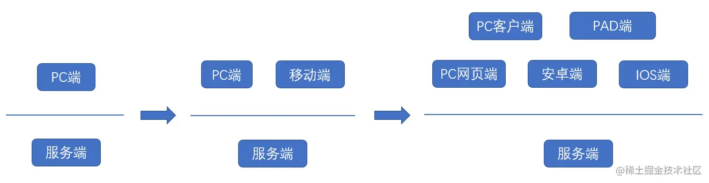

BFF是一种Web架构，全名为Backends for Frontends, 即为服务于前端的后端。这个词来源于 Sam Newman 的一篇文章 [Pattern: Backends For Frontends](https://samnewman.io/patterns/architectural/bff/)。BFF一般指的是在前端与后端之间增加一个中间层。为什么要在前端和后端之间增加一个BFF层呢？

计算机科学家 David Wheeler曾经说过一句话： All problems in computer science can be solved by another level of indirection。 计算机科学中的所有问题都可以通过加一层来解决。因此，需要使用BFF的场景，肯定是普通的前后端开发模式遇到了部分问题。例如在Sam Newman的文章中描述了BFF解决多个展示端的场景。

## 多端展示问题
从系统一开始开发的时候只考虑了PC网页端的设计，服务器端API是为了PC网页端而服务的。但是后来随着移动互联网的兴起，移动端开始流行，决定在原有服务端的基础上开发移动端App,复用之前的API，但是原有API是为了PC端设计的，并不符合移动端的需求。
1. PC端的需求与移动端并不一定完全相同，现有接口无法满足所有移动端的新需求。
2. PC端电脑性能强，可以并发请求多个接口或进行部分较复杂的数据处理，但是移动端性能低，如果使用同样的多个接口，由前端组装数据，页面展示可能会出现延迟和卡顿现象
3. PC端的屏幕较大，展示内容较多且全面。但是移动端屏幕小，展示内容较少。而且部分数据的获取并不容易，需要后端调用许多服务。如果移动端复用PC段接口，会获取和传输部分无用数据，不仅消耗服务端资源，还浪费网络带宽

而且随着科技的发展和用户的需求，不同的展示端越来越多，在不仅在手机上会区分Android端，IOS端，而且还会有平板电脑端，手机网页端，PC网页端，PC的APP端等等。这些端的页面设计各不相同，对于数据的需求也不相同。假设我们复用同一个服务端和API接口，如果出现不满足需求的场景就加接口加字段，那么随着这些不同客户端的开发和迭代，服务端会变的大而臃肿，效率低下。而且同一个接口提供给太多前端调用，涉及到太多的逻辑，复杂性越来越高。

因此，更好的方式就是服务端对展示进行解耦，服务端只负责提供数据，有专门的展示端负责前端的展示业务。这里的展示端就是BFF层

## 不同业务场景的展示模式差异
在某些业务中,客户端的类型只有一种，但是在不同的场景下,展示的模式有差异。比如在[美团的BFF实践中](https://mp.weixin.qq.com/s/mhM9tfWBlIuMVkZQ-6C0Tw),不同行业的团购货架展示模块不同，是两套独立定义的产品逻辑，并且会各自迭代

在这种业务场景下,虽然同一个客户端，但是业务不同，需求的数据格式和类型也不同，因此遇到与上面多端展示类似的接口问题

## 端生命周期的需求
还有一种情形，是闲鱼团队遇到的短生命周期的需求。在普通的业务场景下，服务端正常稳定迭代开发。但是偶尔会有一些特殊的运营活动，这种活动时间较短，可能仅仅持续几天时间。

如果仅仅为了这些几天的活动，每次都要开新API，联调，甚至修改原有服务端的逻辑，成本较大，而且较为低效。如果加一层BFF，让前端可以直接获取数据，那么开发和联调会变的简单很多。

## 业务整合需要

[大厂为啥都要用Node去写中间层(BFF)呢？](https://juejin.cn/post/7240404579133128760#heading-6)